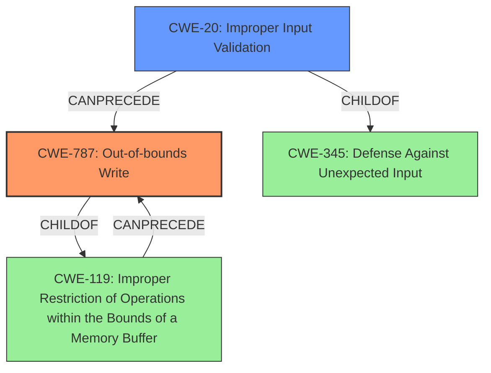

# Enhanced Analysis for CVE-2024-11544

# Summary
| CWE ID | CWE Name | Confidence | CWE Abstraction Level | CWE Vulnerability Mapping Label | CWE-Vulnerability Mapping Notes |
|---|---|---|---|---|---|
| CWE-787 | Out-of-bounds Write | 1.0 | Base | Allowed | Primary CWE: The **lack of proper validation of user-supplied data** leads to a **memory corruption** condition, specifically an out-of-bounds write. |
| CWE-20 | Improper Input Validation | 0.7 | Class | Discouraged | Secondary CWE: The root cause is **lack of proper validation of user-supplied data**. |

## Evidence and Confidence

*   **Confidence Score:** 0.9
*   **Evidence Strength:** HIGH

## Relationship Analysis
The primary CWE is CWE-787, which is a Base level CWE describing an out-of-bounds write. This is directly caused by a **lack of proper validation of user-supplied data**, which is represented by CWE-20. CWE-787 is a child of CWE-119 (Improper Restriction of Operations within the Bounds of a Memory Buffer), indicating that it is a more specific type of memory buffer issue. CWE-20 is a Class level CWE and is a child of the Pillar CWE-345 (Defense Against Unexpected Input).



## Vulnerability Chain
The vulnerability chain starts with **lack of proper validation of user-supplied data** (CWE-20), which leads to **memory corruption** (CWE-787), and finally results in Remote Code Execution.

CWE-20 (Improper Input Validation) -> CWE-787 (Out-of-bounds Write) -> Impact: Remote Code Execution.

## Summary of Analysis
The primary weakness is CWE-787 (Out-of-bounds Write) because the **lack of proper validation of user-supplied data** leads to a memory corruption condition where data is written past the end or before the beginning of the intended buffer. The vulnerability description explicitly mentions the **lack of proper validation of user-supplied data**, which can result in a **memory corruption** condition. The "CVE Reference Links Content Summary" section further supports this by stating: "The vulnerability lies in the lack of proper validation of user-supplied data when parsing DXF files, leading to a memory corruption condition."

CWE-20 is considered as a secondary weakness because it describes the root cause: improper input validation. While CWE-20 is a relevant factor, CWE-787 provides a more precise description of the memory corruption issue. CWE-20 is classified as "Discouraged" when lower-level CWEs could be used instead.

I considered CWE-119 (Improper Restriction of Operations within the Bounds of a Memory Buffer), but it is a Class-level CWE and is discouraged when more specific CWEs are available. CWE-787 is a more specific Base-level CWE. Other CWEs considered but not selected included CWE-125 (Out-of-bounds Read) as the description focuses on a write condition, not a read condition.

The retriever results and the CWE for similar CVE descriptions both highly suggested CWE-787.


## CWE Relationship Analysis

Current CWEs represent these abstraction levels: .


### Vulnerability Chain Analysis

**Chain starting from CWE-345:**
- 345 (Insufficient Verification of Data Authenticity) - ROOT


**Chain starting from CWE-125:**
- 125 (Out-of-bounds Read) - ROOT


### CWE Relationship Diagram

```mermaid
graph TD
    classDef primary fill:#f96,stroke:#333,stroke-width:2px
    classDef secondary fill:#69f,stroke:#333
    classDef tertiary fill:#9e9,stroke:#333
```