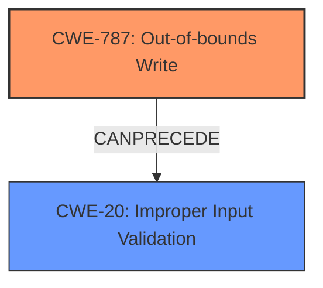

# Raw Analyzer Response for CVE-2024-11547

# Summary
| CWE ID | CWE Name | Confidence | CWE Abstraction Level | CWE Vulnerability Mapping Label | CWE-Vulnerability Mapping Notes |
|---|---|---|---|---|---|
| CWE-787 | Out-of-bounds Write | 1.0 | Base | Allowed | Primary CWE. The vulnerability results from writing data past the end or before the beginning of the intended buffer due to a **lack of proper validation of user-supplied data**. |
| CWE-20 | Improper Input Validation | 0.7 | Class | Discouraged | Secondary CWE. The root cause is a **lack of proper validation of user-supplied data**. While CWE-20 is a higher-level class, it accurately reflects the **lack of validation** that leads to the memory corruption. |

## Evidence and Confidence

*   **Confidence Score:** 0.9
*   **Evidence Strength:** HIGH

## Relationship Analysis
The primary relationship that influenced the selection was the parent-child relationship between CWE-20 (Improper Input Validation) and more specific CWEs. Although CWE-20 is discouraged when more specific information is available, the vulnerability description clearly points to a **lack of proper validation of user-supplied data** as the root cause. While **memory corruption** is the weakness, it is a consequence of the **improper validation**.

## Vulnerability Chain
The vulnerability chain starts with the **lack of proper validation of user-supplied data** (CWE-20), which leads to a **memory corruption** condition, specifically an out-of-bounds write (CWE-787), and ultimately results in remote code execution.

## Summary of Analysis
The initial analysis focused on identifying the root cause of the vulnerability. The vulnerability description clearly states the **lack of proper validation of user-supplied data**, leading to memory corruption. The primary CWE, CWE-787 (Out-of-bounds Write), accurately reflects the specific type of memory corruption. However, considering the root cause, CWE-20 (Improper Input Validation) was also considered, as the **lack of validation** is the initial flaw. The final decision was to include both CWEs, with CWE-787 as the primary due to its specific description of the **memory corruption**, and CWE-20 as a secondary CWE to highlight the underlying **lack of validation**.

The selection of CWE-787 is based on the following evidence:
- "The issue results from the **lack of proper validation of user-supplied data**, which can result in a **memory corruption** condition."
- "The vulnerability lies in the improper parsing of DWG files due to the **lack of proper validation of user-supplied data**, leading to a **memory corruption** condition."

The inclusion of CWE-20 is based on the following evidence:
- "**lack of proper validation of user-supplied data**" which is the initial flaw leading to the out-of-bounds write

The selected CWEs are at the optimal level of specificity, with CWE-787 describing the **memory corruption** and CWE-20 highlighting the **lack of validation** at the input level.

Relevant CWE Information:

# Enhanced Context (25 CWEs)
The following CWEs were identified as potentially relevant to this vulnerability:

## CWE-824: Access of Uninitialized Pointer
**Abstraction Level**: Base
**Similarity Score**: 0.67
**Source**: dense

**Description**:
The product accesses or uses a pointer that has not been initialized.

**Mapping Guidance**:
- Usage: Allowed
- Rationale: This CWE entry is at the Base level of abstraction, which is a preferred level of abstraction for mapping to the root causes of vulnerabilities.

*Not selected:* This CWE does not align with the provided vulnerability description which details an **improper validation** issue leading to **memory corruption**, not an uninitialized pointer.

## CWE-125: Out-of-bounds Read
**Abstraction Level**: Base
**Similarity Score**: 0.67
**Source**: dense

**Description**:
The product reads data past the end, or before the beginning, of the intended buffer.

**Mapping Guidance**:
- Usage: Allowed
- Rationale: This CWE entry is at the Base level of abstraction, which is a preferred level of abstraction for mapping to the root causes of vulnerabilities.

*Not selected:* While out-of-bounds read is related to buffer overflows, the description specifically mentions **memory corruption** which usually refers to an out-of-bounds write.

## CWE-434: Unrestricted Upload of File with Dangerous Type
**Abstraction Level**: Base
**Similarity Score**: 0.66
**Source**: dense

**Description**:
The product allows the upload or transfer of dangerous file types that are automatically processed within its environment.

**Mapping Guidance**:
- Usage: Allowed
- Rationale: This CWE entry is at the Base level of abstraction, which is a preferred level of abstraction for mapping to the root causes of vulnerabilities.

*Not selected:* This CWE is not appropriate as the vulnerability lies in the **parsing** of DWG files and **lack of proper validation**, rather than the unrestricted upload of a dangerous file type.

## CWE-119: Improper Restriction of Operations within the Bounds of a Memory Buffer
**Abstraction Level**: Class
**Similarity Score**: 0.66
**Source**: dense

**Description**:
The product performs operations on a memory buffer, but it reads from or writes to a memory location outside the buffer's intended boundary. This may result in read or write operations on unexpected memory locations that could be linked to other variables, data structures, or internal program data.

**Mapping Guidance**:
- Usage: Discouraged
- Rationale: CWE-119 is commonly misused in low-information vulnerability reports when lower-level CWEs could be used instead, or when more details about the vulnerability are available.

*Not selected:* This is too high level. CWE-787 is a better fit.

## CWE-129: Improper Validation of Array Index
**Abstraction Level**: Variant
**Similarity Score**: 0.66
**Source**: dense

**Description**:
The product uses untrusted input when calculating or using an array index, but the product does not validate or incorrectly validates the index to ensure the index references a valid position within the array.

**Mapping Guidance**:
- Usage: Allowed
- Rationale: This CWE entry is at the Variant level of abstraction, which is a preferred level of abstraction for mapping to the root causes of vulnerabilities.

*Not selected:* The vulnerability description doesn't explicitly mention array index.

## CWE-789: Memory Allocation with Excessive Size Value
**Abstraction Level**: Variant
**Similarity Score**: 0.66
**Source**: dense

**Description**:
The product allocates memory based on an untrusted, large size value, but it does not ensure that the size is within expected limits, allowing arbitrary amounts of memory to be allocated.

**Mapping Guidance**:
- Usage: Allowed
- Rationale: This CWE entry is at the Variant level of abstraction, which is a preferred level of abstraction for mapping to the root causes of vulnerabilities.

*Not selected:* The vulnerability description doesn't mention an excessive size value leading to memory allocation issues.

## CWE-788: Access of Memory Location After End of Buffer
**Abstraction Level**: Base
**Similarity Score**: 0.66
**Source**: dense

**Description**:
The product reads or writes to a buffer using an index or pointer that references a memory location after the end of the buffer.

**Mapping Guidance**:
- Usage: Discouraged
- Rationale: The CWE entry might be misused when lower-level CWE entries might be available. It also overlaps existing CWE entries and might be deprecated in the future.

*Not selected:* CWE-787 is a better fit.

## CWE-73: External Control of File Name or Path
**Abstraction Level**: Base
**Similarity Score**: 0.66
**Source**: dense

**Description**:
The product allows user input to control or influence paths or file names that are used in filesystem operations.

**Mapping Guidance**:
- Usage: Allowed
- Rationale: This CWE entry is at the Base level of abstraction, which is a preferred level of abstraction for mapping to the root causes of vulnerabilities.

*Not selected:* This CWE is not relevant as the vulnerability is related to the parsing of DWG files, not the external control of file names or paths.

## CWE-782: Exposed IOCTL with Insufficient Access Control
**Abstraction Level**: Variant
**Similarity Score**: 0.66
**Source**: dense

**Description**:
The product implements an IOCTL with functionality that should be restricted, but it does not properly enforce access control for the IOCTL.

**Mapping Guidance**:
- Usage: Allowed
- Rationale: This CWE entry is at the Variant level of abstraction, which is a preferred level of abstraction for mapping to the root causes of vulnerabilities.