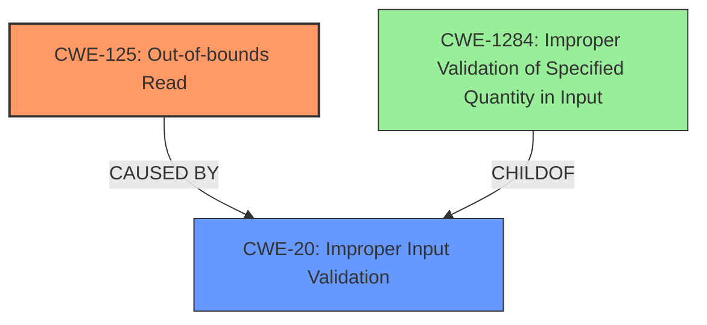

# Analysis Report for CVE-2024-11561

# Vulnerability Analysis Report: CVE-2024-11561

## Description

IrfanView DXF File Parsing **Out-Of-Bounds Read** Remote Code Execution Vulnerability. This vulnerability allows remote attackers to execute arbitrary code on affected installations of IrfanView. User interaction is required to exploit this vulnerability in that the target must visit a malicious page or open a malicious file. The specific flaw exists within the parsing of DXF files. The issue results from the **lack of proper validation of user-supplied data**, which can result in a read past the end of an allocated buffer. An attacker can leverage this vulnerability to execute code in the context of the current process. Was ZDI-CAN-24857.

## Vulnerability Description Key Phrases

- **Rootcause:** lack of proper validation of user-supplied data
- **Weakness:** Out-Of-Bounds Read
- **Impact:** ['Remote Code Execution', 'execute arbitrary code', 'execute code in the context of the current process']
- **Vector:** visiting malicious page or opening malicious file
- **Attacker:** remote attackers
- **Product:** IrfanView
- **Component:** DXF File Parsing

## Analysis (with Relationship Data)

# Summary
| CWE ID | CWE Name | Confidence | CWE Abstraction Level | CWE Vulnerability Mapping Label | CWE-Vulnerability Mapping Notes |
|---|---|---|---|---|---|
| CWE-125 | Out-of-bounds Read | 1.0 | Base | Primary | Allowed |
| CWE-20 | Improper Input Validation | 0.8 | Class | Secondary | Discouraged |

## Evidence and Confidence

*   **Confidence Score:** 0.9
*   **Evidence Strength:** HIGH

## Relationship Analysis
The primary weakness is an Out-of-bounds Read (CWE-125), which occurs due to a **lack of proper validation of user-supplied data**. CWE-125 is a base-level CWE. CWE-20 is a class-level CWE and a parent of CWE-1284 (Improper Validation of Specified Quantity in Input), which is related to validating user-supplied data. While CWE-20 is too general, it captures the high-level issue of input validation.



## Vulnerability Chain
The vulnerability chain starts with the **lack of proper validation of user-supplied data** (CWE-20). This leads to an out-of-bounds read (CWE-125), which can then be exploited for remote code execution.

## Summary of Analysis
The vulnerability description clearly states that the IrfanView DXF file parsing has an **Out-Of-Bounds Read** vulnerability due to the **lack of proper validation of user-supplied data**.

The primary CWE is CWE-125 (Out-of-bounds Read), as this is the direct result of the vulnerability. The **lack of proper validation of user-supplied data** is a contributing factor, which can be represented by CWE-20 (Improper Input Validation).

The retriever results and similar CVE descriptions also suggest CWE-787 (Out-of-bounds Write), but the vulnerability description explicitly mentions "Out-Of-Bounds Read," making CWE-125 a more accurate fit.

The final decision is based on the explicit mention of "Out-Of-Bounds Read" in the vulnerability description and the **lack of proper validation of user-supplied data**.

Relevant CWE Information:

# Enhanced Context (25 CWEs)
The following CWEs were identified as potentially relevant to this vulnerability:

## CWE-125: Out-of-bounds Read
**Abstraction Level**: Base
**Similarity Score**: 0.69
**Source**: dense

**Description**:
The product reads data past the end, or before the beginning, of the intended buffer.

**Mapping Guidance**:
- Usage: Allowed
- Rationale: This CWE entry is at the Base level of abstraction, which is a preferred level of abstraction for mapping to the root causes of vulnerabilities.

**Technical Explanation:** The vulnerability description states, "The issue results from the **lack of proper validation of user-supplied data**, which can result in a read past the end of an allocated buffer," which directly maps to this CWE.
**Security Implications:** This can lead to information disclosure or, in some cases, code execution.
**Relationship:** This is the primary weakness.

## CWE-20: Improper Input Validation
**Abstraction Level**: Class
**Similarity Score**: 0.743
**Source**: sparse

**Description**:
The product does not validate or incorrectly validates input.

**Mapping Guidance**:
- Usage: Discouraged
- Rationale: This CWE entry is a Class and might have Base-level children that would be more appropriate

**Technical Explanation:** The vulnerability is caused by the **lack of proper validation of user-supplied data**.
**Security Implications:** This allows attackers to supply malicious input that can lead to various vulnerabilities.
**Relationship:** This is a contributing factor to the primary weakness (CWE-125).

## CWE-787: Out-of-bounds Write
**Abstraction Level**: Base
**Similarity Score**: 983.05
**Source**: sparse

**Description**:
The product writes data past the end, or before the beginning, of the intended buffer.

**Mapping Guidance**:
- Usage: Allowed
- Rationale: This CWE entry is at the Base level of abstraction, which is a preferred level of abstraction for mapping to the root causes of vulnerabilities.

**Technical Explanation:** While highly ranked in retriever results and top CWEs for similar CVE descriptions, the vulnerability description specifically mentions "Out-Of-Bounds Read", not write. Thus, this is not the best fit.

## CWE-1284: Improper Validation of Specified Quantity in Input
**Abstraction Level**: Base
**Similarity Score**: 953.40
**Source**: sparse

**Description**:
The product receives input that is expected to specify a quantity (such as size or length), but it does not validate or incorrectly validates that the quantity has the required properties.

**Mapping Guidance**:
- Usage: Allowed
- Rationale: This CWE entry is at the Base level of abstraction, which is a preferred level of abstraction for mapping to the root causes of vulnerabilities.

**Technical Explanation:** The **lack of proper validation of user-supplied data** can be more specifically described by CWE-1284 where a quantity is not properly validated. This is a plausible option but the vulnerability description doesn't indicate the **lack of proper validation of user-supplied data** is a quantity.


## CWE Relationship Analysis

Current CWEs represent these abstraction levels: .


### Vulnerability Chain Analysis

**Chain starting from CWE-1284:**
- 1284 (Improper Validation of Specified Quantity in Input) - ROOT


**Chain starting from CWE-787:**
- 787 (Out-of-bounds Write) - ROOT


### CWE Relationship Diagram

```mermaid
graph TD
    classDef primary fill:#f96,stroke:#333,stroke-width:2px
    classDef secondary fill:#69f,stroke:#333
    classDef tertiary fill:#9e9,stroke:#333
```


*Report generated on 2025-07-13 01:39:39*
