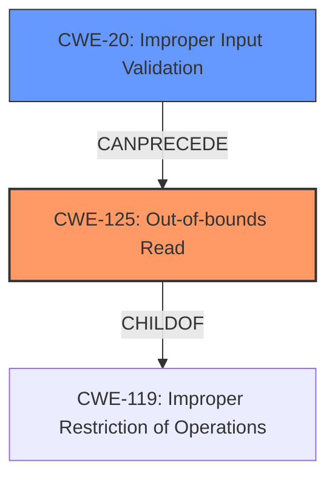

# Analysis Report for CVE-2024-11569

# Vulnerability Analysis Report: CVE-2024-11569

## Description

IrfanView DXF File Parsing Out-Of-Bounds Read Remote Code Execution Vulnerability. This vulnerability allows remote attackers to execute arbitrary code on affected installations of IrfanView. User interaction is required to exploit this vulnerability in that the target must visit a malicious page or open a malicious file. The specific flaw exists within the parsing of DXF files. The issue results from the **lack of proper validation of user-supplied data**, which can result in a read past the end of an allocated buffer. An attacker can leverage this vulnerability to execute code in the context of the current process. Was ZDI-CAN-24873.

## Vulnerability Description Key Phrases

- **Rootcause:** lack of proper validation of user-supplied data
- **Weakness:** Out-of-bounds read
- **Impact:** ['execute arbitrary code', 'execute code in the context of the current process', 'remote code execution']
- **Attacker:** remote attackers
- **Product:** IrfanView
- **Component:** DXF file parsing

## Analysis (with Relationship Data)

# Summary
| CWE ID | CWE Name | Confidence | CWE Abstraction Level | CWE Vulnerability Mapping Label | CWE-Vulnerability Mapping Notes |
|---|---|---|---|---|---|
| CWE-125 | Out-of-bounds Read | 1.0 | Base | Primary | Allowed |
| CWE-20 | Improper Input Validation | 0.7 | Class | Secondary | Discouraged |

## Evidence and Confidence

*   **Confidence Score:** 0.9
*   **Evidence Strength:** HIGH

## Relationship Analysis
The primary CWE is CWE-125 **Out-of-bounds Read** which is a base level CWE. CWE-125 is child of CWE-119 which is an **Improper Restriction of Operations within the Bounds of a Memory Buffer**. CWE-20 **Improper Input Validation** is a Class level CWE and could be the root cause, which could lead to out-of-bounds read.



## Vulnerability Chain
The vulnerability chain starts with **lack of proper validation of user-supplied data** (CWE-20), leading to an **Out-of-bounds Read** (CWE-125), and ultimately resulting in the ability to execute arbitrary code.

## Summary of Analysis
The vulnerability is due to an **Out-of-bounds Read** when parsing DXF files in IrfanView because of the **lack of proper validation of user-supplied data**. The vulnerability description explicitly mentions an **Out-of-bounds read**, so CWE-125 is chosen as the primary CWE. The root cause is the **lack of proper validation of user-supplied data** so CWE-20 is also considered.

*   **CWE-125: Out-of-bounds Read**
    *   The description states "The issue results from the **lack of proper validation of user-supplied data**, which can result in a read past the end of an allocated buffer.". This clearly indicates an out-of-bounds read.
    *   This CWE is at the Base level of abstraction.
    *   The impact is the ability to execute arbitrary code.
    *   Confidence: 1.0

*   **CWE-20: Improper Input Validation**
    *   The description states "**lack of proper validation of user-supplied data**".
    *   CWE-20 is a Class-level CWE, and while it is the root cause, the vulnerability is more precisely an Out-of-bounds Read.
    *   CWE-20 can lead to other vulnerabilities.
    *   Usage: Discouraged
    *   Confidence: 0.7

CWE-787 was considered because it was the Primary CWE Match from the "CWE for similar CVE Descriptions" section and because it was a top retriever result. However, the vulnerability description explicitly mentions an Out-of-bounds Read, therefore CWE-125 is a better match.


## CWE Relationship Analysis

Current CWEs represent these abstraction levels: .


### Vulnerability Chain Analysis

**Chain starting from CWE-119:**
- 119 (Improper Restriction of Operations within the Bounds of a Memory Buffer) - ROOT


**Chain starting from CWE-787:**
- 787 (Out-of-bounds Write) - ROOT


### CWE Relationship Diagram

```mermaid
graph TD
    classDef primary fill:#f96,stroke:#333,stroke-width:2px
    classDef secondary fill:#69f,stroke:#333
    classDef tertiary fill:#9e9,stroke:#333
```


*Report generated on 2025-07-13 01:42:06*
