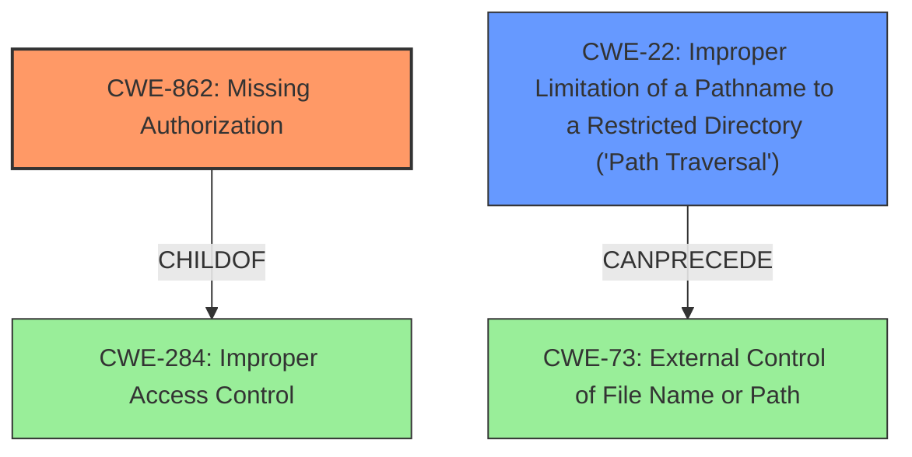

# Enhanced Analysis for CVE-2024-11585

# Summary
| CWE ID | CWE Name | Confidence | CWE Abstraction Level | CWE Vulnerability Mapping Label | CWE-Vulnerability Mapping Notes |
|---|---|---|---|---|---|
| CWE-862 | Missing Authorization | 1.0 | Class | Allowed-with-Review | Primary CWE. There is no authorization check to verify the user is authorized to perform the requested file operations. |
| CWE-22 | Improper Limitation of a Pathname to a Restricted Directory ('Path Traversal') | 0.9 | Base | Allowed | Secondary Candidate. Although there's a regex to filter the filepath, it's insufficient to prevent path traversal. |

## Evidence and Confidence

*   **Confidence Score:** 0.95
*   **Evidence Strength:** HIGH

## Relationship Analysis
The primary weakness is **CWE-862 Missing Authorization**, which is a Class-level CWE. It indicates the absence of an authorization check, allowing unauthorized access to functionality. The secondary weakness is **CWE-22 Improper Limitation of a Pathname to a Restricted Directory ('Path Traversal')**, a Base-level CWE. This allows for deletion of arbitrary files. **CWE-862** is related to **CWE-284 Improper Access Control** (Pillar) as **CWE-862** is a more specific type of access control issue. **CWE-22** can lead to **CWE-73 External Control of File Name or Path**.



## Vulnerability Chain
The vulnerability chain starts with **CWE-862 Missing Authorization**, allowing unauthenticated users to access the file deletion functionality. Then, **CWE-22 Improper Limitation of a Pathname to a Restricted Directory ('Path Traversal')** allows attackers to manipulate the file path, leading to arbitrary file content deletion and potential data loss.

## Summary of Analysis
The analysis is based on the provided evidence, which clearly indicates **missing authorization** and **insufficient file path validation** as the root causes.
The "Vulnerability Description Key Phrases" section states the **rootcause** as "**missing authorization and insufficient file path validation**." The "CVE Reference Links Content Summary" confirms this by stating, "There is no check to verify if the user is authorized to perform the requested file operations" and "Although there's a regex to filter the filepath, it's insufficient to prevent path traversal."
The primary CWE, **CWE-862 Missing Authorization**, is chosen because the application lacks an authorization check for the file deletion functionality. The secondary CWE, **CWE-22 Improper Limitation of a Pathname to a Restricted Directory ('Path Traversal')**, is included because the insufficient path validation allows attackers to delete files outside the intended directory. Both CWEs are at the appropriate level of specificity, with **CWE-862** being a Class and **CWE-22** being a Base.

Other CWEs considered but not used:

*   CWE-284: Improper Access Control - This is a high-level category. Since the specific cause of the access control issue is known (**missing authorization**), **CWE-862** is more appropriate.
*   CWE-306: Missing Authentication for Critical Function - While the vulnerability is exploitable by unauthenticated users, the core issue is the **lack of authorization**, not the absence of authentication. **CWE-862** is more precise.
* CWE-863: Incorrect Authorization - This CWE is not appropriate because there is NO authorization check at all.


## CWE Relationship Analysis

Current CWEs represent these abstraction levels: .


### Vulnerability Chain Analysis

**Chain starting from CWE-863:**
- 863 (Incorrect Authorization) - ROOT


**Chain starting from CWE-862:**
- 862 (Missing Authorization) - ROOT


### CWE Relationship Diagram

```mermaid
graph TD
    classDef primary fill:#f96,stroke:#333,stroke-width:2px
    classDef secondary fill:#69f,stroke:#333
    classDef tertiary fill:#9e9,stroke:#333
```