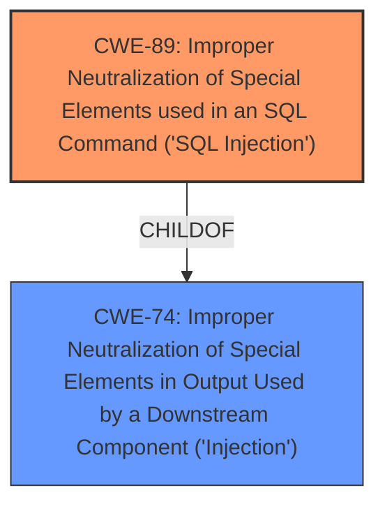

# Enhanced Analysis for CVE-2024-11592

# Summary

| CWE ID  | CWE Name                                                                           | Confidence | CWE Abstraction Level | CWE Vulnerability Mapping Label | CWE-Vulnerability Mapping Notes |
| :-------- | :--------------------------------------------------------------------------------- | :--------- | :---------------------- | :------------------------------ | :-------------------------------- |
| CWE-89    | Improper Neutralization of Special Elements used in an SQL Command ('SQL Injection') | 1.0        | Base                    | Primary CWE                     | Allowed                           |

## Evidence and Confidence

*   **Confidence Score:** 1.0
*   **Evidence Strength:** HIGH

## Relationship Analysis

The primary relationship influencing the decision is that CWE-89 is a Base level CWE, which is appropriate for root cause analysis. While CWE-74 is a parent Class of CWE-89, it is less specific and therefore less appropriate. There are no strong chain relationships indicated in the provided data.



## Vulnerability Chain

The vulnerability chain is straightforward:

1.  **Root Cause:** **Improper Neutralization of Special Elements used in an SQL Command ('SQL Injection')** (CWE-89) due to lack of input validation and sanitization on the `pagetitle` parameter.
2.  **Impact:** Unauthorized database access, sensitive data leakage, data tampering, and potential system control.

## Summary of Analysis

The analysis is primarily based on the evidence provided in the "Vulnerability Description Key Phrases" and "CVE Reference Links Content Summary" sections. The key phrase "**sql injection**" directly indicates CWE-89. The CVE Reference Links Content Summary confirms that the **root cause** is the lack of proper sanitization and validation of the `pagetitle` parameter, leading to SQL injection. The suggested mitigations, such as prepared statements and input validation, further support this classification.

The retriever results also strongly support CWE-89 as the primary CWE. While other CWEs like CWE-79, CWE-74, and CWE-1336 were considered, they are less specific to the root cause of the vulnerability, which is directly related to SQL injection.

CWE-89 is at the optimal level of specificity because it directly addresses the **root cause** of the vulnerability, which is the **improper neutralization** of special elements used in an SQL command. This is a Base level CWE, which is the preferred level for root cause analysis.

Relevant CWE Information:

# Enhanced Context (25 CWEs)
The following CWEs were identified as potentially relevant to this vulnerability:

## CWE-89: Improper Neutralization of Special Elements used in an SQL Command ('SQL Injection')
**Abstraction Level**: Base
**Similarity Score**: 0.80
**Source**: dense

**Description**:
The product constructs all or part of an SQL command using externally-influenced input from an upstream component, but it does not neutralize or incorrectly neutralizes special elements that could modify the intended SQL command when it is sent to a downstream component. Without sufficient removal or quoting of SQL syntax in user-controllable inputs, the generated SQL query can cause those inputs to be interpreted as SQL instead of ordinary user data.

**Mapping Guidance**:
- Usage: Allowed
- Rationale: This CWE entry is at the Base level of abstraction, which is a preferred level of abstraction for mapping to the root causes of vulnerabilities.
## CWE-89: Improper Neutralization of Special Elements used in an SQL Command ('SQL Injection')
**Abstraction Level**: Base
**Similarity Score**: 1415.89
**Source**: sparse

**Description**:
The product constructs all or part of an SQL command using externally-influenced input from an upstream component, but it does not neutralize or incorrectly neutralizes special elements that could modify the intended SQL command when it is sent to a downstream component. Without sufficient removal or quoting of SQL syntax in user-controllable inputs, the generated SQL query can cause those inputs to be interpreted as SQL instead of ordinary user data.

**Mapping Guidance**:
- Usage: Allowed
- Rationale: This CWE entry is at the Base level of abstraction, which is a preferred level of abstraction for mapping to the root causes of vulnerabilities.


## CWE Relationship Analysis

Current CWEs represent these abstraction levels: .


### Vulnerability Chain Analysis

**Chain starting from CWE-89:**
- 89 (Improper Neutralization of Special Elements used in an SQL Command ('SQL Injection')) - ROOT


**Chain starting from CWE-79:**
- 79 (Improper Neutralization of Input During Web Page Generation ('Cross-site Scripting')) - ROOT


### CWE Relationship Diagram

```mermaid
graph TD
    classDef primary fill:#f96,stroke:#333,stroke-width:2px
    classDef secondary fill:#69f,stroke:#333
    classDef tertiary fill:#9e9,stroke:#333
```