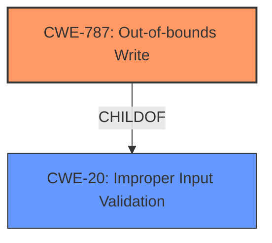

# Analysis Report for CVE-2024-11611

# Vulnerability Analysis Report: CVE-2024-11611

## Description

AutomationDirect C-More EA9 EAP9 File Parsing **Memory Corruption** Remote Code Execution Vulnerability. This vulnerability allows remote attackers to execute arbitrary code on affected installations of AutomationDirect C-More EA9. User interaction is required to exploit this vulnerability in that the target must visit a malicious page or open a malicious file. The specific flaw exists within the parsing of EAP9 files. The issue results from the **lack of proper validation of user-supplied data**, which can result in a memory corruption condition. An attacker can leverage this vulnerability to execute code in the context of the current process. Was ZDI-CAN-24774.

## Vulnerability Description Key Phrases

- **Rootcause:** ['lack of proper validation of user-supplied data', 'improper validation of user-supplied data']
- **Weakness:** Memory Corruption
- **Impact:** ['execute code in the context of the current process', 'arbitrary code execution', 'execute arbitrary code', 'Remote Code Execution']
- **Vector:** visit a malicious page or open a malicious file
- **Attacker:** remote attackers
- **Product:** AutomationDirect C-More EA9
- **Component:** EAP9 File Parsing

## Analysis (with Relationship Data)

# Summary
| CWE ID | CWE Name | Confidence | CWE Abstraction Level | CWE Vulnerability Mapping Label | CWE-Vulnerability Mapping Notes |
|---|---|---|---|---|---|
| **CWE-787** | Out-of-bounds Write | 1.0 | Base | Primary | Allowed |
| CWE-20 | Improper Input Validation | 0.7 | Class | Secondary | Discouraged |

## Evidence and Confidence

*   **Confidence Score:** 0.9
*   **Evidence Strength:** HIGH

## Relationship Analysis
The primary relationship influencing the decision is that CWE-787 **Out-of-bounds Write** is a more specific **root cause** than CWE-20 **Improper Input Validation**. While **Improper Input Validation** can lead to various issues, the description explicitly mentions **Memory Corruption** due to a **lack of proper validation of user-supplied data** which directly implies that the **out-of-bounds write** is the more precise weakness.



## Vulnerability Chain
The vulnerability chain starts with **improper input validation** (**lack of proper validation of user-supplied data**), which leads to **memory corruption**, and ultimately results in **remote code execution**.
- **Root Cause:** **Lack of proper validation of user-supplied data** during EAP9 file parsing.
- **Weakness:** **Memory Corruption** due to out-of-bounds write.
- **Impact:** Remote attackers can **execute arbitrary code** on affected systems.

The chain can be summarized as: **Improper Input Validation** -> **Out-of-bounds Write** -> **Memory Corruption** -> **Remote Code Execution**.

## Summary of Analysis
The initial analysis focused on identifying the **root cause** and the resulting impact of the vulnerability. The vulnerability description clearly states that the issue stems from a **lack of proper validation of user-supplied data**, leading to a **memory corruption** condition. The retriever results and keyphrase analysis consistently pointed to CWE-787 **Out-of-bounds Write** and CWE-20 **Improper Input Validation** as the most relevant CWEs.

The decision to prioritize CWE-787 **Out-of-bounds Write** as the primary CWE is based on the following:

1.  **Specificity:** CWE-787 is a more specific weakness that directly describes the **memory corruption** resulting from writing data beyond the intended buffer.
2.  **Evidence:** The vulnerability description explicitly mentions that the **lack of proper validation of user-supplied data** can result in a **memory corruption** condition, which aligns with the definition of an **out-of-bounds write**.
3.  **Relationship Analysis:** CWE-787 is a child of CWE-119 **Improper Restriction of Operations within the Bounds of a Memory Buffer**, indicating a more specific type of buffer-related vulnerability.
4.  **Mapping Guidance:** CWE-787 is at the Base level of abstraction, which is preferred for mapping the **root causes** of vulnerabilities.

CWE-20 **Improper Input Validation** is considered as a secondary CWE, as it represents a broader class of vulnerabilities. While **improper input validation** is the initial **root cause**, the more specific consequence is the **out-of-bounds write** leading to memory corruption.

The selected CWEs are at the optimal level of specificity because they directly address the **root cause** (**lack of proper validation**) and the resulting **memory corruption** due to writing outside the buffer boundaries. This provides a clear and accurate representation of the vulnerability.

Relevant CWE Information:

# Enhanced Context (25 CWEs)
The following CWEs were identified as potentially relevant to this vulnerability:

## CWE-824: Access of Uninitialized Pointer
**Abstraction Level**: Base
**Similarity Score**: 0.74
**Source**: dense

**Description**:
The product accesses or uses a pointer that has not been initialized.

**Mapping Guidance**:
- Usage: Allowed
- Rationale: This CWE entry is at the Base level of abstraction, which is a preferred level of abstraction for mapping to the root causes of vulnerabilities.

*Not Used:* This CWE is not appropriate because the vulnerability is caused by writing to an invalid memory location rather than accessing an uninitialized pointer.

## CWE-129: Improper Validation of Array Index
**Abstraction Level**: Variant
**Similarity Score**: 0.73
**Source**: dense

**Description**:
The product uses untrusted input when calculating or using an array index, but the product does not validate or incorrectly validates the index to ensure the index references a valid position within the array.

**Mapping Guidance**:
- Usage: Allowed
- Rationale: This CWE entry is at the Variant level of abstraction, which is a preferred level of abstraction for mapping to the root causes of vulnerabilities.

*Not Used:* While an array index might be involved, the description doesn't explicitly mention it. The core issue is the **lack of proper validation of user-supplied data** leading to memory corruption.

## CWE-807: Reliance on Untrusted Inputs in a Security Decision
**Abstraction Level**: Base
**Similarity Score**: 0.73
**Source**: dense

**Description**:
The product uses a protection mechanism that relies on the existence or values of an input, but the input can be modified by an untrusted actor in a way that bypasses the protection mechanism.

**Mapping Guidance**:
- Usage: Allowed
- Rationale: This CWE entry is at the Base level of abstraction, which is a preferred level of abstraction for mapping to the root causes of vulnerabilities.

*Not Used:* The vulnerability description does not indicate that a security decision is being bypassed due to the use of untrusted input.

## CWE-74: Improper Neutralization of Special Elements in Output Used by a Downstream Component ('Injection')
**Abstraction Level**: Class
**Similarity Score**: 0.73
**Source**: dense

**Description**:
The product constructs all or part of a command, data structure, or record using externally-influenced input from an upstream component, but it does not neutralize or incorrectly neutralizes special elements that could modify how it is parsed or interpreted when it is sent to a downstream component.

**Mapping Guidance**:
- Usage: Discouraged
- Rationale: CWE-74 is high-level and often misused when lower-level weaknesses are more appropriate.

*Not Used:* The vulnerability is not related to injection.

## CWE-788: Access of Memory Location After End of Buffer
**Abstraction Level**: Base
**Similarity Score**: 0.72
**Source**: dense

**Description**:
The product reads or writes to a buffer using an index or pointer that references a memory location after the end of the buffer.

**Mapping Guidance**:
- Usage: Discouraged
- Rationale: The CWE entry might be misused when lower-level CWE entries might be available. It also overlaps existing CWE entries and might be deprecated in the future.

*Not Used:* The description indicates that the vulnerability is due to writing past the end of the buffer, but this is better captured by CWE-787.

## CWE-73: External Control of File Name or Path
**Abstraction Level**: Base
**Similarity Score**: 0.72
**Source**: dense

**Description**:
The product allows user input to control or influence paths or file names that are used in filesystem operations.

**Mapping Guidance**:
- Usage: Allowed
- Rationale: This CWE entry is at the Base level of abstraction, which is a preferred level of abstraction for mapping to the root causes of vulnerabilities.

*Not Used:* The vulnerability is not related to external control of file names or paths.

## CWE-657: Violation of Secure Design Principles
**Abstraction Level**: Class
**Similarity Score**: 0.72
**Source**: dense

**Description**:
The product violates well-established principles for secure design.

**Mapping Guidance**:
- Usage: Discouraged
- Rationale: This CWE entry is a level-1 Class (i.e., a child of a Pillar). It might have lower-level children that would be more appropriate

*Not Used:* This is a very general CWE, and more specific CWEs are available.

## CWE-131: Incorrect Calculation of Buffer Size
**Abstraction Level**: Base
**Similarity Score**: 0.72
**Source**: dense

**Description**:
The product does not correctly calculate the size to be used when allocating a buffer, which could lead to a buffer overflow.

**Mapping Guidance**:
- Usage: Allowed
- Rationale: This CWE entry is at the Base level of abstraction, which is a preferred level of abstraction for mapping to the root causes of vulnerabilities.

*Not Used:* While this could be a contributing factor, the description focuses on the **lack of proper validation of user-supplied data** rather than incorrect calculation of buffer size.

## CWE-134: Use of Externally-Controlled Format String
**Abstraction Level**: Base


## CWE Relationship Analysis

Current CWEs represent these abstraction levels: .


### Vulnerability Chain Analysis

**Chain starting from CWE-807:**
- 807 (Reliance on Untrusted Inputs in a Security Decision) - ROOT


**Chain starting from CWE-131:**
- 131 (Incorrect Calculation of Buffer Size) - ROOT


### CWE Relationship Diagram

```mermaid
graph TD
    classDef primary fill:#f96,stroke:#333,stroke-width:2px
    classDef secondary fill:#69f,stroke:#333
    classDef tertiary fill:#9e9,stroke:#333
```


*Report generated on 2025-07-13 01:46:32*
