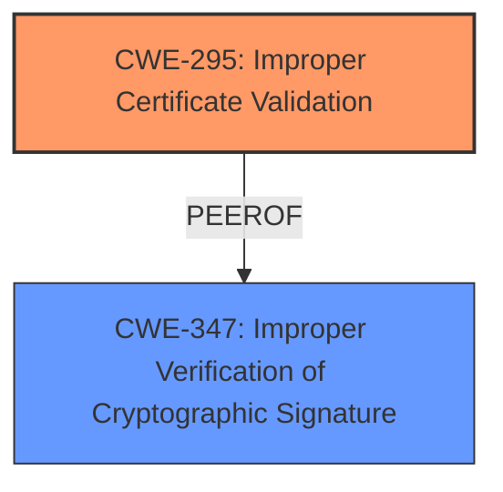

# Analysis Report for CVE-2024-11621

# Vulnerability Analysis Report: CVE-2024-11621

## Description

**Missing certificate validation** in Devolutions Remote Desktop Manager on macOS, iOS, Android, Linux allows an attacker to intercept and modify encrypted communications via a man-in-the-middle attack. Versions affected are Remote Desktop Manager macOS 2024.3.9.0 and earlier Remote Desktop Manager Linux 2024.3.2.5 and earlier Remote Desktop Manager Android 2024.3.3.7 and earlier Remote Desktop Manager iOS 2024.3.3.0 and earlier Remote Desktop Manager Powershell 2024.3.6.0 and earlier

## Vulnerability Description Key Phrases

- **Rootcause:** Missing certificate validation
- **Product:** Devolutions Remote Desktop Manager, Remote Desktop Manager Powershell
- **Impact:** intercept and modify encrypted communications, man-in-the-middle attack
- **Attacker:** attacker
- **Version:** macOS 2024.3.9.0 and earlier, Linux 2024.3.2.5 and earlier, Android 2024.3.3.7 and earlier, iOS 2024.3.3.0 and earlier, Powershell 2024.3.6.0 and earlier

## Analysis (with Relationship Data)

# Summary
| CWE ID | CWE Name | Confidence | CWE Abstraction Level | CWE Vulnerability Mapping Label | CWE-Vulnerability Mapping Notes |
|---|---|---|---|---|---|
| CWE-295 | Improper Certificate Validation | 1.0 | Base | Allowed | Primary CWE |
| CWE-347 | Improper Verification of Cryptographic Signature | 0.7 | Base | Allowed | Secondary Candidate |

## Evidence and Confidence

*   **Confidence Score:** 0.9
*   **Evidence Strength:** HIGH

## Relationship Analysis
The primary relationship influencing the decision is that **CWE-295 (Improper Certificate Validation)** is a specific type of cryptographic validation issue. While **CWE-347 (Improper Verification of Cryptographic Signature)** is more general, the vulnerability description explicitly mentions **missing certificate validation**, making **CWE-295** a more precise fit. **CWE-295** is at the Base level, providing a good level of detail.



## Vulnerability Chain
The vulnerability chain starts with the **missing certificate validation (CWE-295)**. This **root cause** allows an attacker to perform a man-in-the-middle attack, intercepting and modifying encrypted communications. The lack of proper validation is the initial flaw that leads to the security impact.

## Summary of Analysis
The initial analysis strongly points to **CWE-295 (Improper Certificate Validation)** as the primary CWE. The vulnerability description explicitly mentions **missing certificate validation**. The CVE reference confirms the **root cause** is a **missing certificate validation** allowing for MitM attacks. The retriever results also list **CWE-295** as the top candidate.

The relationship graph helped clarify that while other cryptographic issues might be related, the core problem is specifically with certificate validation.

The selected CWE is at the optimal level of specificity because it directly describes the **missing certificate validation** issue, as stated in the vulnerability description.

Relevant CWE Information:

# Enhanced Context (25 CWEs)
The following CWEs were identified as potentially relevant to this vulnerability:

## CWE-295: Improper Certificate Validation
**Abstraction Level**: Base
**Similarity Score**: 0.80
**Source**: dense

**Description**:
The product does not validate, or incorrectly validates, a certificate.

**Mapping Guidance**:
- Usage: Allowed
- Rationale: This CWE entry is at the Base level of abstraction, which is a preferred level of abstraction for mapping to the root causes of vulnerabilities.

**Technical Explanation for CWE-295:**

The vulnerability stems from the **lack of validation** of certificates in Devolutions Remote Desktop Manager. This **missing validation** allows an attacker to present a malicious certificate, which the application incorrectly trusts. The security implication is a man-in-the-middle attack where encrypted communications can be intercepted and modified. **CWE-295** is a Base-level CWE, providing a specific description of the weakness. It is the **primary** weakness in this scenario.

## CWE-347: Improper Verification of Cryptographic Signature
**Abstraction Level**: Base
**Similarity Score**: 0.77
**Source**: dense

**Description**:
The product does not verify, or incorrectly verifies, the cryptographic signature for data.

**Mapping Guidance**:
- Usage: Allowed
- Rationale: This CWE entry is at the Base level of abstraction, which is a preferred level of abstraction for mapping to the root causes of vulnerabilities.

**Technical Explanation for CWE-347:**

**CWE-347 (Improper Verification of Cryptographic Signature)** was considered because certificate validation is a form of cryptographic signature verification. However, the vulnerability description specifically mentions certificates, making **CWE-295** a more precise fit. **CWE-347** is a Base-level CWE, providing a general description of the weakness, making it a **secondary candidate** to **CWE-295**.

**Other CWEs Considered but Not Used:**

*   **CWE-20 (Improper Input Validation):** While input validation is generally important, the specific weakness is related to certificate validation, making **CWE-295** more appropriate. **CWE-20** is also discouraged.
*   **CWE-306 (Missing Authentication for Critical Function):** Although the vulnerability can lead to unauthorized access, the root cause is not a general **missing authentication** issue, but a **missing certificate validation**, thus **CWE-306** is less relevant.
*   **CWE-322 (Key Exchange without Entity Authentication):** This is related to cryptographic key exchange, but the more fundamental problem is **missing certificate validation**.
*   **CWE-770 (Allocation of Resources Without Limits or Throttling):** This is not related to certificate validation or cryptographic issues.
*   **CWE-22 (Improper Limitation of a Pathname to a Restricted Directory ('Path Traversal')) and CWE-73 (External Control of File Name or Path):** These are related to file path manipulation, which is not relevant to this vulnerability.


## CWE Relationship Analysis

Current CWEs represent these abstraction levels: .


### Vulnerability Chain Analysis

**Chain starting from CWE-770:**
- 770 (Allocation of Resources Without Limits or Throttling) - ROOT


**Chain starting from CWE-22:**
- 22 (Improper Limitation of a Pathname to a Restricted Directory ('Path Traversal')) - ROOT


### CWE Relationship Diagram

```mermaid
graph TD
    classDef primary fill:#f96,stroke:#333,stroke-width:2px
    classDef secondary fill:#69f,stroke:#333
    classDef tertiary fill:#9e9,stroke:#333
```


*Report generated on 2025-07-13 01:47:30*
