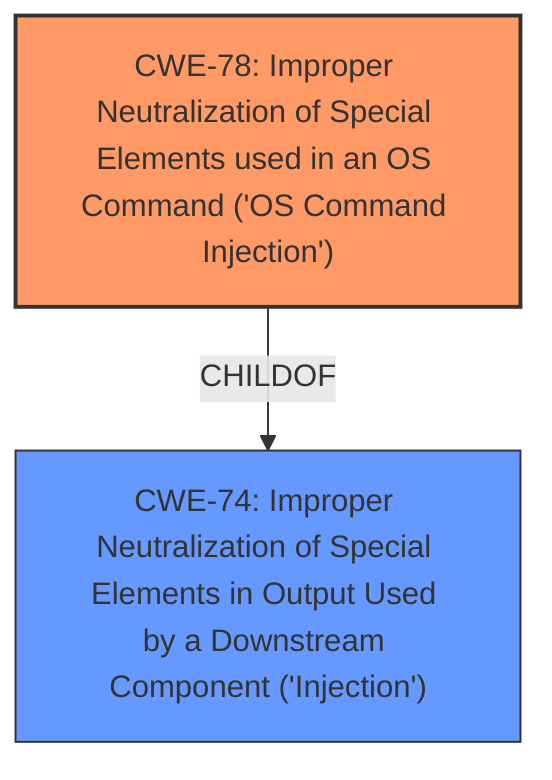

# Raw Analyzer Response for CVE-2024-11657

# Summary
| CWE ID | CWE Name | Confidence | CWE Abstraction Level | CWE Vulnerability Mapping Label | CWE-Vulnerability Mapping Notes |
|---|---|---|---|---|---|
| CWE-78 | Improper Neutralization of Special Elements used in an OS Command ('OS Command Injection') | 1.0 | Base | Allowed | Primary CWE |
| CWE-74 | Improper Neutralization of Special Elements in Output Used by a Downstream Component ('Injection') | 0.4 | Class | Discouraged | Secondary Candidate |

## Evidence and Confidence

*   **Confidence Score:** 1.0
*   **Evidence Strength:** HIGH

## Relationship Analysis
The primary relationship influencing the CWE selection is the hierarchical relationship between CWE-74 and CWE-78. CWE-78 is a child of CWE-74, representing a more specific type of injection related to OS commands. The evidence strongly supports the presence of OS command injection, making CWE-78 the more appropriate choice. CWE-77, although similar, is a Class-level CWE and thus less specific than CWE-78.

## Vulnerability Chain
The vulnerability chain starts with **improper neutralization** of input, specifically the `diag_nslookup` argument, which directly leads to **command injection**. This allows for arbitrary code execution, potentially leading to full system compromise. The root cause is the lack of input validation, with the ultimate impact being arbitrary command execution.
  - The **Primary CWE** is **CWE-78: Improper Neutralization of Special Elements used in an OS Command ('OS Command Injection')** because it identifies the issue that led to the vulnerability.

## Summary of Analysis
The analysis strongly supports the selection of CWE-78 as the primary CWE. The vulnerability description explicitly mentions "command injection" due to the manipulation of the `diag_nslookup` argument. The CVE Reference Links Content Summary confirms that user-supplied input is passed to a system command execution function without proper filtering or validation. This directly aligns with the characteristics of CWE-78. The high retriever score and the base level abstraction further support this decision.

The selection of CWE-78 is based on concrete evidence from the provided text, particularly the vulnerability description and the CVE Reference Links Content Summary. The hierarchical relationship analysis reinforces the choice, as CWE-78 is a more specific child of CWE-74. The mapping guidance for CWE-78 allows its usage, further validating the decision.

The vulnerability chain clearly indicates that the root cause is the **improper neutralization** of special elements in the OS command, leading to command injection. CWE-78 directly addresses this root cause and its associated impact.

Relevant CWE Information:

# Enhanced Context (25 CWEs)
The following CWEs were identified as potentially relevant to this vulnerability:

## CWE-78: Improper Neutralization of Special Elements used in an OS Command ('OS Command Injection')
**Abstraction Level**: Base
**Similarity Score**: 0.77
**Source**: dense

**Description**:
The product constructs all or part of an OS command using externally-influenced input from an upstream component, but it does not neutralize or incorrectly neutralizes special elements that could modify the intended OS command when it is sent to a downstream component.

**Mapping Guidance**:
- Usage: Allowed
- Rationale: This CWE entry is at the Base level of abstraction, which is a preferred level of abstraction for mapping to the root causes of vulnerabilities.

**Evidence:** The description explicitly states "manipulation of the argument diag_nslookup leads to **command injection**" and the CVE Reference Links Content Summary states "User-supplied input to `diag_nslookup` is directly passed to a system command execution function (`diag_command`) without any filtering or validation."

## CWE-74: Improper Neutralization of Special Elements in Output Used by a Downstream Component ('Injection')
**Abstraction Level**: Class
**Similarity Score**: 0.76
**Source**: dense

**Description**:
The product constructs all or part of a command, data structure, or record using externally-influenced input from an upstream component, but it does not neutralize or incorrectly neutralizes special elements that could modify how it is parsed or interpreted when it is sent to a downstream component.

**Mapping Guidance**:
- Usage: Discouraged
- Rationale: CWE-74 is high-level and often misused when lower-level weaknesses are more appropriate.

**Evidence:** While the vulnerability involves injection, the specific type is command injection, making the more specific CWE-78 a better fit. However, CWE-74 is a parent of CWE-78 and indicates injection is occuring.

The retriever listed several other CWEs, but they are not as relevant as CWE-78:

*   CWE-77: Improper Neutralization of Special Elements used in a Command ('Command Injection') - This is a Class-level CWE, making it less specific than CWE-78.
*   CWE-89: Improper Neutralization of Special Elements used in an SQL Command ('SQL Injection') - This relates to SQL injection, which is not indicated in the vulnerability description.
*   CWE-79: Improper Neutralization of Input During Web Page Generation ('Cross-site Scripting') - This relates to Cross-site Scripting, which is not indicated in the vulnerability description.
*   CWE-1336: Improper Neutralization of Special Elements Used in a Template Engine - This relates to template injection, which is not indicated in the vulnerability description.
*   CWE-434: Unrestricted Upload of File with Dangerous Type - This relates to file upload vulnerabilities, which is not indicated in the vulnerability description.
*   CWE-93: Improper Neutralization of CRLF Sequences ('CRLF Injection') - This relates to CRLF injection, which is not indicated in the vulnerability description.
*   CWE-306: Missing Authentication for Critical Function - While authentication is required, the primary issue is command injection, not missing authentication.
*   CWE-912: Hidden Functionality - This is not indicated in the vulnerability description.
*   CWE-184: Incomplete List of Disallowed Inputs - This weakness is not described in the summary.