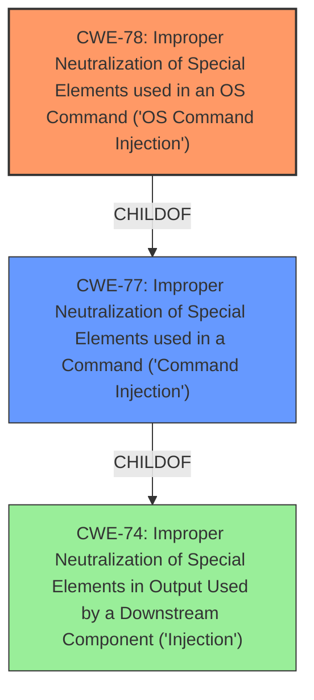

# Enhanced Analysis for CVE-2024-11665

# Summary

| CWE ID | CWE Name | Confidence | CWE Abstraction Level | CWE Vulnerability Mapping Label | CWE-Vulnerability Mapping Notes |
|---|---|---|---|---|---|
| CWE-78 | Improper Neutralization of Special Elements used in an OS Command ('OS Command Injection') | 1.0 | Base | Allowed | Primary CWE |
| CWE-77 | Improper Neutralization of Special Elements used in a Command ('Command Injection') | 0.8 | Class | Allowed-with-Review | Secondary Candidate |

## Evidence and Confidence

*   **Confidence Score:** 0.9
*   **Evidence Strength:** HIGH

## Relationship Analysis
The primary relationship that influenced my decision was the hierarchical relationship between CWE-77 and CWE-78. CWE-78 is a specific type of CWE-77, focusing on OS commands. Given the vulnerability description explicitly mentions OS command injection, CWE-78 is a more precise and appropriate classification.



## Vulnerability Chain
The vulnerability chain starts with the **improper neutralization of special elements** within user-controlled input. This leads directly to the execution of arbitrary OS commands, resulting in a full compromise of the charging station controller.

## Summary of Analysis
The analysis is heavily based on the provided evidence, including the vulnerability description and the CVE reference links content summary. The key phrase "Improper Neutralization of Special Elements used in a Command (Command Injection)" from the vulnerability description directly points to a command injection vulnerability. The CVE reference links further clarify that the vulnerability allows execution of arbitrary OS commands.
CWE-78 is at the optimal level of specificity as it accurately reflects the vulnerability's nature, focusing on OS command injection rather than a more general command injection.

Relevant CWE Information:

# Enhanced Context (25 CWEs)
The following CWEs were identified as potentially relevant to this vulnerability:

## CWE-74: Improper Neutralization of Special Elements in Output Used by a Downstream Component ('Injection')
**Abstraction Level**: Class
**Similarity Score**: 0.78
**Source**: dense

**Description**:
The product constructs all or part of a command, data structure, or record using externally-influenced input from an upstream component, but it does not neutralize or incorrectly neutralizes special elements that could modify how it is parsed or interpreted when it is sent to a downstream component.

**Mapping Guidance**:
- Usage: Discouraged
- Rationale: CWE-74 is high-level and often misused when lower-level weaknesses are more appropriate.

## CWE-78: Improper Neutralization of Special Elements used in an OS Command ('OS Command Injection')
**Abstraction Level**: Base
**Similarity Score**: 3.31
**Source**: graph

**Description**:
The product constructs all or part of an OS command using externally-influenced input from an upstream component, but it does not neutralize or incorrectly neutralizes special elements that could modify the intended OS command when it is sent to a downstream component.

**Mapping Guidance**:
- Usage: Allowed
- Rationale: This CWE entry is at the Base level of abstraction, which is a preferred level of abstraction for mapping to the root causes of vulnerabilities.

**Relationships**:
- CANFOLLOW -> CWE-184
- CANALSOBE -> CWE-88
- CHILDOF -> CWE-77
- CHILDOF -> CWE-77
- CHILDOF -> CWE-74

### CWE-78: Improper Neutralization of Special Elements used in an OS Command ('OS Command Injection')
*   **CWE-78** matches the vulnerability because the root cause is the **improper neutralization** of input that is used to construct OS commands. The impact is arbitrary OS command execution.
*   CWE-78 is a Base level CWE, which is the preferred level.
*   The vulnerability description specifically mentions "OS Command Injection".
*   Confidence: 1.0

### CWE-77: Improper Neutralization of Special Elements used in a Command ('Command Injection')
*   **CWE-77** is a more general form of command injection. While applicable, CWE-78 is more specific.
*   CWE-77 is a Class level CWE.
*   The **rootcause** is **Improper Neutralization of Special Elements used in a Command**.
*   Confidence: 0.8

### Other CWEs Considered and Rejected:

*   CWE-89: Improper Neutralization of Special Elements used in an SQL Command ('SQL Injection'): This CWE is specific to SQL injection, which is not the case here.
*   CWE-138: Improper Neutralization of Special Elements: This CWE is too generic and doesn't provide specific details about the type of injection.
*   CWE-1336: Improper Neutralization of Special Elements Used in a Template Engine: This CWE is specific to template engines, which is not mentioned in the vulnerability description.
*   CWE-1236: Improper Neutralization of Formula Elements in a CSV File: This CWE is specific to CSV files, which are not relevant here.
*   CWE-74: Improper Neutralization of Special Elements in Output Used by a Downstream Component ('Injection'): This CWE is a high-level category for injection vulnerabilities and is too broad compared to CWE-78.
*   CWE-184: Incomplete List of Disallowed Inputs: While relevant as a potential contributing factor, the primary issue is the lack of proper neutralization, making CWE-78 a more direct mapping.


## CWE Relationship Analysis

Current CWEs represent these abstraction levels: .


### Vulnerability Chain Analysis

**Chain starting from CWE-89:**
- 89 (Improper Neutralization of Special Elements used in an SQL Command ('SQL Injection')) - ROOT


**Chain starting from CWE-88:**
- 88 (Improper Neutralization of Argument Delimiters in a Command ('Argument Injection')) - ROOT


### CWE Relationship Diagram

```mermaid
graph TD
    classDef primary fill:#f96,stroke:#333,stroke-width:2px
    classDef secondary fill:#69f,stroke:#333
    classDef tertiary fill:#9e9,stroke:#333
```