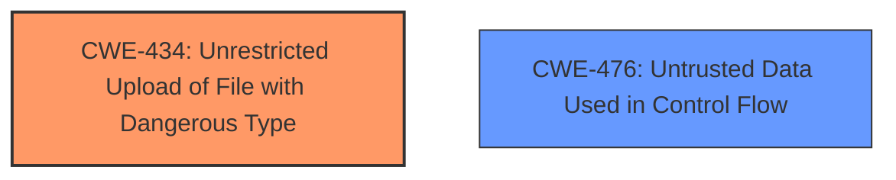

# Raw Analyzer Response for CVE-2024-11674

# Summary
| CWE ID | CWE Name | Confidence | CWE Abstraction Level | CWE Vulnerability Mapping Label | CWE-Vulnerability Mapping Notes |
|---|---|---|---|---|---|
| CWE-434 | Unrestricted Upload of File with Dangerous Type | 1.0 | Base | Allowed | Primary CWE |
| CWE-476 | Untrusted Data Used in Control Flow | 0.6 | Base | Allowed | Secondary Candidate |

## Evidence and Confidence

*   **Confidence Score:** 1.0
*   **Evidence Strength:** HIGH

## Relationship Analysis
The primary relationship influencing the CWE selection is the direct match of the vulnerability description to the characteristics of CWE-434. The vulnerability involves **unrestricted upload** of files, which aligns directly with the definition of CWE-434. CWE-476 was considered as a potential secondary CWE due to the possibility of the uploaded file being used in control flow, but evidence is lacking.

## Vulnerability Chain
The vulnerability chain starts with the **unrestricted upload** of a file (CWE-434). If a malicious file is uploaded and executed, it can lead to Remote Code Execution (RCE).

## Summary of Analysis
The primary CWE is CWE-434 because the **root cause** of the vulnerability is the **unrestricted upload** of files without proper validation. The CVE Reference Links Content Summary provides sufficient evidence for this classification, stating that the system allows users to upload files without proper validation, and the code doesn't verify the file extension or MIME type before saving the file. The retriever results also list CWE-434 as a top candidate. I am highly confident in this assessment because the vulnerability description and the detailed information in the CVE Reference Links Content Summary directly match the definition of CWE-434.

Relevant CWE Information:

# Enhanced Context (25 CWEs)
The following CWEs were identified as potentially relevant to this vulnerability:

## CWE-434: Unrestricted Upload of File with Dangerous Type
**Abstraction Level**: Base
**Similarity Score**: 0.84
**Source**: dense

**Description**:
The product allows the upload or transfer of dangerous file types that are automatically processed within its environment.

**Mapping Guidance**:
- Usage: Allowed
- Rationale: This CWE entry is at the Base level of abstraction, which is a preferred level of abstraction for mapping to the root causes of vulnerabilities.

## CWE-434: Unrestricted Upload of File with Dangerous Type
**Abstraction Level**: Base
**Similarity Score**: 1163.00
**Source**: sparse

**Description**:
The product allows the upload or transfer of dangerous file types that are automatically processed within its environment.

**Mapping Guidance**:
- Usage: Allowed
- Rationale: This CWE entry is at the Base level of abstraction, which is a preferred level of abstraction for mapping to the root causes of vulnerabilities.

## CWE-434: Unrestricted Upload of File with Dangerous Type
**Abstraction Level**: Base
**Similarity Score**: 2.94
**Source**: graph

**Description**:
The product allows the upload or transfer of dangerous file types that are automatically processed within its environment.

**Mapping Guidance**:
- Usage: Allowed
- Rationale: This CWE entry is at the Base level of abstraction, which is a preferred level of abstraction for mapping to the root causes of vulnerabilities.

**Relationships**:
- CANFOLLOW -> CWE-73
- CANFOLLOW -> CWE-184
- CANFOLLOW -> CWE-183
- PEEROF -> CWE-430
- PEEROF -> CWE-436

## CWE-476: Untrusted Data Used in Control Flow

**Abstraction Level**: Base
**Similarity Score**: Not Listed
**Source**: N/A

**Description**:
The application uses data from an untrusted source to directly control the execution flow of the application. This can lead to unexpected behavior, including code execution, denial of service, and privilege escalation.

**Why Not Used**:

CWE-73, CWE-79, CWE-89, CWE-95, CWE-138, CWE-425, CWE-472, CWE-552, CWE-639, CWE-1336, CWE-471, CWE-94, CWE-184, CWE-494, CWE-22 are not selected because there is not enough evidence to support them.
CWE-116, CWE-705, CWE-1391 are Class types, so they are not selected.
CWE-306 is not selected because the vulnerability summary says the Attacker Capabilities/Position requires "Authentication: The attacker needs to be an authenticated user"
CWE-1241 is not selected because there is no mention of random number generators in the summary.

---

**CWE-434: Unrestricted Upload of File with Dangerous Type**

*   **Technical Explanation:** The vulnerability occurs because the application does not properly validate the type of file being uploaded. This allows an attacker to upload a malicious file, such as a PHP script, and execute it on the server. The **root cause** is the **missing or insufficient validation** of the uploaded file's type.
*   **Security Implications:** This can lead to Remote Code Execution (RCE), allowing the attacker to compromise the server, access sensitive data, or perform other malicious actions.
*   **Relationship Analysis:** CWE-434 is a Base level CWE, which is appropriate for this vulnerability.
*   **Mapping Guidance Influence:** The MITRE mapping guidance recommends using Base level CWEs when possible, and CWE-434 is a direct match for the vulnerability.
*   **Primary/Secondary:** This is the primary CWE.
*   **Confidence:** 1.0

**CWE-476: Untrusted Data Used in Control Flow**

*   **Technical Explanation:** While the primary issue is the unrestricted file upload, there's a potential for the uploaded file to be used in control flow. If the application processes the uploaded file and uses its content to make decisions, CWE-476 might be applicable. However, there is no evidence to support this.
*   **Security Implications:** If the uploaded file is used to control the application's logic, it can lead to various security issues.
*   **Relationship Analysis:** This is potentially a secondary CWE, if the uploaded file is used to control the application.
*   **Mapping Guidance Influence:** N/A.
*   **Primary/Secondary:** This is a secondary candidate.
*   **Confidence:** 0.6