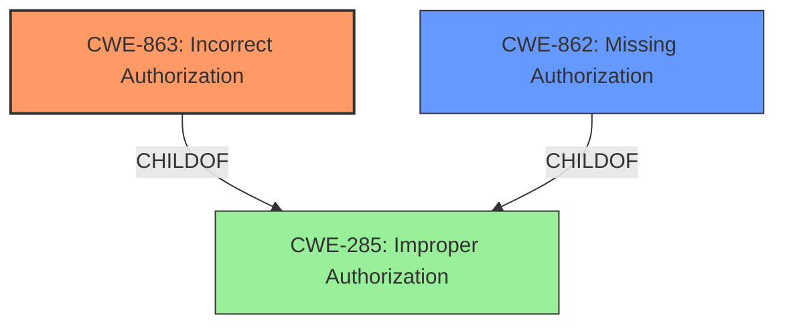

# Raw Analyzer Response for CVE-2024-11741

# Summary
| CWE ID  | CWE Name                                                                 | Confidence | CWE Abstraction Level | CWE Vulnerability Mapping Label | CWE-Vulnerability Mapping Notes |
| :-------- | :----------------------------------------------------------------------- | :--------- | :-------------------- | :------------------------------ | :------------------------------ |
| CWE-863   | Incorrect Authorization                                                  | 0.9        | Class                 | Primary                         | Allowed-with-Review             |
| CWE-862 | Missing Authorization                                                  | 0.7        | Class                 | Secondary                         | Allowed-with-Review             |

## Evidence and Confidence

*   **Confidence Score:** 0.8
*   **Evidence Strength:** HIGH

## Relationship Analysis

The primary relationship that influenced my decision was the parent-child relationship between CWE-285 (Improper Authorization), CWE-862 (Missing Authorization), and CWE-863 (Incorrect Authorization). CWE-863 is a Class-level CWE that describes a situation where an authorization check is performed, but it is done incorrectly. CWE-862 is also a Class-level CWE that describes a situation where an authorization check is missing altogether. Since the vulnerability description states that the Grafana Alerting VictorOps integration was **not properly protected**, I considered both CWE-863 and CWE-862. The choice of CWE-863 was influenced by the fact that some level of protection was presumably in place, but it was **not properly** implemented, thus leaning towards an incorrect authorization rather than a complete absence of authorization.

## Vulnerability Chain

The vulnerability chain starts with an **improper protection** of the Grafana Alerting VictorOps integration, which leads to users with Viewer permission being able to access information they should not have.

1.  **Root Cause:** **Not properly protected** (Incorrect Authorization)
2.  **Weakness:** Improper access control
3.  **Impact:** Exposure of the Grafana Alerting VictorOps integration to users with Viewer permission.

The primary CWE is CWE-863 (Incorrect Authorization) because it directly addresses the **incorrect** implementation of authorization mechanisms. The secondary CWE is CWE-862 (Missing Authorization) because it is possible that the protection was not only incorrectly implemented but also, to some extent, absent for users with Viewer permissions.

## Summary of Analysis

Initially, I considered both CWE-863 (Incorrect Authorization) and CWE-862 (Missing Authorization). The vulnerability description states that the Grafana Alerting VictorOps integration was **not properly protected**, which suggests that some form of protection was intended but was implemented incorrectly. The evidence from the CVE Reference Links Content Summary states "The Grafana Alerting VictorOps integration was not properly protected," further reinforcing the notion of an incorrect authorization mechanism. The retriever results also listed CWE-863 as the top combined result.

The graph relationships show that both CWE-863 and CWE-862 are children of CWE-285 (Improper Authorization), a more general class. Given the specific detail in the vulnerability description about the improper protection, selecting CWE-863 provides a more accurate and specific representation of the vulnerability.

The selection of CWE-863 is at the optimal level of specificity because it is a Class-level CWE that directly addresses the **incorrect** implementation of authorization, aligning with the evidence provided.
Relevant CWE Information:

# Enhanced Context (25 CWEs)
The following CWEs were identified as potentially relevant to this vulnerability:

## CWE-306: Missing Authentication for Critical Function
**Abstraction Level**: Base
**Similarity Score**: 2.40
**Source**: graph

**Description**:
CWE-306: Missing Authentication for Critical Function

**Mapping Guidance**:
- Usage: Allowed
- Rationale: This CWE entry is at the Base level of abstraction, which is a preferred level of abstraction for mapping to the root causes of vulnerabilities.

**Relationships**:
- PARENTOF -> CWE-322
- PARENTOF -> CWE-288
- CHILDOF -> CWE-287
- CHILDOF -> CWE-287
- CHILDOF -> CWE-306