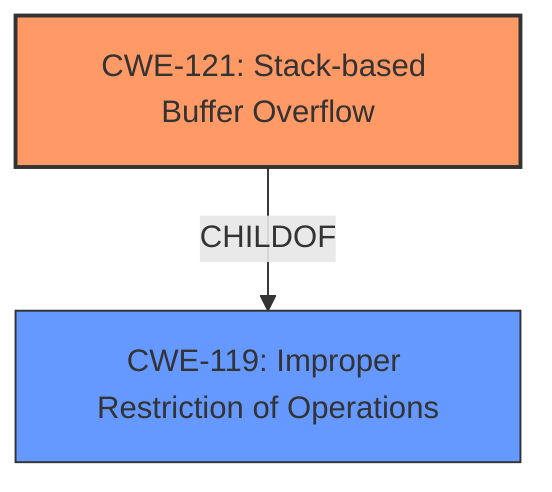

# Analysis Report for CVE-2024-11745

# Vulnerability Analysis Report: CVE-2024-11745

## Description

A vulnerability was found in Tenda AC8 16.03.34.09 and classified as critical. Affected by this issue is the function route_static_check of the file /goform/SetStaticRouteCfg. The manipulation of the argument list leads to **stack-based buffer overflow**. The attack may be launched remotely. The exploit has been disclosed to the public and may be used.

## Vulnerability Description Key Phrases

- **Weakness:** stack-based buffer overflow
- **Vector:** manipulation of the argument list
- **Product:** Tenda AC8
- **Version:** 16.03.34.09
- **Component:** route_static_check in /goform/SetStaticRouteCfg

## Analysis (with Relationship Data)

# Summary
| CWE ID  | CWE Name                                                                        | Confidence | CWE Abstraction Level | CWE Vulnerability Mapping Label | CWE-Vulnerability Mapping Notes |
| :------- | :------------------------------------------------------------------------------ | :--------- | :---------------------- | :------------------------------ | :------------------------------ |
| CWE-121 | Stack-based Buffer Overflow                                                     | 1.0        | Variant               | Primary                         | Allowed                       |
| CWE-119 | Improper Restriction of Operations within the Bounds of a Memory Buffer        | 0.7        | Class                  | Secondary                       | Discouraged                     |

## Evidence and Confidence

*   **Confidence Score:** 1.0
*   **Evidence Strength:** HIGH

## Relationship Analysis
The primary CWE selected is CWE-121, which is a variant of CWE-119. This parent-child relationship influenced the decision to prioritize the more specific CWE-121, as it directly reflects the vulnerability description. The other CWEs are not directly related to buffer overflows.



## Vulnerability Chain
The vulnerability chain starts with the **stack-based buffer overflow** (CWE-121) due to the manipulation of the argument list. This leads to the potential for arbitrary code execution.

## Summary of Analysis
The analysis is based on the vulnerability description, which explicitly states "**stack-based buffer overflow**". This directly corresponds to CWE-121. The confidence level is high (1.0) because the description contains sufficient evidence. The retriever results also list CWE-121 as a potential match.

The selection of CWE-121 is at the optimal level of specificity, as it is a variant that accurately describes the vulnerability.

Relevant CWE Information:

# Enhanced Context (25 CWEs)
The following CWEs were identified as potentially relevant to this vulnerability:

## CWE-121: Stack-based Buffer Overflow
**Abstraction Level**: Variant
**Similarity Score**: 0.74
**Source**: dense

**Description**:
A stack-based buffer overflow condition is a condition where the buffer being overwritten is allocated on the stack (i.e., is a local variable or, rarely, a parameter to a function).

**Mapping Guidance**:
- Usage: Allowed
- Rationale: This CWE entry is at the Variant level of abstraction, which is a preferred level of abstraction for mapping to the root causes of vulnerabilities.

### Initial Analysis
The vulnerability description clearly states "stack-based buffer overflow", which makes CWE-121 the most suitable candidate. The retriever results confirm this with a relatively high score.

### Criticism and Conclusion
The evidence is sufficient to confidently assign CWE-121. The retriever results and the vulnerability description align, making this a straightforward mapping. The other CWEs listed in the retriever results are not relevant to the specific vulnerability described.

CWE-119, "Improper Restriction of Operations within the Bounds of a Memory Buffer," was considered as a more general classification. However, since the vulnerability is specifically a **stack-based buffer overflow**, CWE-121 is the more accurate choice. The description mentions the "**stack-based buffer overflow**" vulnerability that is affected by the manipulation of the argument list.

CWE-190, CWE-89, CWE-79, CWE-125, CWE-674, CWE-1284, CWE-78, and CWE-128 were all considered but ultimately rejected as they do not align with the specific details of a **stack-based buffer overflow** vulnerability. These other CWEs address different types of weaknesses such as integer overflows, SQL injection, cross-site scripting, out-of-bounds reads, uncontrolled recursion, improper input validation, OS command injection, and wrap-around errors, respectively.


## CWE Relationship Analysis

Current CWEs represent these abstraction levels: .


### Vulnerability Chain Analysis

**Chain starting from CWE-89:**
- 89 (Improper Neutralization of Special Elements used in an SQL Command ('SQL Injection')) - ROOT


**Chain starting from CWE-121:**
- 121 (Stack-based Buffer Overflow) - ROOT


### CWE Relationship Diagram

```mermaid
graph TD
    classDef primary fill:#f96,stroke:#333,stroke-width:2px
    classDef secondary fill:#69f,stroke:#333
    classDef tertiary fill:#9e9,stroke:#333
```


*Report generated on 2025-07-13 02:02:33*
