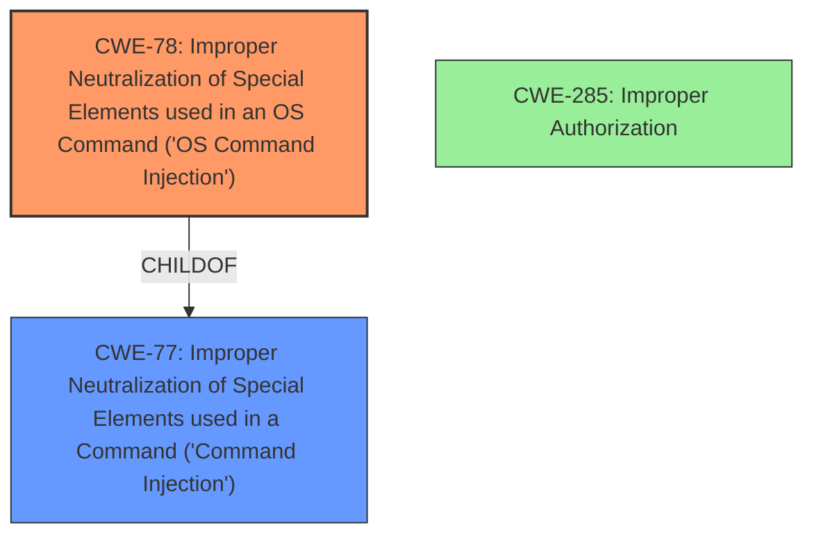

# Analysis for CVE-2024-11772

# Summary
| CWE ID | CWE Name | Confidence | CWE Abstraction Level | CWE Vulnerability Mapping Label | CWE-Vulnerability Mapping Notes |
|---|---|---|---|---|---|
| CWE-78 | Improper Neutralization of Special Elements used in an OS Command ('OS Command Injection') | 1.0 | Base | Allowed | Primary CWE - This is the root cause of the vulnerability. The application fails to properly neutralize special elements in an OS command, allowing an attacker to inject malicious commands. |
| CWE-77 | Improper Neutralization of Special Elements used in a Command ('Command Injection') | 0.7 | Class | Allowed-with-Review | Secondary Candidate - Although CWE-78 is more specific, CWE-77 represents the broader class of command injection. |
| CWE-285 | Improper Authorization | 0.5 | Class | Discouraged | Secondary Candidate - The vulnerability requires admin privileges. The authorization might not be correctly validated, but the core issue is command injection after authentication. |

## Evidence and Confidence

*   **Confidence Score:** 0.9
*   **Evidence Strength:** HIGH

## Relationship Analysis
The primary relationship influencing the decision is the ChildOf relationship between CWE-78 and CWE-77. CWE-78 is a more specific form of CWE-77, and since the vulnerability description explicitly mentions OS command injection, CWE-78 is the more appropriate choice. CWE-285 was considered due to the admin privileges requirement, but the root cause is the **command injection** itself, not the authorization **weakness**. Therefore, authorization is a prerequisite condition, but not the primary **weakness**.

## Vulnerability Chain
The vulnerability chain starts with the attacker authenticating with admin privileges (prerequisite). Then, due to **improper neutralization** of special elements, the attacker can inject OS commands, leading to remote code execution (impact).

Authentication with Admin Privileges -> **Improper Neutralization of Special Elements in OS Command (CWE-78)** -> Remote Code Execution

## Summary of Analysis
The initial analysis identified CWE-78 as the primary **weakness** due to the explicit mention of command injection. The retriever results and graph relationships support this decision, with CWE-78 being a specific instance of the more general CWE-77. Although admin privileges are required, the root cause is the **improper neutralization** that allows command injection.

The evidence supporting this assessment comes directly from the vulnerability description, which states: "**Command injection** in the admin web console of Ivanti CSA before version 5.0.3 allows a remote authenticated attacker with admin privileges to achieve remote code execution." The phrase "**command injection**" strongly indicates CWE-78.

CWE-78 is at the optimal level of specificity as it accurately captures the nature of the **weakness**.
CWE-77 is a more generic entry, and while it applies, CWE-78 provides a more precise classification. Other CWEs related to authorization were considered but deemed less relevant as they represent conditions rather than the root cause.

# Enhanced Context (25 CWEs)
The following CWEs were identified as potentially relevant to this vulnerability:

## CWE-266: Incorrect Privilege Assignment
**Abstraction Level**: Base
**Similarity Score**: 0.77
**Source**: dense

**Description**:
A product incorrectly assigns a privilege to a particular actor, creating an unintended sphere of control for that actor.

**Mapping Guidance**:
- Usage: Allowed
- Rationale: This CWE entry is at the Base level of abstraction, which is a preferred level of abstraction for mapping to the root causes of vulnerabilities.

**REJECTED**: This CWE is not relevant because the vulnerability description says that the attacker has "admin privileges." It doesn't mention the attacker having the **incorrect privilege assignment**.

## CWE-74: Improper Neutralization of Special Elements in Output Used by a Downstream Component ('Injection')
**Abstraction Level**: Class
**Similarity Score**: 0.76
**Source**: dense

**Description**:
The product constructs all or part of a command, data structure, or record using externally-influenced input from an upstream component, but it does not neutralize or incorrectly neutralizes special elements that could modify how it is parsed or interpreted when it is sent to a downstream component.

**Mapping Guidance**:
- Usage: Discouraged
- Rationale: CWE-74 is high-level and often misused when lower-level weaknesses are more appropriate.

**REJECTED**: Although the vulnerability is command injection, CWE-78 is much more specific. The Usage is Discouraged.

## CWE-267: Privilege Defined With Unsafe Actions
**Abstraction Level**: Base
**Similarity Score**: 0.76
**Source**: dense

**Description**:
A particular privilege, role, capability, or right can be used to perform unsafe actions that were not intended, even when it is assigned to the correct entity.

**Mapping Guidance**:
- Usage: Allowed
- Rationale: This CWE entry is at the Base level of abstraction, which is a preferred level of abstraction for mapping to the root causes of vulnerabilities.

**REJECTED**: This CWE is not relevant because the vulnerability description says that the attacker has "admin privileges." It doesn't say anything about the privilege itself being unsafe.

## CWE-280: Improper Handling of Insufficient Permissions or Privileges 
**Abstraction Level**: Base
**Similarity Score**: 0.76
**Source**: dense

**Description**:
The product does not handle or incorrectly handles when it has insufficient privileges to access resources or functionality as specified by their permissions. This may cause it to follow unexpected code paths that may leave the product in an invalid state.

**Mapping Guidance**:
- Usage: Allowed
- Rationale: This CWE entry is at the Base level of abstraction, which is a preferred level of abstraction for mapping to the root causes of vulnerabilities.

**REJECTED**: This CWE is not relevant because the attacker has admin privileges.

## CWE-274: Improper Handling of Insufficient Privileges
**Abstraction Level**: Base
**Similarity Score**: 0.76
**Source**: dense

**Description**:
The product does not handle or incorrectly handles when it has insufficient privileges to perform an operation, leading to resultant weaknesses.

**Mapping Guidance**:
- Usage: Discouraged
- Rationale: This CWE entry could be deprecated in a future version of CWE.

**REJECTED**: This CWE is not relevant because the attacker has admin privileges. Usage is Discouraged.

## CWE-41: Improper Resolution of Path Equivalence
**Abstraction Level**: Base
**Similarity Score**: 0.75
**Source**: dense

**Description**:
The product is vulnerable to file system contents disclosure through path equivalence. Path equivalence involves the use of special characters in file and directory names. The associated manipulations are intended to generate multiple names for the same object.

**Mapping Guidance**:
- Usage: Allowed
- Rationale: This CWE entry is at the Base level of abstraction, which is a preferred level of abstraction for mapping to the root causes of vulnerabilities.

**REJECTED**: This vulnerability is not related to path equivalence.

## CWE-807: Reliance on Untrusted Inputs in a Security Decision
**Abstraction Level**: Base
**Similarity Score**: 0.75
**Source**: dense

**Description**:
The product uses a protection mechanism that relies on the existence or values of an input, but the input can be modified by an untrusted actor in a way that bypasses the protection mechanism.

**Mapping Guidance**:
- Usage: Allowed
- Rationale: This CWE entry is at the Base level of abstraction, which is a preferred level of abstraction for mapping to the root causes of vulnerabilities.

**REJECTED**: Although the input is untrusted, this CWE is not a direct fit. The core issue is the command injection rather than reliance on untrusted input for a security decision.

## CWE-472: External Control of Assumed-Immutable Web Parameter
**Abstraction Level**: Base
**Similarity Score**: 0.75
**Source**: dense

**Description**:
The web application does not sufficiently verify inputs that are assumed to be immutable but are actually externally controllable, such as hidden form fields.

**Mapping Guidance**:
- Usage: Allowed
- Rationale: This CWE entry is at the Base level of abstraction, which is a preferred level of abstraction for mapping to the root causes of vulnerabilities.

**REJECTED**: This CWE is not relevant to command injection.

## CWE-183: Permissive List of Allowed Inputs
**Abstraction Level**: Base
**Similarity Score**: 0.75
**Source**: dense

**Description**:
The product implements a protection mechanism