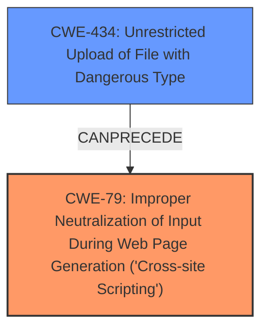

# Enhanced Analysis for CVE-2024-11847

# Summary
| CWE ID | CWE Name | Confidence | CWE Abstraction Level | CWE Vulnerability Mapping Label | CWE-Vulnerability Mapping Notes |
|---|---|---|---|---|---|
| CWE-79 | Improper Neutralization of Input During Web Page Generation ('Cross-site Scripting') | 1.0 | Base | Allowed | Primary CWE. The plugin **does not sanitize SVG file contents**, leading to stored **XSS** attacks. |
| CWE-434 | Unrestricted Upload of File with Dangerous Type | 0.7 | Base | Allowed | Secondary CWE. The plugin allows unrestricted upload of SVG files, which can contain malicious code. |

## Evidence and Confidence

*   **Confidence Score:** 0.9
*   **Evidence Strength:** HIGH

## Relationship Analysis
The primary relationship influencing the decision is the CANFOLLOW relationship between CWE-434 and CWE-79, where unrestricted file upload can lead to cross-site scripting if the file contents are not properly sanitized. The abstraction levels are both Base, providing appropriate specificity.


## Vulnerability Chain
The vulnerability chain starts with:
1.  **Root Cause:** **CWE-434** (Unrestricted Upload of File with Dangerous Type) - The plugin allows uploading SVG files without restrictions on file type.
2.  **Weakness:** The uploaded SVG file is not sanitized.
3.  **CWE-79** (Improper Neutralization of Input During Web Page Generation ('Cross-site Scripting')) - Since the SVG file contents are not sanitized, malicious JavaScript code embedded in the SVG can be executed in the context of the user's browser.
4.  **Impact:** Stored XSS attack, potentially leading to account compromise or other malicious activities.

## Summary of Analysis
The analysis strongly points to CWE-79 as the primary weakness. The **root cause** is the **lack of sanitization of SVG file contents**, leading to stored **XSS**. The evidence is clear: "The wp-svg-upload WordPress plugin through 1.0.0 **does not sanitize SVG file contents**, which enables users with at least the author role to SVG with malicious JavaScript to conduct Stored **XSS** attacks." This directly matches the description of CWE-79. CWE-434 is a secondary weakness because the **unrestricted upload of dangerous file types** allows the injection of the malicious SVG. Both CWEs are at the Base level of abstraction, providing the most specific representation of the vulnerability. The retriever results also support CWE-79 as the top candidate.

The graph relationships and retriever results confirm this assessment. The selection of CWE-79 is made with high confidence due to the clear evidence in the vulnerability description and supporting information.


## CWE Relationship Analysis

Current CWEs represent these abstraction levels: .


### Vulnerability Chain Analysis

**Chain starting from CWE-79:**
- 79 (Improper Neutralization of Input During Web Page Generation ('Cross-site Scripting')) - ROOT


**Chain starting from CWE-434:**
- 434 (Unrestricted Upload of File with Dangerous Type) - ROOT


### CWE Relationship Diagram

```mermaid
graph TD
    classDef primary fill:#f96,stroke:#333,stroke-width:2px
    classDef secondary fill:#69f,stroke:#333
    classDef tertiary fill:#9e9,stroke:#333
```