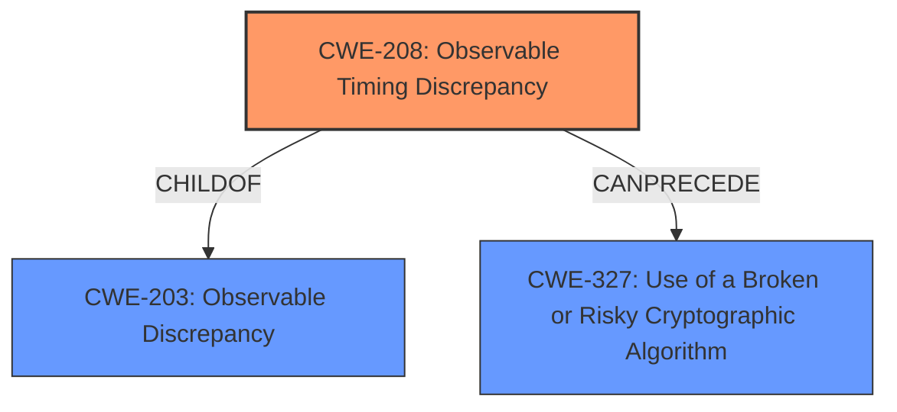

# Enhanced Analysis for CVE-2024-11862

# Summary
| CWE ID | CWE Name | Confidence | CWE Abstraction Level | CWE Vulnerability Mapping Label | CWE-Vulnerability Mapping Notes |
|---|---|---|---|---|---|
| CWE-208 | Observable Timing Discrepancy | 0.9 | Base | Allowed | Primary CWE. The vulnerability is caused by timing discrepancies in cryptographic operations. |
| CWE-327 | Use of a Broken or Risky Cryptographic Algorithm | 0.6 | Class | Allowed-with-Review | Secondary Candidate. The **non-constant time cryptographic operation** can be considered a risky cryptographic algorithm. |

## Evidence and Confidence

*   **Confidence Score:** 0.9
*   **Evidence Strength:** HIGH

## Relationship Analysis
The primary relationship that impacted the decision was the parent-child relationship between CWE-203 (Observable Discrepancy) and CWE-208 (Observable Timing Discrepancy), where CWE-208 is a child of CWE-203. Since the vulnerability is specifically about timing discrepancies, CWE-208 was chosen over its parent, CWE-203, for greater specificity. CWE-327 is also considered as a class level weakness that may have lower level children, but the specific operation is timing, so CWE-208 is a better fit.



## Vulnerability Chain
The chain of root cause and weaknesses for the Vulnerability Description is as follows:
1.  Root Cause: **Non constant time cryptographic operation** (CWE-208)
2.  Impact: Render half of the encryption key obsolete.

## Summary of Analysis
The initial analysis focused on the **non constant time cryptographic operation** which is a clear indicator of CWE-208 (Observable Timing Discrepancy). The "CVE Reference Links Content Summary" section further solidifies this by stating, "Timing attacks on Galois Field multiplications within the `Devolutions.XTS.NET` package" as the root cause. The impact, rendering half of the XTS key obsolete, is a consequence of the timing attack. The graph relationships influenced the final selection by highlighting the specificity of CWE-208 over its parent, CWE-203. The selection is based on the provided evidence and the optimal level of specificity.

Relevant CWE Information:

# Enhanced Context (25 CWEs)

## CWE-208: Observable Timing Discrepancy
**Abstraction Level**: Base
**Similarity Score**: 0.78
**Source**: dense

**Description**:
Two separate operations in a product require different amounts of time to complete, in a way that is observable to an actor and reveals security-relevant information about the state of the product, such as whether a particular operation was successful or not.

**Mapping Guidance**:
- Usage: Allowed
- Rationale: This CWE entry is at the Base level of abstraction, which is a preferred level of abstraction for mapping to the root causes of vulnerabilities.
### Technical Explanation for CWE-208:
*   How the vulnerability's details match the CWE's characteristics: The vulnerability description explicitly states "**Non constant time cryptographic operation**", indicating a timing discrepancy. The CVE reference summary mentions "Timing attacks on Galois Field multiplications". This aligns perfectly with CWE-208, which describes vulnerabilities arising from observable timing differences that reveal security-relevant information.
*   The security implications and potential impact: An attacker can exploit the timing discrepancy to gain information about the cryptographic key, ultimately rendering half of it obsolete. This significantly weakens the encryption.
*   Any parent-child relationships or chain patterns that influenced your mapping: CWE-208 is a child of CWE-203 (Observable Discrepancy). While CWE-203 is also relevant, CWE-208 is more specific because the discrepancy is related to timing.
*   Whether the weakness is primary or secondary in the vulnerability: This is the primary weakness.
*   How the official MITRE mapping guidance influenced your decision: The MITRE mapping guidance for CWE-208 states "This CWE entry is at the Base level of abstraction, which is a preferred level of abstraction for mapping to the root causes of vulnerabilities," which supports the decision to choose this CWE.

### Summary explanation of what other CWEs from Complete CWE Specifications were considered but not used.

*   CWE-203: Observable Discrepancy - While this is a parent of CWE-208 and broadly applicable, it is less specific than CWE-208, which directly addresses timing discrepancies.
*   CWE-327: Use of a Broken or Risky Cryptographic Algorithm - This is a Class-level CWE, and while a non-constant time operation could be considered a risky algorithm implementation, CWE-208 is a more direct representation of the root cause.
*   CWE-916: Use of Password Hash With Insufficient Computational Effort - This is not relevant as the vulnerability is not related to password hashing.
*   CWE-1240: Use of a Cryptographic Primitive with a Risky Implementation - While this could be considered, CWE-208 directly addresses the timing issue, making it a more appropriate primary classification. The risky implementation is causing the timing discrepancy.
*   CWE-385: Covert Timing Channel - This is related to timing, but it's more about covert channels for communication, which is not the primary issue here.


## CWE Relationship Analysis

Current CWEs represent these abstraction levels: .


### Vulnerability Chain Analysis

**Chain starting from CWE-203:**
- 203 (Observable Discrepancy) - ROOT


**Chain starting from CWE-327:**
- 327 (Use of a Broken or Risky Cryptographic Algorithm) - ROOT


### CWE Relationship Diagram

```mermaid
graph TD
    classDef primary fill:#f96,stroke:#333,stroke-width:2px
    classDef secondary fill:#69f,stroke:#333
    classDef tertiary fill:#9e9,stroke:#333
```