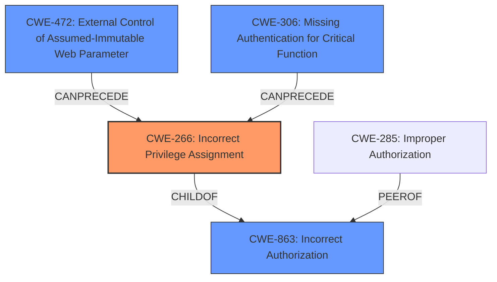

# Analysis for CVE-2024-11951

# Summary

| CWE ID   | CWE Name                                                      | Confidence | CWE Abstraction Level | CWE Vulnerability Mapping Label | CWE-Vulnerability Mapping Notes |
| :-------- | :------------------------------------------------------------ | :--------- | :-------------------- | :------------------------------ | :------------------------------ |
| CWE-266   | Incorrect Privilege Assignment                                | 1.0        | Base                  | Primary CWE                     | Allowed                       |
| CWE-863   | Incorrect Authorization                                       | 0.7        | Class                 | Secondary Candidate             | Allowed-with-Review           |
| CWE-472   | External Control of Assumed-Immutable Web Parameter         | 0.6        | Base                  | Secondary Candidate             | Allowed                       |
| CWE-306   | Missing Authentication for Critical Function                | 0.5        | Base                  | Secondary Candidate             | Allowed                       |

## Evidence and Confidence

*   **Confidence Score:** 0.9
*   **Evidence Strength:** HIGH

## Relationship Analysis

The primary CWE is CWE-266, which represents the root cause of the vulnerability: the incorrect assignment of privileges during user registration. CWE-863 (Incorrect Authorization) is a broader class that could apply, but CWE-266 is more specific. CWE-472 (External Control of Assumed-Immutable Web Parameter) is relevant because the user-controlled role could be considered an externally controlled parameter. CWE-306 Missing Authentication for Critical Function is relevant, but it would imply that no authentication was needed for registering new accounts.

## Vulnerability Chain

The vulnerability chain starts with the **incorrect privilege assignment** (CWE-266), where users can set their own role during registration. This leads to attackers gaining elevated privileges, resulting in privilege escalation.
- **CWE-266**: Incorrect Privilege Assignment (**Root Cause**)
- **Impact**: Elevated privileges, privilege escalation

## Summary of Analysis

The analysis strongly supports CWE-266 as the primary CWE because the vulnerability description explicitly states that the plugin allows users to set their own role during registration, which is a direct cause of privilege misassignment. The "Vulnerability Description Key Phrases" section also identifies "**plugin allowing users who are registering new accounts to set their own role**" as the root cause. The technical impact is privilege escalation. The other CWEs were considered as secondary factors or alternative classifications. CWE-863 is too general, CWE-472 might be a contributing factor but doesn't fully capture the root cause, and CWE-306 does not appear to be the root cause. The selection of CWE-266 is based on the evidence provided and is at the appropriate level of specificity (Base).

Relevant CWE Information:

# Enhanced Context (25 CWEs)
The following CWEs were identified as potentially relevant to this vulnerability:

## CWE-266: Incorrect Privilege Assignment
**Abstraction Level**: Base
**Similarity Score**: 0.80
**Source**: dense

**Description**:
A product incorrectly assigns a privilege to a particular actor, creating an unintended sphere of control for that actor.

**Mapping Guidance**:
- Usage: Allowed
- Rationale: This CWE entry is at the Base level of abstraction, which is a preferred level of abstraction for mapping to the root causes of vulnerabilities.

## CWE-863: Incorrect Authorization
**Abstraction Level**: Class
**Similarity Score**: 1372.59
**Source**: sparse

**Description**:
The product performs an authorization check when an actor attempts to access a resource or perform an action, but it does not correctly perform the check.

**Mapping Guidance**:
- Usage: Allowed-with-Review
- Rationale: This CWE entry is a Class and might have Base-level children that would be more appropriate

## CWE-472: External Control of Assumed-Immutable Web Parameter
**Abstraction Level**: Base
**Similarity Score**: 0.77
**Source**: dense

**Description**:
The web application does not sufficiently verify inputs that are assumed to be immutable but are actually externally controllable, such as hidden form fields.

**Mapping Guidance**:
- Usage: Allowed
- Rationale: This CWE entry is at the Base level of abstraction, which is a preferred level of abstraction for mapping to the root causes of vulnerabilities.

## CWE-306: Missing Authentication for Critical Function
**Abstraction Level**: base
**Similarity Score**: 2.40
**Source**: graph

**Description**:
CWE-306: Missing Authentication for Critical Function

**Mapping Guidance**:
- Usage: Allowed
- Rationale: This CWE entry is at the Base level of abstraction, which is a preferred level of abstraction for mapping to the root causes of vulnerabilities.