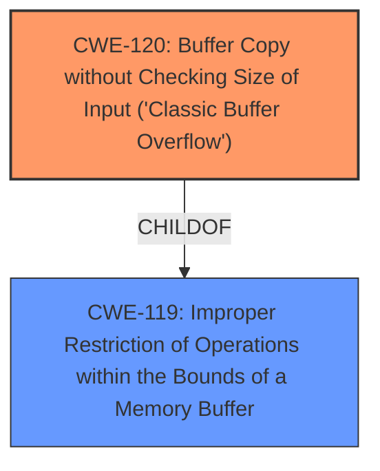

# Analysis Report for CVE-2024-11959

# Vulnerability Analysis Report: CVE-2024-11959

## Description

A vulnerability was found in D-Link DIR-605L 2.13B01. It has been classified as critical. This affects the function formResetStatistic of the file /goform/formResetStatistic. The manipulation of the argument curTime leads to **buffer overflow**. It is possible to initiate the attack remotely. The exploit has been disclosed to the public and may be used.

## Vulnerability Description Key Phrases

- **Weakness:** buffer overflow
- **Vector:** manipulation of curTime argument
- **Product:** D-Link DIR-605L
- **Version:** 2.13B01
- **Component:** formResetStatistic in /goform/formResetStatistic

## Analysis (with Relationship Data)

# Summary
| CWE ID | CWE Name | Confidence | CWE Abstraction Level | CWE Vulnerability Mapping Label | CWE-Vulnerability Mapping Notes |
|---|---|---|---|---|---|
| CWE-120 | Buffer Copy without Checking Size of Input ('Classic Buffer Overflow') | 0.9 | Base | Primary CWE | Allowed-with-Review |

## Evidence and Confidence

*   **Confidence Score:** 0.9
*   **Evidence Strength:** HIGH

## Relationship Analysis
The primary relationship that influenced the decision was the parent-child relationship between CWE-119 (Improper Restriction of Operations within the Bounds of a Memory Buffer) and CWE-120 (Buffer Copy without Checking Size of Input ('Classic Buffer Overflow')). While CWE-119 was a strong initial contender due to its general applicability to buffer overflows, the description clearly indicated a buffer copy operation without size checking, making CWE-120 a more specific and appropriate choice. The "CanPrecede" relationship between CWE-120 and other CWEs like CWE-787 (Out-of-bounds Write) was also considered, but not directly applicable based on the provided information.



## Vulnerability Chain
The vulnerability chain starts with the **improper handling of the curTime argument** in the `formResetStatistic` function, which leads to a **buffer overflow** due to the lack of size checking during the copy operation. This results in the potential for remote code execution.

CWE-120 (Buffer Copy without Checking Size of Input ('Classic Buffer Overflow')) -> Potential Remote Code Execution (Impact)

## Summary of Analysis
The initial assessment considered CWE-119 because the description mentions "buffer overflow". However, after reviewing the detailed CWE descriptions and considering the specific operation described (copying data into a buffer without checking the size), CWE-120 was selected as the most accurate representation of the vulnerability.

The vulnerability description states that "The manipulation of the argument curTime leads to **buffer overflow**". The CVE Reference Links Content Summary confirms this, stating "Manipulation of the `curTime` argument in the `formResetStatistic` function leads to a buffer overflow." This directly supports the selection of a buffer overflow related CWE.

CWE-120 is at the Base level of abstraction, which is preferred. While CWE-119 is more general, CWE-120 specifically addresses the scenario where data is copied into a buffer without proper size validation, leading to a buffer overflow. The MITRE mapping guidance for CWE-120 suggests "Allowed-with-Review" because it can be misused; however, the context here is clear enough to warrant its use. Other CWEs, like those related to SQL Injection (CWE-89) or Cross-site Scripting (CWE-79), were considered based on the Retriever Results, but they do not align with the core weakness of a buffer overflow caused by unchecked input size.

Relevant CWE Information:

# Enhanced Context (25 CWEs)
The following CWEs were identified as potentially relevant to this vulnerability:

## CWE-134: Use of Externally-Controlled Format String
**Abstraction Level**: Base
**Similarity Score**: 0.75
**Source**: dense

**Description**:
The product uses a function that accepts a format string as an argument, but the format string originates from an external source.

**Mapping Guidance**:
- Usage: Allowed
- Rationale: This CWE entry is at the Base level of abstraction, which is a preferred level of abstraction for mapping to the root causes of vulnerabilities.

*Not Used:* This CWE is not applicable because the vulnerability involves a buffer overflow, not the use of externally-controlled format strings.

## CWE-119: Improper Restriction of Operations within the Bounds of a Memory Buffer
**Abstraction Level**: Class
**Similarity Score**: 0.73
**Source**: dense

**Description**:
The product performs operations on a memory buffer, but it reads from or writes to a memory location outside the buffer's intended boundary. This may result in read or write operations on unexpected memory locations that could be linked to other variables, data structures, or internal program data.

**Mapping Guidance**:
- Usage: Discouraged
- Rationale: CWE-119 is commonly misused in low-information vulnerability reports when lower-level CWEs could be used instead, or when more details about the vulnerability are available.

*Not Used:* While CWE-119 is a general class for buffer overflows, CWE-120 provides a more specific description of the vulnerability involving a buffer copy without checking size.

## CWE-193: Off-by-one Error
**Abstraction Level**: Base
**Similarity Score**: 0.73
**Source**: dense

**Description**:
A product calculates or uses an incorrect maximum or minimum value that is 1 more, or 1 less, than the correct value.

**Mapping Guidance**:
- Usage: Allowed
- Rationale: This CWE entry is at the Base level of abstraction, which is a preferred level of abstraction for mapping to the root causes of vulnerabilities.

*Not Used:* Not applicable because the vulnerability is a buffer overflow due to missing size checks, not an off-by-one error.

## CWE-755: Improper Handling of Exceptional Conditions
**Abstraction Level**: Class
**Similarity Score**: 0.73
**Source**: dense

**Description**:
The product does not handle or incorrectly handles an exceptional condition.

**Mapping Guidance**:
- Usage: Discouraged
- Rationale: This CWE entry is a level-1 Class (i.e., a child of a Pillar). It might have lower-level children that would be more appropriate

*Not Used:* Not applicable because the vulnerability is a buffer overflow, not a general improper handling of exceptional conditions.

## CWE-121: Stack-based Buffer Overflow
**Abstraction Level**: Variant
**Similarity Score**: 0.73
**Source**: dense

**Description**:
A stack-based buffer overflow condition is a condition where the buffer being overwritten is allocated on the stack (i.e., is a local variable or, rarely, a parameter to a function).

**Mapping Guidance**:
- Usage: Allowed
- Rationale: This CWE entry is at the Variant level of abstraction, which is a preferred level of abstraction for mapping to the root causes of vulnerabilities.

*Not Used:* While this could be a possibility, the description does not mention if it's stack-based, so the more general CWE-120 is more appropriate.

## CWE-425: Direct Request ('Forced Browsing')
**Abstraction Level**: Base
**Similarity Score**: 0.73
**Source**: dense

**Description**:
The web application does not adequately enforce appropriate authorization on all restricted URLs, scripts, or files.

**Mapping Guidance**:
- Usage: Allowed
- Rationale: This CWE entry is at the Base level of abstraction, which is a preferred level of abstraction for mapping to the root causes of vulnerabilities.

*Not Used:* Not relevant as the vulnerability is related to a buffer overflow, not authorization issues.

## CWE-131: Incorrect Calculation of Buffer Size
**Abstraction Level**: Base
**Similarity Score**: 0.73
**Source**: dense

**Description**:
The product does not correctly calculate the size to be used when allocating a buffer, which could lead to a buffer overflow.

**Mapping Guidance**:
- Usage: Allowed
- Rationale: This CWE entry is at the Base level of abstraction, which is a preferred level of abstraction for mapping to the root causes of vulnerabilities.

*Not Used:* While this could be related, CWE-120 is more precise, as it highlights the lack of checking the size of the *input* during the copy operation, which is the direct cause of the overflow.

## CWE-923: Improper Restriction of Communication Channel to Intended Endpoints
**Abstraction Level**: Class
**Similarity Score**: 0.72
**Source**: dense

**Description**:
The product establishes a communication channel to (or from) an endpoint for privileged or protected operations, but it does not properly ensure that it is communicating with the correct endpoint.

**Mapping Guidance**:
- Usage: Allowed-with-Review
- Rationale: This CWE entry is a Class and might have Base-level children that would be more appropriate

*Not Used:* Not relevant as the vulnerability is a buffer overflow.

## CWE-288: Authentication Bypass Using an Alternate Path or Channel
**Abstraction Level**: Base
**Similarity Score**: 0.72
**Source**: dense

**Description**:
The product requires authentication, but the product has an alternate path or channel that does not require authentication.

**Mapping Guidance**:
- Usage: Allowed
- Rationale: This CWE entry is at the Base level of abstraction, which is a preferred level of abstraction for mapping to the root causes of vulnerabilities.


## CWE Relationship Analysis

Current CWEs represent these abstraction levels: .


### Vulnerability Chain Analysis

**Chain starting from CWE-288:**
- 288 (Authentication Bypass Using an Alternate Path or Channel) - ROOT


**Chain starting from CWE-89:**
- 89 (Improper Neutralization of Special Elements used in an SQL Command ('SQL Injection')) - ROOT


### CWE Relationship Diagram

```mermaid
graph TD
    classDef primary fill:#f96,stroke:#333,stroke-width:2px
    classDef secondary fill:#69f,stroke:#333
    classDef tertiary fill:#9e9,stroke:#333
```


*Report generated on 2025-07-13 02:10:10*
