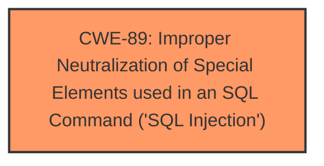

# Enhanced Analysis for CVE-2024-11998

# Summary
| CWE ID | CWE Name | Confidence | CWE Abstraction Level | CWE Vulnerability Mapping Label | CWE-Vulnerability Mapping Notes |
|---|---|---|---|---|---|
| CWE-89 | Improper Neutralization of Special Elements used in an SQL Command ('SQL Injection') | 1.0 | Base | Allowed | Primary CWE |

## Evidence and Confidence

*   **Confidence Score:** 1.0
*   **Evidence Strength:** HIGH

## Relationship Analysis
The primary relationship influencing the decision is the direct match of the vulnerability description to the CWE-89 description. No other relationships are relevant.



## Vulnerability Chain
The vulnerability chain consists of a single element:
1.  **Root Cause:** CWE-89 - Improper neutralization of special elements in an SQL command, leading directly to SQL Injection.

## Summary of Analysis
The vulnerability description clearly states that the **weakness** is **SQL injection** due to improper handling of the `id` argument in `/visualizer-forneccedor.chp`. This aligns perfectly with CWE-89, which describes the **improper neutralization of special elements used in an SQL command**.

The statement "The manipulation of the argument id leads to **sql injection**" is direct evidence supporting the classification.

The retriever results also listed CWE-89 as the top candidate with a score of 1.0.

Therefore, CWE-89 is the most appropriate classification at the Base level of abstraction.

CWEs considered but not used:

*   CWE-79 (Improper Neutralization of Input During Web Page Generation ('Cross-site Scripting')): While the application takes input, the vulnerability is specifically an **SQL injection**, not a cross-site scripting issue.
*   CWE-117 (Improper Output Neutralization for Logs): This is related to logging, and there's no mention of logging in the description.
*   CWE-434 (Unrestricted Upload of File with Dangerous Type): This is about file uploads, which is not relevant here.
*   CWE-1336 (Improper Neutralization of Special Elements Used in a Template Engine): This relates to Template Engines and code injection, which is not mentioned.
*   CWE-74 (Improper Neutralization of Special Elements in Output Used by a Downstream Component ('Injection')): This is a high-level "Injection" class and not specific enough.
*   CWE-95 (Improper Neutralization of Directives in Dynamically Evaluated Code ('Eval Injection')): This relates to Eval Injection and code injection, which is not mentioned.
*   CWE-73 (External Control of File Name or Path): The vulnerability is related to SQL injection, not file path manipulation.


## CWE Relationship Analysis

Current CWEs represent these abstraction levels: .


### Vulnerability Chain Analysis

**Chain starting from CWE-89:**
- 89 (Improper Neutralization of Special Elements used in an SQL Command ('SQL Injection')) - ROOT


**Chain starting from CWE-79:**
- 79 (Improper Neutralization of Input During Web Page Generation ('Cross-site Scripting')) - ROOT


### CWE Relationship Diagram

```mermaid
graph TD
    classDef primary fill:#f96,stroke:#333,stroke-width:2px
    classDef secondary fill:#69f,stroke:#333
    classDef tertiary fill:#9e9,stroke:#333
```