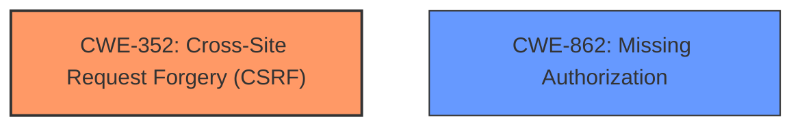

# Analysis Report for CVE-2024-12076

# Vulnerability Analysis Report: CVE-2024-12076

## Description

The Target Video Easy Publish plugin for WordPress is vulnerable to **Cross-Site Request Forgery** in all versions up to, and including, 3.8.3. This is due to **missing or incorrect nonce validation** on the resync_carousel(), seek_snapshot(), uploaded_cc(), and remove_cc() functions. This makes it possible for unauthenticated attackers to inject malicious web scripts via a forged request granted they can trick a site administrator into performing an action such as clicking on a link.

## Vulnerability Description Key Phrases

- **Component:** ['resync_carousel()', 'seek_snapshot()', 'uploaded_cc()', 'remove_cc() functions']
- **Rootcause:** missing or incorrect nonce validation
- **Vector:** forged request
- **Weakness:** Cross-Site Request Forgery
- **Product:** Target Video Easy Publish plugin for WordPress
- **Impact:** inject malicious web scripts
- **Attacker:** unauthenticated attackers
- **Version:** up to and including 3.8.3

## Analysis (with Relationship Data)

# Summary
| CWE ID  | CWE Name                                                                                                | Confidence | CWE Abstraction Level | CWE Vulnerability Mapping Label | CWE-Vulnerability Mapping Notes |
| ------- | ------------------------------------------------------------------------------------------------------- | ---------- | ----------------------- | ------------------------------- | ------------------------------- |
| CWE-352 | Cross-Site Request Forgery (CSRF)                                                                     | 1.0        | Compound                | Primary                         | Allowed                       |
| CWE-862 | Missing Authorization                                                                               | 0.6       | Class                   | Secondary                       | Allowed-with-Review              |

## Evidence and Confidence

*   **Confidence Score:** 0.8
*   **Evidence Strength:** MEDIUM

## Relationship Analysis
The primary weakness is CWE-352, which is a compound weakness. While it doesn't have direct parent-child relationships that strongly influence the selection here, the description matches the concept of CSRF directly due to the **missing or incorrect nonce validation**. CWE-862 is considered as a secondary weakness because **missing nonce validation** can be seen as a form of missing authorization. The abstraction levels of these CWEs (Compound and Class) are acceptable given the information provided, but a more specific Base CWE would be preferred if more details were available.



## Vulnerability Chain
The vulnerability chain starts with the **missing or incorrect nonce validation**, which leads to a Cross-Site Request Forgery vulnerability. This allows an unauthenticated attacker to inject malicious web scripts if they can trick a site administrator into clicking a link.

`Missing Nonce Validation` -> `CWE-352: Cross-Site Request Forgery (CSRF)` -> `Malicious Script Injection`

## Summary of Analysis
The analysis strongly indicates CWE-352 as the primary weakness, supported by the **missing or incorrect nonce validation** on several functions, a key characteristic of CSRF. The evidence points to the vulnerability allowing unauthenticated attackers to inject malicious web scripts via a forged request, which aligns perfectly with the definition of CSRF. The retriever results also list CWE-352 as a top candidate. Additionally, CWE-862 (Missing Authorization) is considered as a secondary candidate because the **missing nonce validation** effectively bypasses authorization checks, though CSRF is the more precise classification. The evidence comes directly from the vulnerability description, particularly the "rootcause" and "weakness" key phrases.

I considered other CWEs from the Retriever Results, such as CWE-79 (Cross-Site Scripting) and CWE-89 (SQL Injection), but these were not selected as they didn't directly relate to the root cause of the vulnerability which is the **missing or incorrect nonce validation** leading to CSRF. CWE-425 (Direct Request ('Forced Browsing')) was also considered but CSRF is a more specific type of forced browsing where the request is initiated by a different site.

Relevant CWE Information:

# Enhanced Context (25 CWEs)
The following CWEs were identified as potentially relevant to this vulnerability:

## CWE-352: Cross-Site Request Forgery (CSRF)
**Abstraction Level**: Compound
**Similarity Score**: 0.75
**Source**: dense

**Description**:
The web application does not, or can not, sufficiently verify whether a well-formed, valid, consistent request was intentionally provided by the user who submitted the request.

**Mapping Guidance**:
- Usage: Allowed
- Rationale: This is a well-known Composite of multiple weaknesses that must all occur simultaneously, although it is attack-oriented in nature.

## CWE-425: Direct Request ('Forced Browsing')
**Abstraction Level**: Base
**Similarity Score**: 0.72
**Source**: dense

**Description**:
The web application does not adequately enforce appropriate authorization on all restricted URLs, scripts, or files.

**Mapping Guidance**:
- Usage: Allowed
- Rationale: This CWE entry is at the Base level of abstraction, which is a preferred level of abstraction for mapping to the root causes of vulnerabilities.

## CWE-434: Unrestricted Upload of File with Dangerous Type
**Abstraction Level**: Base
**Similarity Score**: 0.72
**Source**: dense

**Description**:
The product allows the upload or transfer of dangerous file types that are automatically processed within its environment.

**Mapping Guidance**:
- Usage: Allowed
- Rationale: This CWE entry is at the Base level of abstraction, which is a preferred level of abstraction for mapping to the root causes of vulnerabilities.

## CWE-472: External Control of Assumed-Immutable Web Parameter
**Abstraction Level**: Base
**Similarity Score**: 0.70
**Source**: dense

**Description**:
The web application does not sufficiently verify inputs that are assumed to be immutable but are actually externally controllable, such as hidden form fields.

**Mapping Guidance**:
- Usage: Allowed
- Rationale: This CWE entry is at the Base level of abstraction, which is a preferred level of abstraction for mapping to the root causes of vulnerabilities.

## CWE-116: Improper Encoding or Escaping of Output
**Abstraction Level**: Class
**Similarity Score**: 0.69
**Source**: dense

**Description**:
The product prepares a structured message for communication with another component, but encoding or escaping of the data is either missing or done incorrectly. As a result, the intended structure of the message is not preserved.

**Mapping Guidance**:
- Usage: Allowed-with-Review
- Rationale: This CWE entry is a Class and might have Base-level children that would be more appropriate

## CWE-96: Improper Neutralization of Directives in Statically Saved Code ('Static Code Injection')
**Abstraction Level**: Base
**Similarity Score**: 0.69
**Source**: dense

**Description**:
The product receives input from an upstream component, but it does not neutralize or incorrectly neutralizes code syntax before inserting the input into an executable resource, such as a library, configuration file, or template.

**Mapping Guidance**:
- Usage: Allowed
- Rationale: This CWE entry is at the Base level of abstraction, which is a preferred level of abstraction for mapping to the root causes of vulnerabilities.

## CWE-639: Authorization Bypass Through User-Controlled Key
**Abstraction Level**: Base
**Similarity Score**: 0.69
**Source**: dense

**Description**:
The system's authorization functionality does not prevent one user from gaining access to another user's data or record by modifying the key value identifying the data.

**Mapping Guidance**:
- Usage: Allowed
- Rationale: This CWE entry is at the Base level of abstraction, which is a preferred level of abstraction for mapping to the root causes of vulnerabilities.

## CWE-79: Improper Neutralization of Input During Web Page Generation ('Cross-site Scripting')
**Abstraction Level**: Base
**Similarity Score**: 0.68
**Source**: dense

**Description**:
The product does not neutralize or incorrectly neutralizes user-controllable input before it is placed in output that is used as a web page that is served to other users.

**Mapping Guidance**:
- Usage: Allowed
- Rationale: This CWE entry is at the Base level of abstraction, which is a preferred level of abstraction for mapping to the root causes of vulnerabilities.

## CWE-95: Improper Neutralization of Directives in Dynamically Evaluated Code ('Eval Injection')
**Abstraction Level**: Variant
**Similarity Score**: 0.68
**Source**: dense

**Description**:
The product receives input from an upstream component, but it does not neutralize or incorrectly neutralizes code syntax before using the input in a dynamic evaluation call (e.g. "eval").

**Mapping Guidance**:
- Usage: Allowed
- Rationale: This CWE entry is at the Variant level of abstraction, which is a preferred level of abstraction for mapping to the root causes of vulnerabilities.

## CWE-941: Incorrectly Specified Destination in a Communication Channel
**Abstraction Level**: Base
**Similarity Score**: 0.68
**Source**: dense

**Description**:
The product creates a communication channel to initiate an outgoing request to an actor, but it does not correctly specify the intended destination for that actor.

**Mapping Guidance**:
- Usage: Allowed
- Rationale: This CWE entry is at the Base level of abstraction, which is a preferred level of abstraction for mapping to the root causes of vulnerabilities.

## CWE-352: Cross-Site Request Forgery (CSRF)
**Abstraction Level**: Compound
**Similarity Score**: 590.29
**Source**: sparse

**Description**:
The web application does not, or can not, sufficiently verify whether a well-formed, valid, consistent request was intentionally provided by the user who submitted the request.

**Mapping Guidance**:
- Usage: Allowed
- Rationale: This is a well-known Composite of multiple weaknesses that must all occur simultaneously, although it is attack-oriented in nature.

## CWE-89: Improper Neutralization of


## CWE Relationship Analysis

Current CWEs represent these abstraction levels: .


### Vulnerability Chain Analysis

**Chain starting from CWE-89:**
- 89 (Improper Neutralization of Special Elements used in an SQL Command ('SQL Injection')) - ROOT


**Chain starting from CWE-116:**
- 116 (Improper Encoding or Escaping of Output) - ROOT


### CWE Relationship Diagram

```mermaid
graph TD
    classDef primary fill:#f96,stroke:#333,stroke-width:2px
    classDef secondary fill:#69f,stroke:#333
    classDef tertiary fill:#9e9,stroke:#333
```


*Report generated on 2025-07-13 02:20:55*
