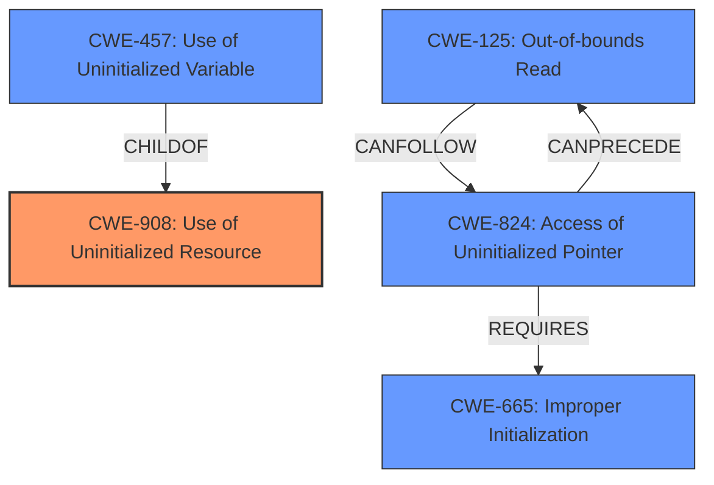

# Analysis for CVE-2024-12085

# Summary
| CWE ID | CWE Name | Confidence | CWE Abstraction Level | CWE Vulnerability Mapping Label | CWE-Vulnerability Mapping Notes |
|---|---|---|---|---|---|
| CWE-908 | Use of Uninitialized Resource | 0.9 | Base | Primary | Allowed |
| CWE-125 | Out-of-bounds Read | 0.5 | Base | Secondary | Allowed |

## Evidence and Confidence

*   **Confidence Score:** 0.7
*   **Evidence Strength:** MEDIUM

## Relationship Analysis
The primary relationship is that CWE-908 **Use of Uninitialized Resource** is a parent of CWE-457 **Use of Uninitialized Variable**, indicating that the more specific variable use is a type of resource use. CWE-125 **Out-of-bounds Read** can follow CWE-824 **Access of Uninitialized Pointer** which in turn can result from an **Improper Initialization** CWE-665. While these relationships exist, the evidence most strongly points to CWE-908 as the initial problem.

## Vulnerability Chain
The vulnerability chain begins with the **use of uninitialized memory**. This leads to a comparison of checksums against this memory, ultimately resulting in an information leak.
- Root Cause: CWE-908 **Use of Uninitialized Resource**
- Impact: Information Leak (via checksum comparison)
- Contributing Factor: Attacker manipulation of checksum length.
There isn't enough information to establish a complete chain, but the core issue and its immediate consequence are clear.

## Summary of Analysis
The primary weakness lies in the **use of uninitialized memory**, leading to an information leak. The description states that an attacker can manipulate the checksum length to cause a comparison with uninitialized memory, leaking data.

The most relevant CWE appears to be CWE-908 **Use of Uninitialized Resource**, which directly addresses the core issue. The description explicitly mentions the **uninitialized memory access**, aligning with the CWE's definition.

Other CWEs considered:
- CWE-824 **Access of Uninitialized Pointer**: While related, the description does not specify that the uninitialized resource is a pointer.
- CWE-457 **Use of Uninitialized Variable**: This is a more specific case of CWE-908, but the description refers to "memory" rather than specifically a variable.
- CWE-125 **Out-of-bounds Read**: The vulnerability description indicates a read of uninitialized memory. Therefore, CWE-125 is a secondary candidate.
- CWE-909 **Missing Initialization of Resource**: This CWE describes the *cause* of the problem, but CWE-908 describes the direct *weakness*.

The selection of CWE-908 is based on the clear statement of **uninitialized memory access** in the vulnerability description, and its direct match to the CWE's definition. The relationship graph helps to illustrate how other CWEs might be related, but are not as directly applicable based on the available evidence. The abstraction level of Base is appropriate as it is a direct representation of the weakness.