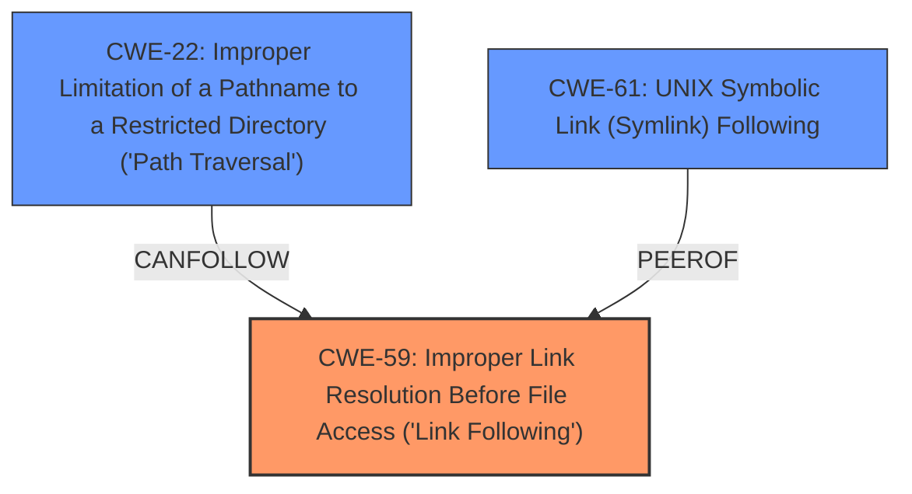

# Raw Analyzer Response for CVE-2024-12087

# Summary
| CWE ID | CWE Name | Confidence | CWE Abstraction Level | CWE Vulnerability Mapping Label | CWE-Vulnerability Mapping Notes |
|---|---|---|---|---|---|
| CWE-59 | Improper Link Resolution Before File Access ('Link Following') | 0.9 | Base |  Primary CWE | Allowed |
| CWE-22 | Improper Limitation of a Pathname to a Restricted Directory ('Path Traversal') | 0.8 | Base | Secondary Candidate | Allowed |
| CWE-61 | UNIX Symbolic Link (Symlink) Following | 0.6 | Compound | Secondary Candidate | Allowed |

## Evidence and Confidence

*   **Confidence Score:** 0.8
*   **Evidence Strength:** HIGH

## Relationship Analysis
The primary weakness is **Improper Link Resolution Before File Access ('Link Following') (CWE-59)**, which can lead to **Improper Limitation of a Pathname to a Restricted Directory ('Path Traversal') (CWE-22)**. The **UNIX Symbolic Link (Symlink) Following (CWE-61)** is a compound CWE related to symlink handling, which is also applicable, although less specific than CWE-59 in this case.

## Vulnerability Chain
The vulnerability chain starts with **lack of proper symlink verification** which is **Improper Link Resolution Before File Access (CWE-59)**, leading to a **path traversal vulnerability**, **Improper Limitation of a Pathname to a Restricted Directory (CWE-22)**, and ultimately resulting in the ability of a malicious server to write files outside of the client's intended destination directory.
  - **CWE-59**: Improper Link Resolution Before File Access ('Link Following') - Root cause: **lack of proper symlink verification**
  - **CWE-22**: Improper Limitation of a Pathname to a Restricted Directory ('Path Traversal') - Weakness: The path traversal issue.
  - **Impact**: Write files outside the client's intended destination.

## Summary of Analysis
Based on the provided vulnerability description and supporting evidence, the primary root cause is the **lack of proper symlink verification**, which directly corresponds to **CWE-59: Improper Link Resolution Before File Access ('Link Following')**. The vulnerability description explicitly mentions the **lack of proper symlink verification**, and the CVE reference links confirm that the vulnerability involves issues with symbolic links. The vulnerability allows writing files outside of the intended destination, a clear indicator of a path traversal issue, making **CWE-22: Improper Limitation of a Pathname to a Restricted Directory ('Path Traversal')** a secondary concern.

The retriever results also suggest **CWE-59** and **CWE-22** as highly relevant. The description for CWE-59 states that the product "does not properly prevent that filename from identifying a link or shortcut that resolves to an unintended resource," which aligns perfectly with the "**lack of proper symlink verification**" mentioned in the vulnerability description.

CWE-61 is related but represents a compound weakness, making CWE-59 a more precise and suitable base CWE.

Other CWEs, such as **CWE-347**, **CWE-427**, and **CWE-306**, were considered but deemed less relevant because they do not directly address the core issue of symlink handling and path traversal in this specific context.

Relevant CWE Information:

# Enhanced Context (25 CWEs)
The following CWEs were identified as potentially relevant to this vulnerability:

## CWE-61: UNIX Symbolic Link (Symlink) Following
**Abstraction Level**: Compound
**Similarity Score**: 0.79
**Source**: dense

**Description**:
The product, when opening a file or directory, does not sufficiently account for when the file is a symbolic link that resolves to a target outside of the intended control sphere. This could allow an attacker to cause the product to operate on unauthorized files.

**Mapping Guidance**:
- Usage: Allowed
- Rationale: This is a well-known Composite of multiple weaknesses that must all occur simultaneously, although it is attack-oriented in nature.

*Technical Explanation:* While CWE-61 is relevant, it's a higher-level, compound CWE. The more specific CWE-59 more accurately captures the **lack of proper symlink verification**.

## CWE-59: Improper Link Resolution Before File Access ('Link Following')
**Abstraction Level**: Base
**Similarity Score**: 0.79
**Source**: dense

**Description**:
The product attempts to access a file based on the filename, but it does not properly prevent that filename from identifying a link or shortcut that resolves to an unintended resource.

**Mapping Guidance**:
- Usage: Allowed
- Rationale: This CWE entry is at the Base level of abstraction, which is a preferred level of abstraction for mapping to the root causes of vulnerabilities.

*Technical Explanation:* This is the primary CWE. The **lack of proper symlink verification** is directly addressed by this CWE.

## CWE-41: Improper Resolution of Path Equivalence
**Abstraction Level**: Base
**Similarity Score**: 0.78
**Source**: dense

**Description**:
The product is vulnerable to file system contents disclosure through path equivalence. Path equivalence involves the use of special characters in file and directory names. The associated manipulations are intended to generate multiple names for the same object.

**Mapping Guidance**:
- Usage: Allowed
- Rationale: This CWE entry is at the Base level of abstraction, which is a preferred level of abstraction for mapping to the root causes of vulnerabilities.

*Technical Explanation:* Not directly related to the vulnerability described.

## CWE-23: Relative Path Traversal
**Abstraction Level**: Base
**Similarity Score**: 0.77
**Source**: dense

**Description**:
The product uses external input to construct a pathname that should be within a restricted directory, but it does not properly neutralize sequences such as ".." that can resolve to a location that is outside of that directory.

**Mapping Guidance**:
- Usage: Allowed
- Rationale: This CWE entry is at the Base level of abstraction, which is a preferred level of abstraction for mapping to the root causes of vulnerabilities.

*Technical Explanation:* While path traversal is an impact, the root cause is the symlink handling issue.

## CWE-923: Improper Restriction of Communication Channel to Intended Endpoints
**Abstraction Level**: Class
**Similarity Score**: 0.75
**Source**: dense

**Description**:
The product establishes a communication channel to (or from) an endpoint for privileged or protected operations, but it does not properly ensure that it is communicating with the correct endpoint.

**Mapping Guidance**:
- Usage: Allowed-with-Review
- Rationale: This CWE entry is a Class and might have Base-level children that would be more appropriate

*Technical Explanation:* Not applicable in this scenario.

## CWE-755: Improper Handling of Exceptional Conditions
**Abstraction Level**: Class
**Similarity Score**: 0.74
**Source**: dense

**Description**:
The product does not handle or incorrectly handles an exceptional condition.

**Mapping Guidance**:
- Usage: Discouraged
- Rationale: This CWE entry is a level-1 Class (i.e., a child of a Pillar). It might have lower-level children that would be more appropriate

*Technical Explanation:* Too generic.

## CWE-73: External Control of File Name or Path
**Abstraction Level**: Base
**Similarity Score**: 0.74
**Source**: dense

**Description**:
The product allows user input to control or influence paths or file names that are used in filesystem operations.

**Mapping Guidance**:
- Usage: Allowed
- Rationale: This CWE entry is at the Base level of abstraction, which is a preferred level of abstraction for mapping to the root causes of vulnerabilities.

*Technical Explanation:* The issue is more specific to symlink handling.

## CWE-22: Improper Limitation of a Pathname to a Restricted Directory ('Path Traversal')
**Abstraction Level**: Base
**Similarity Score**: 0.74
**Source**: dense

**Description**:
The product uses external input to construct a pathname that is intended to identify a file or directory that is located underneath a restricted parent directory, but the product does not properly neutralize special elements within the pathname that can cause the pathname to resolve to a location that is outside of the restricted directory.

**Mapping Guidance**:
- Usage: Allowed
- Rationale: This CWE entry is at the Base level of abstraction, which is a preferred level of abstraction for mapping to the root causes of vulnerabilities.

*Technical Explanation:* This is a secondary CWE. The