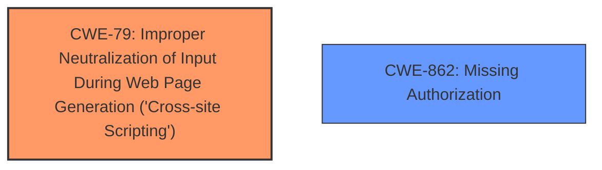

# Enhanced Analysis for CVE-2024-12112

# Summary
| CWE ID | CWE Name | Confidence | CWE Abstraction Level | CWE Vulnerability Mapping Label | CWE-Vulnerability Mapping Notes |
|---|---|---|---|---|---|
| CWE-79 | Improper Neutralization of Input During Web Page Generation ('Cross-site Scripting') | 1.0 | Base | Primary | Allowed |
| CWE-862 | Missing Authorization | 0.9 | Base | Secondary | Allowed |

## Evidence and Confidence

*   **Confidence Score:** 0.95
*   **Evidence Strength:** HIGH

## Relationship Analysis
The primary weakness is CWE-79, which is caused by **insufficient input sanitization** and **output escaping**. The secondary weakness is CWE-862, which is caused by **missing authorization checks**. CWE-79 is a base-level CWE, which is the preferred level of abstraction. CWE-862 is also a base-level CWE, which is the preferred level of abstraction.



## Vulnerability Chain
The vulnerability chain starts with **missing authorization checks** (CWE-862) and **insufficient input sanitization** and **output escaping**. Because of this, an authenticated attacker can inject arbitrary web scripts, leading to stored cross-site scripting (CWE-79).

## Summary of Analysis
The primary weakness is CWE-79, which is caused by **insufficient input sanitization** and **output escaping**. The secondary weakness is CWE-862, which is caused by **missing authorization checks**. The vulnerability description states, "The Easy Form Builder WordPress plugin... is vulnerable to Stored Cross-Site Scripting via the name parameter of the add_form_Emsfb AJAX action in all versions up to, and including, 3.8.8 due to **insufficient input sanitization** and **output escaping** and **missing authorization checks**." This statement provides direct evidence for both CWE-79 and CWE-862.

CWE-79 (Improper Neutralization of Input During Web Page Generation ('Cross-site Scripting')) is the most appropriate primary CWE because the description explicitly mentions cross-site scripting and the root cause is related to **improper neutralization of input**.

CWE-862 (Missing Authorization) is included as a secondary CWE because the vulnerability description explicitly mentions **missing authorization checks**. Without proper authorization, attackers with subscriber-level access can inject malicious scripts.

Other CWEs considered but not used:

*   CWE-352: Cross-Site Request Forgery (CSRF) was considered because it appeared in the retriever results, but it was determined that CSRF is not the primary issue. The main problem is that the application does not properly sanitize input and authorize the request to add forms.
*   CWE-116: Improper Encoding or Escaping of Output was considered, but CWE-79 is more specific to the context of web page generation and XSS.
*   CWE-138: Improper Neutralization of Special Elements was considered, but it is a class-level CWE.
*   CWE-80: Improper Neutralization of Script-Related HTML Tags in a Web Page (Basic XSS) was not selected because CWE-79 is more general and captures the essence of the vulnerability, and is also referenced in the provided text.


## CWE Relationship Analysis

Current CWEs represent these abstraction levels: .


### Vulnerability Chain Analysis

**Chain starting from CWE-116:**
- 116 (Improper Encoding or Escaping of Output) - ROOT


**Chain starting from CWE-862:**
- 862 (Missing Authorization) - ROOT


### CWE Relationship Diagram

```mermaid
graph TD
    classDef primary fill:#f96,stroke:#333,stroke-width:2px
    classDef secondary fill:#69f,stroke:#333
    classDef tertiary fill:#9e9,stroke:#333
```