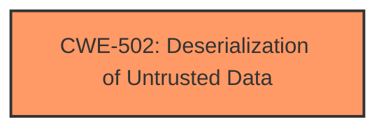

# Analysis Report for CVE-2024-12138

# Vulnerability Analysis Report: CVE-2024-12138

## Description

A vulnerability classified as critical was found in horilla up to 1.2.1. This vulnerability affects the function request_new/get_employee_shift/create_reimbursement/key_result_current_value_update/create_meetings/create_skills. The manipulation leads to **deserialization**. The attack can be initiated remotely. The exploit has been disclosed to the public and may be used. The vendor was contacted early about this disclosure but did not respond in any way.

## Vulnerability Description Key Phrases

- **Weakness:** deserialization
- **Product:** horilla
- **Version:** up to 1.2.1

## Analysis (with Relationship Data)

# Summary
| CWE ID | CWE Name | Confidence | CWE Abstraction Level | CWE Vulnerability Mapping Label | CWE-Vulnerability Mapping Notes |
|---|---|---|---|---|---|
| CWE-502 | Deserialization of Untrusted Data | 1.0 | Base | Primary | Allowed |

## Evidence and Confidence

*   **Confidence Score:** 1.0
*   **Evidence Strength:** HIGH

## Relationship Analysis
The primary relationship that influenced the decision was the direct match of the vulnerability description with the description of CWE-502. There are no child or parent relationships which impacted the decision.



## Vulnerability Chain
The vulnerability chain consists of a single point: the **deserialization** of untrusted data (CWE-502). This is both the root cause and the vulnerability.

## Summary of Analysis
The primary weakness is **deserialization**, which directly corresponds to CWE-502. The vulnerability description explicitly mentions "**deserialization**" as the root cause. The "Retriever Results" list CWE-502 with a high similarity score. The "Complete CWE Specifications" section provides detailed information about CWE-502, confirming its relevance. This assessment is based on the direct evidence of the vulnerability description. The selected CWE is at the optimal level of specificity (Base).

Relevant CWE Information:

# Enhanced Context (25 CWEs)
The following CWEs were identified as potentially relevant to this vulnerability:

## CWE-502: Deserialization of Untrusted Data
**Abstraction Level**: Base
**Similarity Score**: 0.73
**Source**: dense

**Description**:
The product deserializes untrusted data without sufficiently ensuring that the resulting data will be valid.

**Mapping Guidance**:
- Usage: Allowed
- Rationale: This CWE entry is at the Base level of abstraction, which is a preferred level of abstraction for mapping to the root causes of vulnerabilities.


## CWE Relationship Analysis

Current CWEs represent these abstraction levels: .


### Vulnerability Chain Analysis

**Chain starting from CWE-502:**
- 502 (Deserialization of Untrusted Data) - ROOT


### CWE Relationship Diagram

```mermaid
graph TD
    classDef primary fill:#f96,stroke:#333,stroke-width:2px
    classDef secondary fill:#69f,stroke:#333
    classDef tertiary fill:#9e9,stroke:#333
```


*Report generated on 2025-07-13 02:22:44*
