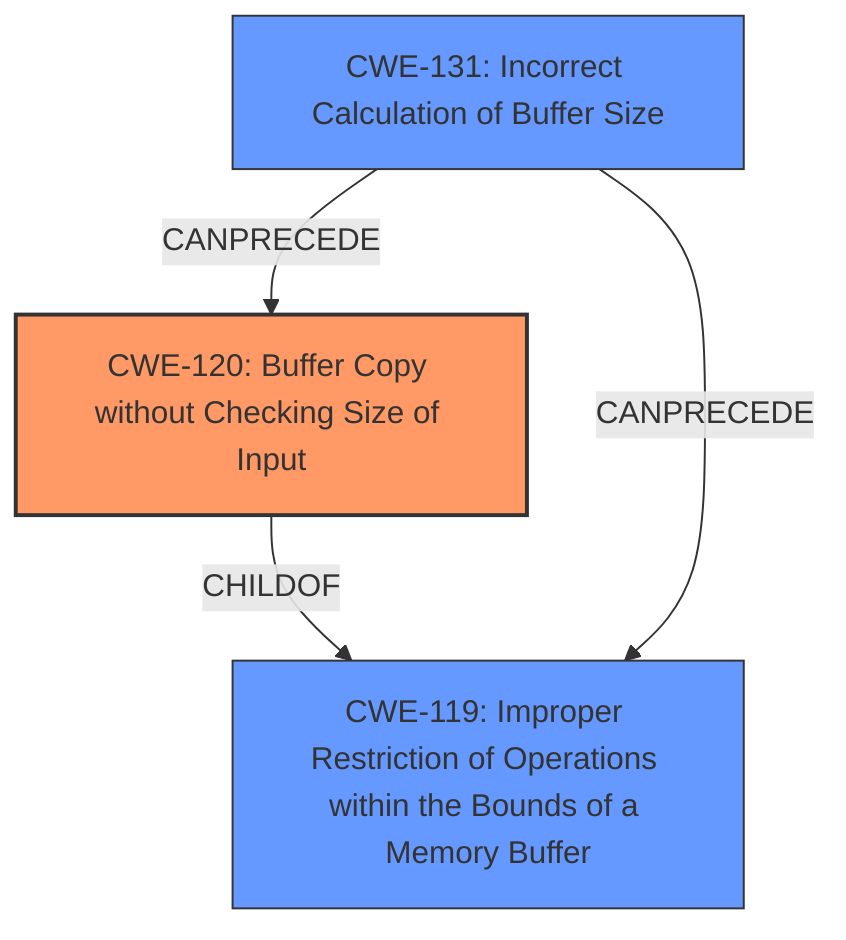

# Enhanced Analysis for CVE-2024-12147

# Summary

| CWE ID  | CWE Name                                                                                    | Confidence | CWE Abstraction Level | CWE Vulnerability Mapping Label | CWE-Vulnerability Mapping Notes |
| :-------- | :------------------------------------------------------------------------------------------ | :--------- | :-------------------- | :------------------------------ | :-------------------------------- |
| CWE-120 | Buffer Copy without Checking Size of Input ('Classic Buffer Overflow')                      | 0.9        | Base                  | Primary                         | Allowed-with-Review             |
| CWE-131 | Incorrect Calculation of Buffer Size                                                        | 0.7        | Base                  | Secondary                       | Allowed                           |
| CWE-119 | Improper Restriction of Operations within the Bounds of a Memory Buffer                   | 0.6        | Class                 | Secondary                       | Discouraged                      |

## Evidence and Confidence

*   **Confidence Score:** 0.8
*   **Evidence Strength:** HIGH

## Relationship Analysis

The primary CWE is CWE-120, which is related to buffer overflows. CWE-120 has a parent relationship to CWE-785 (Use of Pathname Traversal in an Unprotected Filename), which is not relevant here. CWE-120 can follow CWE-456 (Missing Initialization), CWE-416 (Use After Free), CWE-231 (Relative Path Traversal), and CWE-170 (Improper Null Termination), none of which appear to be involved. CWE-131 (Incorrect Calculation of Buffer Size) can precede CWE-119 and is often a root cause of buffer overflows, making it a relevant secondary CWE. CWE-119 is a more general class of weakness, and while applicable, is less specific than CWE-120 or CWE-131.



## Vulnerability Chain

The vulnerability chain starts with the Netgear R6900 router receiving a crafted HTTP POST request to `/upgrade_check.cgi`. The **incorrect calculation of the buffer size** (CWE-131) based on the `Content-Length` argument leads to a **buffer copy without checking the size of input** (CWE-120) in the `memcpy` operation. This results in a **buffer overflow** and, ultimately, a crash of the `httpd` service.

## Summary of Analysis

The initial analysis identified several potential CWEs, with CWE-119, CWE-190, and CWE-120 being the top candidates. However, a closer examination of the vulnerability description and the CVE Reference Links Content Summary reveals that the root cause is a buffer copy operation where the size is not checked against the destination buffer. The `memcpy` function in `sub_18334` uses a size parameter derived from user-controlled input (`Content-Length`), which is not validated. This directly leads to a buffer overflow when the size exceeds the buffer's capacity.

CWE-120 (Buffer Copy without Checking Size of Input) is the most accurate representation of this vulnerability because it specifically describes the scenario where data is copied into a buffer without proper size validation, which is the **root cause** here. While CWE-119 (Improper Restriction of Operations within the Bounds of a Memory Buffer) is a broader category, CWE-120 is more specific and thus more appropriate. CWE-131 (Incorrect Calculation of Buffer Size) is also relevant as the size calculation is based on user input without validation.

The evidence for this decision comes from the CVE Reference Links Content Summary, which states: "The vulnerability stems from an incorrect use of `memcpy`. The size parameter passed to `memcpy` is derived from user-controlled input, and this calculated size can be larger than the destination buffer, leading to a buffer overflow." and "The `memcpy` function is used to copy data into a fixed-size buffer, and the size of the copy operation is not correctly validated, potentially leading to a buffer overflow."

Based on the evidence and the CWE specifications, the selected CWEs are at the optimal level of specificity. CWE-120 is the primary weakness, with CWE-131 contributing to the root cause.

Relevant CWE Information:

# Enhanced Context (25 CWEs)
The following CWEs were identified as potentially relevant to this vulnerability:

## CWE-131: Incorrect Calculation of Buffer Size
**Abstraction Level**: Base
**Similarity Score**: 0.76
**Source**: dense

**Description**:
The product does not correctly calculate the size to be used when allocating a buffer, which could lead to a buffer overflow.

**Mapping Guidance**:
- Usage: Allowed
- Rationale: This CWE entry is at the Base level of abstraction, which is a preferred level of abstraction for mapping to the root causes of vulnerabilities.

*This is a relevant secondary cause because the size parameter to `memcpy` is derived from user-controlled input, and this calculated size can be larger than the destination buffer, leading to a buffer overflow.*

## CWE-755: Improper Handling of Exceptional Conditions
**Abstraction Level**: Class
**Similarity Score**: 0.75
**Source**: dense

**Description**:
The product does not handle or incorrectly handles an exceptional condition.

**Mapping Guidance**:
- Usage: Discouraged
- Rationale: This CWE entry is a level-1 Class (i.e., a child of a Pillar). It might have lower-level children that would be more appropriate

*This is too general and not applicable here.*

## CWE-193: Off-by-one Error
**Abstraction Level**: Base
**Similarity Score**: 0.75
**Source**: dense

**Description**:
A product calculates or uses an incorrect maximum or minimum value that is 1 more, or 1 less, than the correct value.

**Mapping Guidance**:
- Usage: Allowed
- Rationale: This CWE entry is at the Base level of abstraction, which is a preferred level of abstraction for mapping to the root causes of vulnerabilities.

*This is not applicable here.*

## CWE-134: Use of Externally-Controlled Format String
**Abstraction Level**: Base
**Similarity Score**: 0.75
**Source**: dense

**Description**:
The product uses a function that accepts a format string as an argument, but the format string originates from an external source.

**Mapping Guidance**:
- Usage: Allowed
- Rationale: This CWE entry is at the Base level of abstraction, which is a preferred level of abstraction for mapping to the root causes of vulnerabilities.

*This is not applicable here.*

## CWE-119: Improper Restriction of Operations within the Bounds of a Memory Buffer
**Abstraction Level**: Class
**Similarity Score**: 0.74
**Source**: dense

**Description**:
The product performs operations on a memory buffer, but it reads from or writes to a memory location outside the buffer's intended boundary. This may result in read or write operations on unexpected memory locations that could be linked to other variables, data structures, or internal program data.

**Mapping Guidance**:
- Usage: Discouraged
- Rationale: CWE-119 is commonly misused in low-information vulnerability reports when lower-level CWEs could be used instead, or when more details about the vulnerability are available.

*This is a more general class of weakness and is applicable, but less specific than CWE-120.*

## CWE-252: Unchecked Return Value
**Abstraction Level**: Base
**Similarity Score**: 0.74
**Source**: dense

**Description**:
The product does not check the return value from a method or function, which can prevent it from detecting unexpected states and conditions.

**Mapping Guidance**:
- Usage: Allowed
- Rationale: This CWE entry is at the Base level of abstraction, which is a preferred level of abstraction for mapping to the root causes of vulnerabilities.

*This is not applicable here.*

## CWE-923: Improper Restriction of Communication Channel to Intended Endpoints
**Abstraction Level**: Class
**Similarity Score**: 0.74
**Source**: dense

**Description**:
The product establishes a communication channel to (or from) an endpoint for privileged or protected operations, but it does not properly ensure that it is communicating with the correct endpoint.

**Mapping Guidance**:
- Usage: Allowed-with-Review
- Rationale: This CWE entry is a Class and might have Base-level children that would be more appropriate

*This is not applicable here.*

## CWE-121: Stack-based Buffer Overflow
**Abstraction Level**: Variant
**Similarity Score**:


## CWE Relationship Analysis

Current CWEs represent these abstraction levels: .


### Vulnerability Chain Analysis

**Chain starting from CWE-121:**
- 121 (Stack-based Buffer Overflow) - ROOT


**Chain starting from CWE-416:**
- 416 (Use After Free) - ROOT


### CWE Relationship Diagram

```mermaid
graph TD
    classDef primary fill:#f96,stroke:#333,stroke-width:2px
    classDef secondary fill:#69f,stroke:#333
    classDef tertiary fill:#9e9,stroke:#333
```