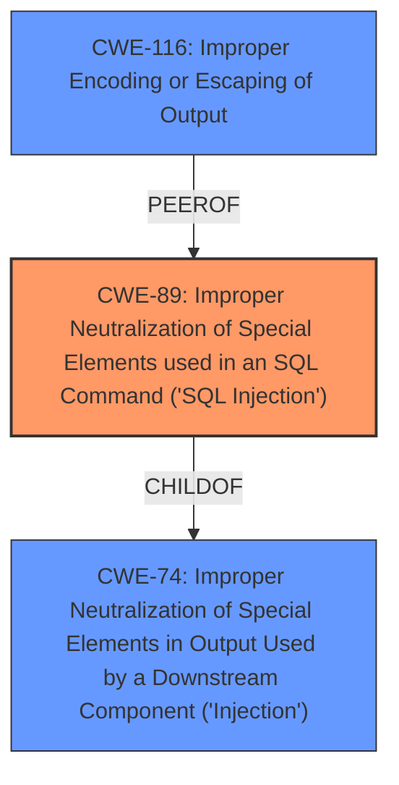

# Analysis Report for CVE-2024-12157

# Vulnerability Analysis Report: CVE-2024-12157

## Description

The Popup MailChimp, GetResponse and ActiveCampaign Intergrations plugin for WordPress is vulnerable to SQL Injection via the id parameter of the upc_delete_db_record AJAX action in all versions up to, and including, 3.2.6 due to **insufficient escaping on the user supplied parameter and lack of sufficient preparation on the existing SQL query**. This makes it possible for unauthenticated attackers to append additional SQL queries into already existing queries that can be used to extract sensitive information from the database.

## Vulnerability Description Key Phrases

- **Rootcause:** ['insufficient escaping on the user supplied parameter and lack of sufficient preparation on the existing SQL query', 'insufficient escaping on user supplied parameter and lack of sufficient preparation on SQL query']
- **Weakness:** SQL injection
- **Impact:** ['extract sensitive information from the database', 'append additional SQL queries']
- **Attacker:** unauthenticated attackers
- **Product:** Popup MailChimp GetResponse and ActiveCampaign Integrations WordPress plugin
- **Version:** all versions up to and including 3.2.6
- **Component:** upc_delete_db_record AJAX action

## Analysis (with Relationship Data)

# Summary
| CWE ID  | CWE Name                                                                                                                                 | Confidence | CWE Abstraction Level | CWE Vulnerability Mapping Label | CWE-Vulnerability Mapping Notes |
| :-------- | :--------------------------------------------------------------------------------------------------------------------------------------- | :--------- | :---------------------- | :------------------------------ | :------------------------------ |
| CWE-89    | Improper Neutralization of Special Elements used in an SQL Command ('SQL Injection')                                                     | 1          | Base                    | Primary                         | Allowed                         |
| CWE-116   | Improper Encoding or Escaping of Output                                                                                                | 0.7        | Class                   | Secondary                       | Allowed-with-Review             |

## Evidence and Confidence

*   **Confidence Score:** 0.9
*   **Evidence Strength:** HIGH

## Relationship Analysis
The primary relationship is that CWE-89 [Improper Neutralization of Special Elements used in an SQL Command ('SQL Injection')] is a child of CWE-74 [Improper Neutralization of Special Elements in Output Used by a Downstream Component ('Injection')]. CWE-89 focuses specifically on SQL injection, providing a more precise classification than its parent. CWE-116 [Improper Encoding or Escaping of Output] is considered a secondary CWE because **insufficient escaping** is a contributing factor to the SQL injection, but the core issue is the **lack of sufficient preparation on the existing SQL query**.



## Vulnerability Chain
The vulnerability chain begins with **insufficient escaping on the user supplied parameter and lack of sufficient preparation on the existing SQL query**, leading to the ability to **append additional SQL queries** and ultimately **extract sensitive information from the database**.
- Root Cause: **insufficient escaping on the user supplied parameter and lack of sufficient preparation on the existing SQL query** (CWE-89)
- Impact: **append additional SQL queries** (CWE-89)
- Impact: **extract sensitive information from the database** (CWE-89)

## Summary of Analysis
The primary vulnerability is CWE-89 [Improper Neutralization of Special Elements used in an SQL Command ('SQL Injection')], as the root cause is the **lack of sufficient preparation on the existing SQL query** combined with **insufficient escaping on the user supplied parameter**, allowing attackers to inject arbitrary SQL commands. This is directly supported by the vulnerability description: "due to **insufficient escaping on the user supplied parameter and lack of sufficient preparation on the existing SQL query**. This makes it possible for unauthenticated attackers to append additional SQL queries into already existing queries that can be used to extract sensitive information from the database."
CWE-116 [Improper Encoding or Escaping of Output] is a contributing factor, but not the primary weakness. The graph relationships show that CWE-89 is a more specific child of CWE-74, which is why CWE-89 was chosen. The retriever scores and keyphrase analysis also strongly support this selection. The selected CWEs are at the optimal level of specificity, with CWE-89 being a Base level CWE and CWE-116 being a Class level CWE.

Relevant CWE Information:
- CWE-89: Improper Neutralization of Special Elements used in an SQL Command ('SQL Injection')
- CWE-116: Improper Encoding or Escaping of Output


## CWE Relationship Analysis

Current CWEs represent these abstraction levels: .


### Vulnerability Chain Analysis

**Chain starting from CWE-74:**
- 74 (Improper Neutralization of Special Elements in Output Used by a Downstream Component ('Injection')) - ROOT


**Chain starting from CWE-89:**
- 89 (Improper Neutralization of Special Elements used in an SQL Command ('SQL Injection')) - ROOT


### CWE Relationship Diagram

```mermaid
graph TD
    classDef primary fill:#f96,stroke:#333,stroke-width:2px
    classDef secondary fill:#69f,stroke:#333
    classDef tertiary fill:#9e9,stroke:#333
```


*Report generated on 2025-07-13 02:24:20*
