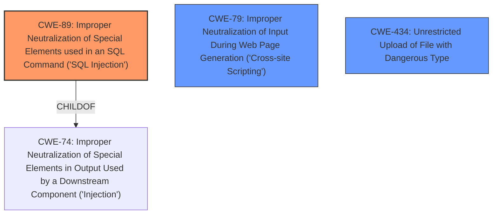

# Analysis Report for CVE-2024-12234

# Vulnerability Analysis Report: CVE-2024-12234

## Description

A vulnerability was found in 1000 Projects Beauty Parlour Management System 1.0. It has been classified as critical. Affected is an unknown function of the file /admin/edit-customer-detailed.php. The manipulation of the argument name leads to **sql injection**. It is possible to launch the attack remotely. The exploit has been disclosed to the public and may be used. Other parameters might be affected as well.

## Vulnerability Description Key Phrases

- **Weakness:** sql injection
- **Vector:** manipulation of name argument
- **Product:** 1000 Projects Beauty Parlour Management System
- **Version:** 1
- **Component:** /admin/edit-customer-detailed.php

## Analysis (with Relationship Data)

# Summary
| CWE ID | CWE Name | Confidence | CWE Abstraction Level | CWE Vulnerability Mapping Label | CWE-Vulnerability Mapping Notes |
|---|---|---|---|---|---|
| CWE-89 | Improper Neutralization of Special Elements used in an SQL Command ('SQL Injection') | 1.0 | Base | Allowed | Primary CWE |
| CWE-79 | Improper Neutralization of Input During Web Page Generation ('Cross-site Scripting') | 0.3 | Base | Allowed | Secondary Candidate |
| CWE-434 | Unrestricted Upload of File with Dangerous Type | 0.1 | Base | Allowed | Secondary Candidate |

## Evidence and Confidence

*   **Confidence Score:** 0.9
*   **Evidence Strength:** HIGH

## Relationship Analysis
The primary CWE is CWE-89, which represents the root cause of the vulnerability - **SQL Injection**. Other CWEs like CWE-79 and CWE-434 were considered based on retriever results but deemed less relevant. The relationships of CWE-89 to its parents (e.g., CWE-74 Improper Neutralization of Special Elements in Output Used by a Downstream Component ('Injection')) and children were considered, but the Base level of CWE-89 was the most appropriate.



## Vulnerability Chain
The vulnerability chain starts with the **improper neutralization** of the `name` argument, leading to **SQL injection**, which could allow unauthorized database access, sensitive data leakage, data tampering, comprehensive system control, and service interruption.

Improper Input Handling (name parameter) -> **SQL Injection** (CWE-89) -> Unauthorized Database Access/Data Leakage/System Control

## Summary of Analysis
The analysis is based on the provided vulnerability description and the CVE reference links content summary. The root cause of the vulnerability is clearly identified as **SQL injection** due to the **improper handling** of the `name` parameter in the `edit-customer-detailed.php` file.

The primary CWE selected is CWE-89 (Improper Neutralization of Special Elements used in an SQL Command ('SQL Injection')), which directly aligns with the vulnerability description and the CVE reference links summary. The evidence for this is the statement that "The manipulation of the argument name leads to **sql injection**." and the CVE Reference Links Content Summary which states: "The root cause is a SQL injection vulnerability in the `admin/edit-customer-detailed.php` file of the "Beauty Parlour Management System PHP SQLite Project". The vulnerability arises from insufficient user input validation of the `name` parameter."

Other CWEs such as CWE-79 (Improper Neutralization of Input During Web Page Generation ('Cross-site Scripting')) and CWE-434 (Unrestricted Upload of File with Dangerous Type) were considered based on the retriever results, but they were not as directly relevant to the vulnerability description as CWE-89. CWE-79 is related to Cross-Site Scripting (XSS), which is a different type of vulnerability than **SQL Injection**. CWE-434 relates to file uploads, which is not mentioned in the vulnerability description.

The selection of CWE-89 is at the optimal level of specificity, as it accurately represents the root cause of the vulnerability (i.e., **SQL Injection**). It is a Base-level CWE, which is preferred for mapping root causes.

Relevant CWE Information:

# Enhanced Context (25 CWEs)
The following CWEs were identified as potentially relevant to this vulnerability:

## CWE-89: Improper Neutralization of Special Elements used in an SQL Command ('SQL Injection')
**Abstraction Level**: Base
**Similarity Score**: 0.79
**Source**: dense

**Description**:
The product constructs all or part of an SQL command using externally-influenced input from an upstream component, but it does not neutralize or incorrectly neutralizes special elements that could modify the intended SQL command when it is sent to a downstream component. Without sufficient removal or quoting of SQL syntax in user-controllable inputs, the generated SQL query can cause those inputs to be interpreted as SQL instead of ordinary user data.

**Mapping Guidance**:
- Usage: Allowed
- Rationale: This CWE entry is at the Base level of abstraction, which is a preferred level of abstraction for mapping to the root causes of vulnerabilities.


## CWE-472: External Control of Assumed-Immutable Web Parameter
**Abstraction Level**: Base
**Similarity Score**: 0.78
**Source**: dense

**Description**:
The web application does not sufficiently verify inputs that are assumed to be immutable but are actually externally controllable, such as hidden form fields.

**Mapping Guidance**:
- Usage: Allowed
- Rationale: This CWE entry is at the Base level of abstraction, which is a preferred level of abstraction for mapping to the root causes of vulnerabilities.


## CWE-425: Direct Request ('Forced Browsing')
**Abstraction Level**: Base
**Similarity Score**: 0.78
**Source**: dense

**Description**:
The web application does not adequately enforce appropriate authorization on all restricted URLs, scripts, or files.

**Mapping Guidance**:
- Usage: Allowed
- Rationale: This CWE entry is at the Base level of abstraction, which is a preferred level of abstraction for mapping to the root causes of vulnerabilities.


## CWE-434: Unrestricted Upload of File with Dangerous Type
**Abstraction Level**: Base
**Similarity Score**: 0.77
**Source**: dense

**Description**:
The product allows the upload or transfer of dangerous file types that are automatically processed within its environment.

**Mapping Guidance**:
- Usage: Allowed
- Rationale: This CWE entry is at the Base level of abstraction, which is a preferred level of abstraction for mapping to the root causes of vulnerabilities.


## CWE-74: Improper Neutralization of Special Elements in Output Used by a Downstream Component ('Injection')
**Abstraction Level**: Class
**Similarity Score**: 0.76
**Source**: dense

**Description**:
The product constructs all or part of a command, data structure, or record using externally-influenced input from an upstream component, but it does not neutralize or incorrectly neutralizes special elements that could modify how it is parsed or interpreted when it is sent to a downstream component.

**Mapping Guidance**:
- Usage: Discouraged
- Rationale: CWE-74 is high-level and often misused when lower-level weaknesses are more appropriate.


## CWE-80: Improper Neutralization of Script-Related HTML Tags in a Web Page (Basic XSS)
**Abstraction Level**: Variant
**Similarity Score**: 0.76
**Source**: dense

**Description**:
The product receives input from an upstream component, but it does not neutralize or incorrectly neutralizes special characters such as "<", ">", and "&" that could be interpreted as web-scripting elements when they are sent to a downstream component that processes web pages.

**Mapping Guidance**:
- Usage: Allowed
- Rationale: This CWE entry is at the Variant level of abstraction, which is a preferred level of abstraction for mapping to the root causes of vulnerabilities.


## CWE-116: Improper Encoding or Escaping of Output
**Abstraction Level**: Class
**Similarity Score**: 0.76
**Source**: dense

**Description**:
The product prepares a structured message for communication with another component, but encoding or escaping of the data is either missing or done incorrectly. As a result, the intended structure of the message is not preserved.

**Mapping Guidance**:
- Usage: Allowed-with-Review
- Rationale: This CWE entry is a Class and might have Base-level children that would be more appropriate


## CWE-79: Improper Neutralization of Input During Web Page Generation ('Cross-site Scripting')
**Abstraction Level**: Base
**Similarity Score**: 0.75
**Source**: dense

**Description**:
The product does not neutralize or incorrectly neutralizes user-controllable input before it is placed in output that is used as a web page that is served to other users.

**Mapping Guidance**:
- Usage: Allowed
- Rationale: This CWE entry is at the Base level of abstraction, which is a preferred level of abstraction for mapping to the root causes of vulnerabilities.


## CWE-96: Improper Neutralization of Directives in Statically Saved Code ('Static Code Injection')
**Abstraction Level**: Base
**Similarity Score**: 0.75
**Source**: dense

**Description**:
The product receives input from an upstream component, but it does not neutralize or incorrectly neutralizes code syntax before inserting the input into an


## CWE Relationship Analysis

Current CWEs represent these abstraction levels: .


### Vulnerability Chain Analysis

**Chain starting from CWE-89:**
- 89 (Improper Neutralization of Special Elements used in an SQL Command ('SQL Injection')) - ROOT


**Chain starting from CWE-116:**
- 116 (Improper Encoding or Escaping of Output) - ROOT


### CWE Relationship Diagram

```mermaid
graph TD
    classDef primary fill:#f96,stroke:#333,stroke-width:2px
    classDef secondary fill:#69f,stroke:#333
    classDef tertiary fill:#9e9,stroke:#333
```


*Report generated on 2025-07-13 02:29:13*
