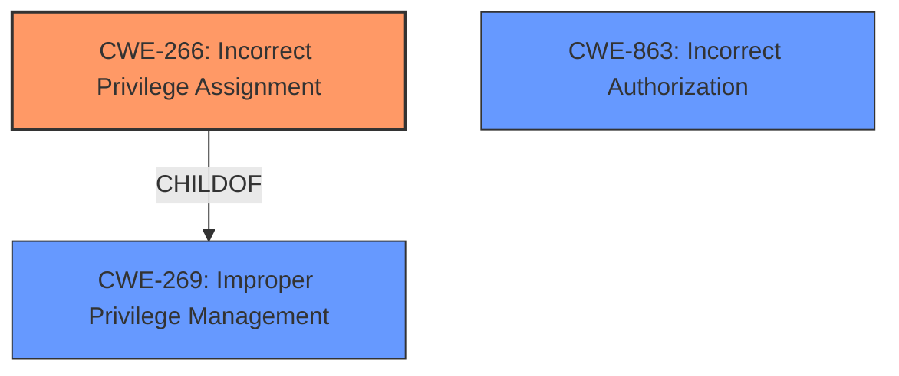

# Enhanced Analysis for CVE-2024-12281

# Summary
| CWE ID | CWE Name | Confidence | CWE Abstraction Level | CWE Vulnerability Mapping Label | CWE-Vulnerability Mapping Notes |
|---|---|---|---|---|---|
| CWE-266 | Incorrect Privilege Assignment | 0.9 | Base | Allowed | Primary CWE |
| CWE-863 | Incorrect Authorization | 0.7 | Class | Allowed-with-Review | Secondary Candidate |

## Evidence and Confidence

*   **Confidence Score:** 0.8
*   **Evidence Strength:** HIGH

## Relationship Analysis
The primary relationship influencing the selection was the parent-child relationship between CWE-269 (Improper Privilege Management) and CWE-266 (Incorrect Privilege Assignment). Since the vulnerability stems from the incorrect assignment of privileges during account registration, CWE-266, a base variant of CWE-269, was deemed a more specific and appropriate choice. CWE-863 (Incorrect Authorization) was considered a peer and higher-level alternative but didn't directly address the root cause of privilege misassignment. The abstraction levels guided the selection of the base variant (CWE-266) for greater precision.



## Vulnerability Chain
The vulnerability chain begins with the **incorrect privilege assignment** (**CWE-266**) during user registration, which allows unauthenticated attackers to create accounts with elevated privileges, leading to privilege escalation as the final impact. The chain is: **CWE-266** (Root Cause) -> Privilege Escalation (Impact).

## Summary of Analysis
The initial analysis focused on identifying the root cause of the privilege escalation vulnerability in the Homey theme for WordPress. The vulnerability description clearly states that the **plugin allows users who are registering new accounts to set their own role**, indicating an **incorrect privilege assignment**.

The retriever results suggested CWE-863 (Incorrect Authorization) and CWE-269 (Improper Privilege Management), among others. However, considering the guidance provided, CWE-266 (Incorrect Privilege Assignment) emerged as the most suitable choice.

The provided evidence explicitly points to the **incorrect assignment of privileges** as the root cause. The vulnerability description key phrases emphasize this: "**rootcause:** **plugin allowing users who are registering new accounts to set their own role**"

The graph relationships further solidified this decision, as CWE-266 is a more specific child of CWE-269, addressing the precise nature of the vulnerability.

The selected CWEs are at the optimal level of specificity, with CWE-266 being a Base variant that accurately represents the weakness.

Relevant CWE Information:

*   **CWE-266: Incorrect Privilege Assignment**
    *   **Technical Explanation:** This CWE applies because the Homey theme allows users to set their own role during account registration, leading to an incorrect assignment of privileges. This means that an unauthenticated attacker can create an account and assign themselves elevated privileges, such as Editor or Shop Manager.
    *   **Security Implications:** This vulnerability allows attackers to gain unauthorized access to sensitive data and functionality, potentially leading to data breaches, website defacement, or other malicious activities.
    *   **Relationships:** CWE-266 is a child of CWE-269 (Improper Privilege Management), making it a more specific and appropriate choice for this vulnerability.
    *   **Mapping Guidance Influence:** The MITRE mapping guidance explicitly recommends CWE-266 for cases where a user is assigned the wrong role due to misconfigured roles or faulty logic during account provisioning.
    *   **Primary or Secondary:** Primary

*   **CWE-863: Incorrect Authorization**
    *   **Technical Explanation:** This CWE applies because the system's authorization check is flawed, allowing users to access resources or perform actions they should not be able to. In this case, the incorrect privilege assignment allows unauthenticated users to set their roles to Editor or Shop Manager. This bypasses the intended authorization mechanism.
    *   **Security Implications:** An attacker could exploit this to gain administrative control over the WordPress site.
    *   **Relationships:** This is a class level CWE and could have Base-level children that would be more appropriate.
    *   **Mapping Guidance Influence:** The MITRE mapping guidance suggests Allowed-with-Review for this CWE entry because it is a Class and might have Base-level children that would be more appropriate
    *   **Primary or Secondary:** Secondary

**CWEs Considered but Not Used:**

*   CWE-269 (Improper Privilege Management): This CWE was considered but not used because CWE-266 (Incorrect Privilege Assignment) provides a more specific representation of the vulnerability.
*   CWE-285 (Improper Authorization): This CWE was considered but not used because the root cause is the incorrect assignment of privileges rather than a flawed authorization check.
*   CWE-306 (Missing Authentication for Critical Function): This CWE was considered but not used because the vulnerability is not due to a missing authentication mechanism, but rather the incorrect assignment of privileges during registration.
*   CWE-862 (Missing Authorization): This CWE was considered but not used because the authorization logic is present, but flawed.


## CWE Relationship Analysis

Current CWEs represent these abstraction levels: .


### Vulnerability Chain Analysis

**Chain starting from CWE-863:**
- 863 (Incorrect Authorization) - ROOT


**Chain starting from CWE-862:**
- 862 (Missing Authorization) - ROOT


### CWE Relationship Diagram

```mermaid
graph TD
    classDef primary fill:#f96,stroke:#333,stroke-width:2px
    classDef secondary fill:#69f,stroke:#333
    classDef tertiary fill:#9e9,stroke:#333
```