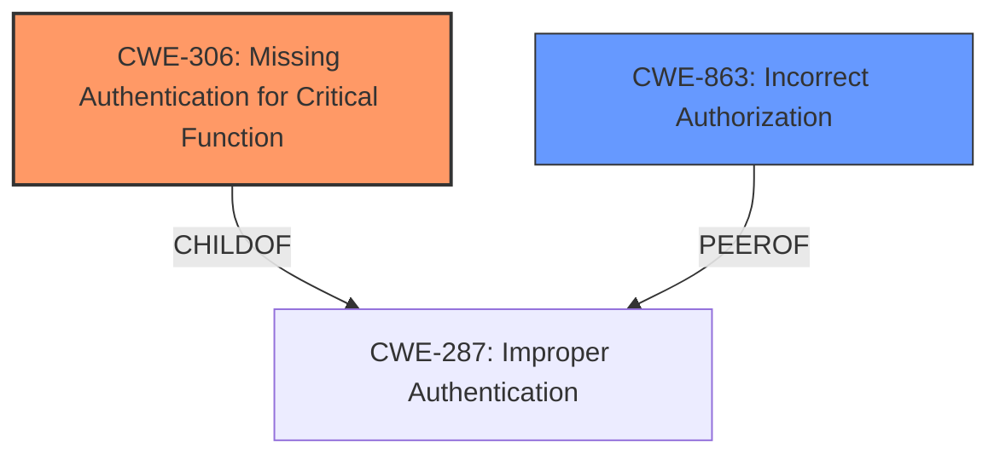

# Enhanced Analysis for CVE-2024-12287

# Summary
| CWE ID | CWE Name | Confidence | CWE Abstraction Level | CWE Vulnerability Mapping Label | CWE-Vulnerability Mapping Notes |
|---|---|---|---|---|---|
| CWE-306 | Missing Authentication for Critical Function | 1 | Base |  Primary CWE | Allowed |
| CWE-863 | Incorrect Authorization | 0.7 | Class | Secondary Candidate | Allowed-with-Review |

## Evidence and Confidence

*   **Confidence Score:** 0.85
*   **Evidence Strength:** HIGH

## Relationship Analysis
The primary relationship influencing the decision is the parent-child relationship between CWE-287 (Improper Authentication) and CWE-306 (Missing Authentication for Critical Function). Since the description explicitly states that the plugin doesn't properly verify users' identities *before* authenticating them, it indicates a lack of authentication rather than an incorrect authentication process. CWE-863 (Incorrect Authorization) was considered, but the issue precedes authorization, making CWE-306 a better fit. The abstraction levels were considered, and the Base level of CWE-306 accurately captures the specific flaw.



## Vulnerability Chain
The vulnerability chain starts with the **lack of authentication** (CWE-306), leading to the ability to bypass authentication and log in as other users, including administrators. This ultimately results in full control of the site.

CWE-306 (Missing Authentication for Critical Function) -> Authentication Bypass -> Privilege Escalation -> Full Site Control

## Summary of Analysis
The analysis is primarily based on the vulnerability description and the provided CVE summary, which clearly point to a **failure to properly verify user identity *before* authentication**. The key phrase "**plugin not properly verifying a users identity prior to authenticating them**" directly supports CWE-306. The Retriever results and graph relationships helped confirm the appropriate CWE choice. The decision is supported by the MITRE guidance distinguishing between authentication and authorization flaws.

The selected CWEs are at the optimal level of specificity because:

*   CWE-306 is a Base-level CWE that directly addresses the root cause described in the vulnerability.
*   CWE-863 is a Class-level CWE and is a secondary candidate because it addresses authorization and not authentication.

Relevant CWE Information:

# Enhanced Context (25 CWEs)
The following CWEs were identified as potentially relevant to this vulnerability:

## CWE-306: Missing Authentication for Critical Function
**Abstraction Level**: Base
**Similarity Score**: 1591.36
**Source**: sparse

**Description**:
The product does not perform any authentication for functionality that requires a provable user identity or consumes a significant amount of resources.

**Mapping Guidance**:
- Usage: Allowed
- Rationale: This CWE entry is at the Base level of abstraction, which is a preferred level of abstraction for mapping to the root causes of vulnerabilities.

**Relationships**:
- PARENTOF -> CWE-322
- PARENTOF -> CWE-288
- CHILDOF -> CWE-287
- CHILDOF -> CWE-287
- CHILDOF -> CWE-306

## CWE-863: Incorrect Authorization
**Abstraction Level**: Class
**Similarity Score**: 1649.43
**Source**: sparse

**Description**:
The product performs an authorization check when an actor attempts to access a resource or perform an action, but it does not correctly perform the check.

**Mapping Guidance**:
- Usage: Allowed-with-Review
- Rationale: This CWE entry is a Class and might have Base-level children that would be more appropriate

CWE-285: Improper Authorization was considered but deemed less appropriate since the root cause is specifically related to missing authentication rather than a flawed authorization process. The guidance explicitly suggests that CWE-285 is discouraged when more specific CWEs are available.
CWE-862: Missing Authorization was considered but deemed less appropriate since the root cause is specifically related to missing authentication rather than missing authorization.
CWE-1390: Weak Authentication was considered but deemed less appropriate since the root cause is specifically related to missing authentication, rather than weak authentication.


## CWE Relationship Analysis

Current CWEs represent these abstraction levels: .


### Vulnerability Chain Analysis

**Chain starting from CWE-288:**
- 288 (Authentication Bypass Using an Alternate Path or Channel) - ROOT


**Chain starting from CWE-863:**
- 863 (Incorrect Authorization) - ROOT


### CWE Relationship Diagram

```mermaid
graph TD
    classDef primary fill:#f96,stroke:#333,stroke-width:2px
    classDef secondary fill:#69f,stroke:#333
    classDef tertiary fill:#9e9,stroke:#333
```