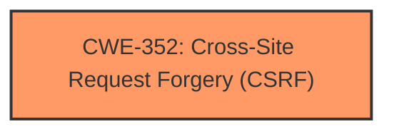

# Analysis for CVE-2024-12301

# Summary
| CWE ID  | CWE Name                                                                       | Confidence | CWE Abstraction Level | CWE Vulnerability Mapping Label | CWE-Vulnerability Mapping Notes |
| :-------- | :----------------------------------------------------------------------------- | :--------- | :---------------------- | :------------------------------ | :------------------------------ |
| CWE-352   | Cross-Site Request Forgery (CSRF)                                            | 1.0        | Compound                | Primary                         | Allowed                       |

## Evidence and Confidence

*   **Confidence Score:** 1.0
*   **Evidence Strength:** HIGH

## Relationship Analysis
The primary relationship influencing the decision is that CWE-352 is a compound weakness, which accurately reflects the nature of CSRF vulnerabilities. Although other CWEs like CWE-862 (Missing Authorization) are related, CWE-352 directly addresses the specific flaw where the application **does not have CSRF checks**. No parent-child or chain relationships strongly influenced the primary CWE selection in this case. The abstraction level of Compound is appropriate because it represents a combination of underlying factors that lead to the vulnerability.

## Vulnerability Chain
The vulnerability chain consists of the following:
1.  **Root Cause:** The application **does not have CSRF checks** to validate the origin of requests.
2.  **Weakness:** This leads to a Cross-Site Request Forgery (CSRF) vulnerability.
3.  **Impact:** Attackers can exploit this by tricking logged-in users into performing unwanted actions.

## Summary of Analysis
The analysis is heavily based on the provided evidence, which clearly states that the JSP Store Locator WordPress plugin **does not have CSRF checks**. This directly aligns with the definition of CWE-352 (Cross-Site Request Forgery), which is a compound weakness describing scenarios where web applications fail to adequately verify the origin of requests.

The core statement from the vulnerability description is: "The JSP Store Locator WordPress plugin through 1.0 **does not have CSRF checks** in some places, which could allow attackers to make logged in users perform unwanted actions via CSRF attacks."

The selection of CWE-352 is based on the fact that the description explicitly mentions the **lack of CSRF checks**, which is the defining characteristic of this type of vulnerability. The "CVE Reference Links Content Summary" reinforces that the **root cause** is the **plugin lacks CSRF checks**. Therefore, CWE-352 is the most specific and accurate representation of the vulnerability.

Other CWEs were considered but ultimately deemed less suitable:
*   CWE-862 (Missing Authorization) - While related, it's a broader category and doesn't specifically address the CSRF aspect.
*   CWE-425 (Direct Request ('Forced Browsing')) - Also related to authorization issues, but not the primary issue.
*   CWE-79 (Improper Neutralization of Input During Web Page Generation ('Cross-site Scripting')) - Irrelevant since the issue is CSRF and not XSS.

The chosen CWE, CWE-352, is at the optimal level of specificity because it directly represents the **lack of CSRF checks**, which is the **root cause** and defining characteristic of the vulnerability.