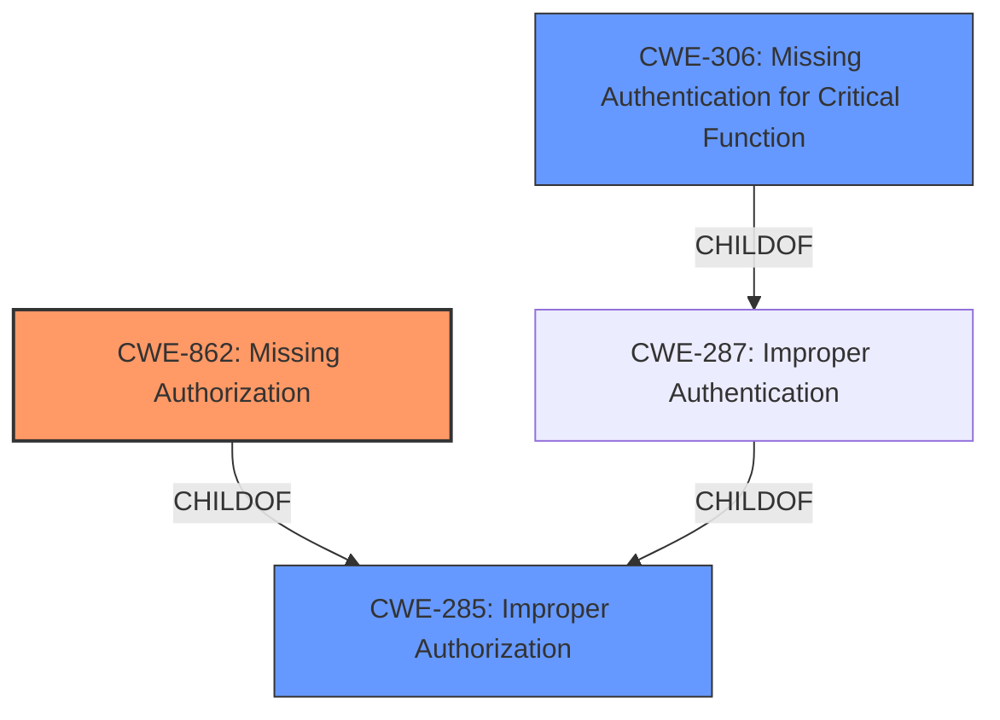

# Analysis for CVE-2024-12307

# Summary
| CWE ID | CWE Name | Confidence | CWE Abstraction Level | CWE Vulnerability Mapping Label | CWE-Vulnerability Mapping Notes |
|---|---|---|---|---|---|
| CWE-862 | Missing Authorization | 1.0 | Class | Allowed-with-Review | The primary weakness is the **missing access control checks** in the student editing functionality. |
| CWE-285 | Improper Authorization | 0.7 | Class | Discouraged | A broader class that could apply if the authorization was not completely missing, but implemented incorrectly. |
| CWE-306 | Missing Authentication for Critical Function | 0.6 | Base | Allowed | Considered because authorization can be bypassed if authentication is missing, but the description specifies **missing access control checks** which falls into authorization rather than authentication. |

## Evidence and Confidence

*   **Confidence Score:** 0.9
*   **Evidence Strength:** HIGH

## Relationship Analysis
The primary CWE identified is CWE-862 (Missing Authorization). This is a Class-level CWE. CWE-862 is related to other authorization-related CWEs such as CWE-863 (Incorrect Authorization) and CWE-285 (Improper Authorization). CWE-285 is a parent of both CWE-862 and CWE-863. The choice of CWE-862 is based on the explicit mention of **missing access control checks** which directly aligns with the definition of Missing Authorization.

## Vulnerability Chain
The vulnerability chain starts with the **missing access control checks** (CWE-862). This leads to the impact of teachers being able to modify student personal data without proper authorization.

## Summary of Analysis
The vulnerability description clearly states that the issue is due to **missing access control checks** in the student editing functionality. This directly corresponds to CWE-862 (Missing Authorization). The guidance also supports that if there's no role/privilege check after login, then CWE-862 is the proper mapping. The retriever results also had CWE-862 as the top match. The evidence provided is strong and directly supports the selection of CWE-862 as the primary weakness.

CWE-285 was considered because it is a broader category for improper authorization, but CWE-862 is more specific and accurately describes the vulnerability.

CWE-306 was considered because **missing access control checks** can sometimes be related to **missing authentication checks**. However, the description specifically mentions authorization checks, making CWE-862 a better fit.