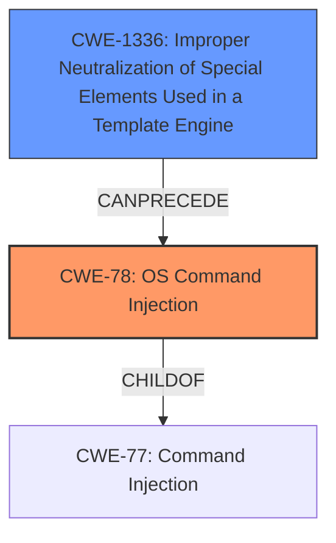

# Analysis Report for CVE-2024-12350

# Vulnerability Analysis Report: CVE-2024-12350

## Description

A vulnerability was found in JFinalCMS 1.0. It has been rated as critical. Affected by this issue is the function update of the file \src\main\java\com\cms\controller\admin\TemplateController.java of the component Template Handler. The manipulation of the argument content leads to **command injection**. The attack may be launched remotely. The exploit has been disclosed to the public and may be used.

## Vulnerability Description Key Phrases

- **Rootcause:** improper input validation
- **Weakness:** command injection
- **Impact:** execute arbitrary commands
- **Vector:** manipulation of content argument
- **Product:** JFinalCMS
- **Version:** 1
- **Component:** update function in TemplateController.java

## Analysis (with Relationship Data)

# Summary
| CWE ID | CWE Name | Confidence | CWE Abstraction Level | CWE Vulnerability Mapping Label | CWE-Vulnerability Mapping Notes |
|---|---|---|---|---|---|
| CWE-78 | Improper Neutralization of Special Elements used in an OS Command ('OS Command Injection') | 1.0 | Base | Primary | Allowed |
| CWE-1336 | Improper Neutralization of Special Elements Used in a Template Engine | 0.8 | Base | Secondary | Allowed |

## Evidence and Confidence

*   **Confidence Score:** 0.9
*   **Evidence Strength:** HIGH

## Relationship Analysis
The primary relationship that influenced the selection was the hierarchical relationship. CWE-78 is a more specific form of command injection, focusing on OS commands. CWE-1336 is a related weakness since the template engine is the entry point for the command injection.



## Vulnerability Chain
The vulnerability chain starts with the **improper neutralization** of the input to the template engine (CWE-1336), which leads to the ability to inject OS commands, resulting in command execution (CWE-78).

## Summary of Analysis
The initial analysis focused on identifying the root cause and the specific type of injection. The evidence clearly points to command injection via template manipulation. The final selection of CWE-78 and CWE-1336 provides the optimal level of specificity.

The vulnerability description states the **weakness** is **command injection** via manipulation of the content argument. The CVE Reference Links Content Summary confirms this by stating that the root cause is a lack of input sanitization in the TemplateController.java file, allowing user-controlled input to be used directly within the Freemarker template engine.

CWE-78 (Improper Neutralization of Special Elements used in an OS Command ('OS Command Injection')) is the most appropriate primary CWE because the injected commands are executed at the OS level.

CWE-1336 (Improper Neutralization of Special Elements Used in a Template Engine) is included as a secondary CWE because the template engine is the entry point for the command injection and is a required condition for the execution.

CWE-77 (Improper Neutralization of Special Elements used in a Command ('Command Injection')) was considered, but CWE-78 is a more specific child.

CWE-89 (Improper Neutralization of Special Elements used in an SQL Command ('SQL Injection')) and CWE-79 (Improper Neutralization of Input During Web Page Generation ('Cross-site Scripting')) were considered but are not applicable as the injection does not directly involve SQL or web page scripting.


## CWE Relationship Analysis

Current CWEs represent these abstraction levels: .


### Vulnerability Chain Analysis

**Chain starting from CWE-89:**
- 89 (Improper Neutralization of Special Elements used in an SQL Command ('SQL Injection')) - ROOT


**Chain starting from CWE-77:**
- 77 (Improper Neutralization of Special Elements used in a Command ('Command Injection')) - ROOT


### CWE Relationship Diagram

```mermaid
graph TD
    classDef primary fill:#f96,stroke:#333,stroke-width:2px
    classDef secondary fill:#69f,stroke:#333
    classDef tertiary fill:#9e9,stroke:#333
```


*Report generated on 2025-07-13 02:38:37*
