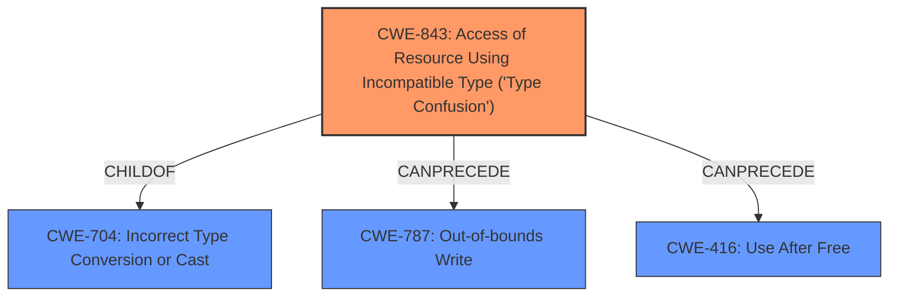

# Analysis for CVE-2024-12381

# Summary
| CWE ID | CWE Name | Confidence | CWE Abstraction Level | CWE Vulnerability Mapping Label | CWE-Vulnerability Mapping Notes |
|---|---|---|---|---|---|
| CWE-843 | Access of Resource Using Incompatible Type ('Type Confusion') | 1.0 | Base | Allowed | Primary CWE |
| CWE-787 | Out-of-bounds Write | 0.5 | Base | Allowed | Secondary Candidate |
| CWE-416 | Use After Free | 0.5 | Variant | Allowed | Secondary Candidate |

## Evidence and Confidence

*   **Confidence Score:** 0.8
*   **Evidence Strength:** HIGH

## Relationship Analysis
The primary CWE is CWE-843 **Type Confusion**, which is a base-level CWE. The retriever results suggested CWE-704 **Incorrect Type Conversion or Cast**, which is a parent (class) of CWE-843. While CWE-704 could be considered, CWE-843 is a more specific and accurate representation of the vulnerability. CWE-787 **Out-of-bounds Write** and CWE-416 **Use After Free** are also considered as impacts of Type confusion.

## Vulnerability Chain
The vulnerability chain starts with **Type Confusion** (CWE-843). This can potentially lead to heap corruption, which could then lead to memory corruption such as an **Out-of-bounds Write** (CWE-787) or **Use After Free** (CWE-416).

## Summary of Analysis
The vulnerability description clearly states that the root cause is **Type Confusion** in V8. The CVE reference links content summary also confirms this. The primary CWE match from the provided data is CWE-843, which aligns with the **Type Confusion** root cause. Other CWEs such as CWE-787 and CWE-416 are possible consequences of the **Type Confusion**, but not the root cause itself. Therefore, CWE-843 is the most appropriate primary CWE. The selection of CWE-843 is based on direct evidence from the vulnerability description and the CVE reference links content summary.

Relevant CWE Information:

*   **CWE-843:** The description of **Type Confusion** aligns perfectly with the vulnerability description.

# Enhanced Context (25 CWEs)
The following CWEs were identified as potentially relevant to this vulnerability:

## CWE-843: Access of Resource Using Incompatible Type ('Type Confusion')
**Abstraction Level**: Base
**Similarity Score**: 0.81
**Source**: dense

**Description**:
The product allocates or initializes a resource such as a pointer, object, or variable using one type, but it later accesses that resource using a type that is incompatible with the original type.

**Mapping Guidance**:
- Usage: Allowed
- Rationale: This CWE entry is at the Base level of abstraction, which is a preferred level of abstraction for mapping to the root causes of vulnerabilities.

## CWE-787: Out-of-bounds Write
**Abstraction Level**: base
**Similarity Score**: 3.30
**Source**: graph

**Description**:
CWE-787: Out-of-bounds Write

**Mapping Guidance**:
- Usage: Allowed
- Rationale: This CWE entry is at the Base level of abstraction, which is a preferred level of abstraction for mapping to the root causes of vulnerabilities.

**Relationships**:
- CANFOLLOW -> CWE-825
- CANFOLLOW -> CWE-824
- CANFOLLOW -> CWE-823
- CANFOLLOW -> CWE-822
- PARENTOF -> CWE-124

## CWE-416: Use After Free
**Abstraction Level**: Variant
**Similarity Score**: 0.73
**Source**: dense

**Description**:
The product reuses or references memory after it has been freed. At some point afterward, the memory may be allocated again and saved in another pointer, while the original pointer references a location somewhere within the new allocation. Any operations using the original pointer are no longer valid because the memory "belongs" to the code that operates on the new pointer.

**Mapping Guidance**:
- Usage: Allowed
- Rationale: This CWE entry is at the Variant level of abstraction, which is a preferred level of abstraction for mapping to the root causes of vulnerabilities.

### Detailed Analysis for CWE Selection:

*   **CWE-843 Access of Resource Using Incompatible Type ('Type Confusion')**: This CWE is selected as the primary weakness because the vulnerability description explicitly mentions **Type Confusion** as the root cause. The description of CWE-843 aligns with the vulnerability, where a resource is accessed using an incompatible type. The security implication is that it can lead to memory corruption, as stated in the vulnerability description ("potentially exploit heap corruption").
    *   **Supporting Evidence:** "Type Confusion in V8" (Vulnerability Description), "Root cause: Type Confusion in V8" (CVE Reference Links Content Summary).
    *   **Confidence:** 1.0

*   **CWE-787 Out-of-bounds Write**: This CWE is considered as a secondary candidate because **Type Confusion** can lead to memory corruption, which could manifest as an out-of-bounds write. However, the description doesn't explicitly state that an out-of-bounds write occurred, only that heap corruption is a potential impact.
    *   **Supporting Evidence:** "potentially exploit heap corruption" (Vulnerability Description).
    *   **Confidence:** 0.5

*   **CWE-416 Use After Free**: This CWE is considered as a secondary candidate because **Type Confusion** can lead to memory corruption, which could manifest as a use-after-free. However, the description doesn't explicitly state that a use-after-free occurred, only that heap corruption is a potential impact.
    *   **Supporting Evidence:** "potentially exploit heap corruption" (Vulnerability Description).
    *   **Confidence:** 0.5

*   **CWE-704 Incorrect Type Conversion or Cast**: This CWE was considered as a parent of CWE-843. However, since CWE-843 is a more specific description of the vulnerability, it was chosen as the primary CWE.
    *   **Reason for not selecting:** CWE-843 is more specific.

*   **CWE-122 Heap-based Buffer Overflow**: While heap corruption is mentioned, this CWE is too specific. **Type Confusion** doesn't necessarily lead to a buffer overflow.
    *   **Reason for not selecting:** The vulnerability description does not specify a buffer overflow.

*   **CWE-911 Improper Update of Reference Count**: This CWE is not directly related to **Type Confusion** or heap corruption in the context of the provided description.
    *   **Reason for not selecting:** The vulnerability description does not mention reference counting.

*   **CWE-451 User Interface (UI) Misrepresentation of Critical Information** and **CWE-356 Product UI does not Warn User of Unsafe Actions**: These CWEs are not relevant as they relate to UI issues, and the vulnerability is related to memory corruption due to **Type Confusion** in the V8 engine.
    *   **Reason for not selecting:** Irrelevant to the vulnerability description.

*   **CWE-129 Improper Validation of Array Index**: This CWE is not directly mentioned or implied in the vulnerability description.
    *   **Reason for not selecting:** The vulnerability description does not mention array index validation.

*   **CWE-123 Write-what-where Condition**: While related to memory corruption, it is a more specific condition than just the **Type Confusion** and potential heap corruption mentioned.
    *   **Reason for not selecting:** Too specific.

The primary selection of CWE-843 is strongly supported by the vulnerability description and external references. The secondary candidates are possibilities due to the potential impact of the **Type Confusion**, but lack explicit evidence.