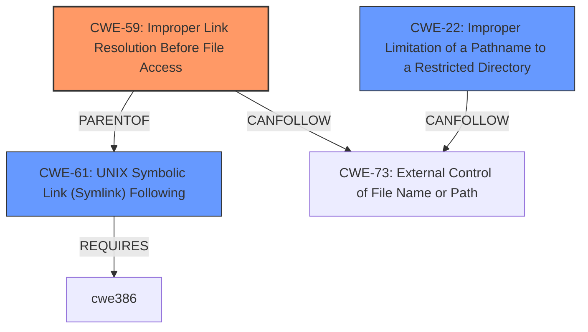

# Analysis for CVE-2024-12390

# Summary

| CWE ID | CWE Name | Confidence | CWE Abstraction Level | CWE Vulnerability Mapping Label | CWE-Vulnerability Mapping Notes |
|---|---|---|---|---|---|
| CWE-59 | Improper Link Resolution Before File Access ('Link Following') | 0.9 | Base | Allowed | Primary CWE |
| CWE-61 | UNIX Symbolic Link (Symlink) Following | 0.7 | Compound | Allowed | Secondary Candidate |
| CWE-22 | Improper Limitation of a Pathname to a Restricted Directory ('Path Traversal') | 0.6 | Base | Allowed | Secondary Candidate |

## Evidence and Confidence

*   **Confidence Score:** 0.9
*   **Evidence Strength:** HIGH

## Relationship Analysis
The primary CWE selected is CWE-59, which describes the **improper link resolution** that leads to the vulnerability. CWE-61 is a compound weakness that includes link following but is less specific than CWE-59 alone. CWE-22 is related to path traversal, which can be a consequence of link following, but it's not the root cause. The relationships between these CWEs helped to narrow down the most accurate classification. Specifically, CWE-59 is a more specific base weakness compared to the compound CWE-61, which is a composition of multiple weaknesses.

## Vulnerability Chain
The vulnerability chain starts with the **improper file extraction validation** when handling RAR files. This leads to **improper link resolution (CWE-59)** because the application doesn't adequately prevent symbolic links from resolving to unintended resources. The **improper link resolution** can then lead to arbitrary file writes and ultimately remote code execution.
  - **Root Cause:** **Improper file extraction validation**
  - CWE-59: Improper Link Resolution Before File Access ('Link Following')
  - Impact: Arbitrary file writes, Remote Code Execution

## Summary of Analysis
The primary focus of the analysis was to identify the root cause of the vulnerability. The vulnerability description clearly states that the application supports the extraction of user-provided RAR files **without proper validation**, and the Python rarfile module supports symlinks, which can be exploited to perform arbitrary file writes. This points to **improper link resolution** as the core issue. The retriever results also highlighted CWE-59 as a strong candidate.

The decision to select CWE-59 was based on the following evidence:

*   The vulnerability description explicitly mentions that the application supports the extraction of user-provided RAR files **without proper validation**.
*   The Python rarfile module, which supports symlinks, can be exploited to perform arbitrary file writes.
*   The retriever results ranked CWE-59 as a highly relevant CWE.

CWE-61 was considered as a secondary candidate because it encompasses the broader concept of symlink following. However, CWE-59 is more specific to the **improper link resolution** aspect of the vulnerability, making it a more accurate classification.

CWE-22 was considered, but it represents a consequence of the vulnerability (path traversal) rather than the root cause (**improper link resolution**).

The selected CWEs are at the optimal level of specificity because they directly address the **improper link resolution** that leads to the vulnerability.

Relevant CWE Information:

**CWE-59: Improper Link Resolution Before File Access ('Link Following')**

*   How the vulnerability's details match the CWE's characteristics: The application processes RAR files containing symlinks, and it **does not properly prevent** these symlinks from resolving to unintended resources. This allows an attacker to write to arbitrary files.
*   The security implications and potential impact: This can lead to arbitrary file writes and remote code execution.
*   Any parent-child relationships or chain patterns that influenced your mapping: CWE-59 is a base weakness and can lead to CWE-73 (External Control of File Name or Path).
*   Whether the weakness is primary or secondary in the vulnerability: This is the primary weakness.
*   How the official MITRE mapping guidance influenced your decision: The mapping guidance allows the use of CWE-59 and states that it is at the Base level of abstraction, which is preferred.

**CWE-61: UNIX Symbolic Link (Symlink) Following**

*   How the vulnerability's details match the CWE's characteristics: The application does not sufficiently account for when a file is a symbolic link that resolves to a target outside of the intended control sphere.
*   The security implications and potential impact: An attacker can cause the product to operate on unauthorized files.
*   Any parent-child relationships or chain patterns that influenced your mapping: CWE-61 is a compound weakness.
*   Whether the weakness is primary or secondary in the vulnerability: This is a secondary weakness.
*   How the official MITRE mapping guidance influenced your decision: The mapping guidance allows the use of CWE-61, although it is attack-oriented.

**CWE-22: Improper Limitation of a Pathname to a Restricted Directory ('Path Traversal')**

*   How the vulnerability's details match the CWE's characteristics: While not the direct root cause, the ability to write to arbitrary files through symlink exploitation can lead to path traversal if an attacker crafts a symlink to point outside the intended directory.
*   The security implications and potential impact: An attacker could potentially bypass restrictions and access unauthorized files or directories.
*   Any parent-child relationships or chain patterns that influenced your mapping: CWE-22 is related to CWE-73 (External Control of File Name or Path).
*   Whether the weakness is primary or secondary in the vulnerability: This is a secondary weakness.
*   How the official MITRE mapping guidance influenced your decision: The mapping guidance allows the use of CWE-22 and states that it is at the Base level of abstraction, which is preferred.