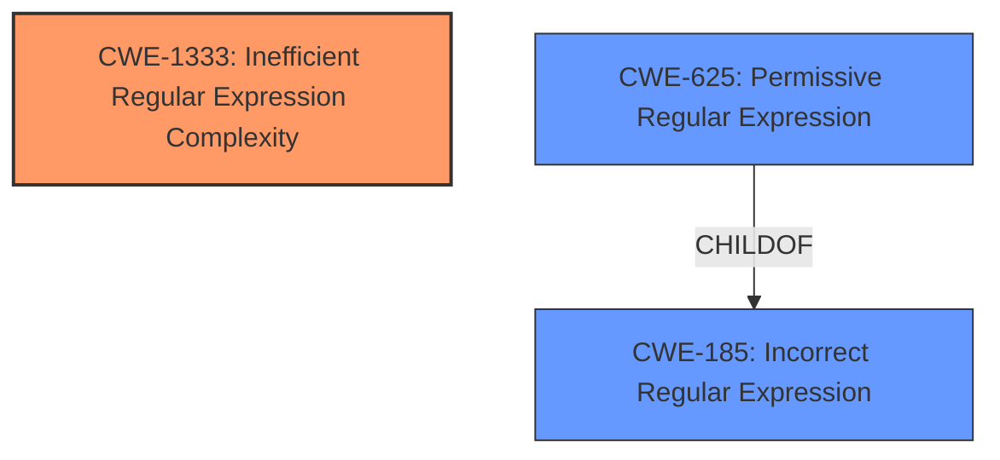

# Enhanced Analysis for CVE-2024-12391

# Summary
| CWE ID | CWE Name | Confidence | CWE Abstraction Level | CWE Vulnerability Mapping Label | CWE-Vulnerability Mapping Notes |
|---|---|---|---|---|---|
| CWE-1333 | Inefficient Regular Expression Complexity | 1.0 | Base | Allowed | Primary CWE |

## Evidence and Confidence

*   **Confidence Score:** 1.0
*   **Evidence Strength:** HIGH

## Relationship Analysis
The primary CWE identified is CWE-1333 (Inefficient Regular Expression Complexity), which is a Base level CWE. Several other CWEs were considered, particularly those related to regular expressions, such as CWE-185 (Incorrect Regular Expression) and CWE-625 (Permissive Regular Expression). However, CWE-1333 was chosen because the vulnerability description specifically mentions that certain regular expressions can cause the Python RE engine to take exponential time, which aligns directly with the description of CWE-1333.



## Vulnerability Chain
The vulnerability chain starts with the **inefficient regular expression complexity** (CWE-1333). An attacker provides a specially crafted regular expression and search string. The Python RE engine then takes an excessive amount of time to process this, leading to a Denial of Service (DoS).

## Summary of Analysis
The primary focus of the analysis was to identify the root cause of the vulnerability. The description explicitly mentions a **Regular Expression Denial of Service (ReDoS) attack** and that the Python RE engine can take exponential time to execute certain regular expressions. This points directly to CWE-1333 (Inefficient Regular Expression Complexity).

The evidence from the vulnerability description is strong: "The function permits the execution of user-provided regular expressions. Certain regular expressions can cause the Python RE engine to take exponential time to execute, leading to a Denial of Service (DoS) condition."

CWE-1333 is at the optimal level of specificity as it directly addresses the inefficient complexity of the regular expression, which is the root cause of the DoS.

Relevant CWE Information:

# Enhanced Context (25 CWEs)
The following CWEs were identified as potentially relevant to this vulnerability:

## CWE-1333: Inefficient Regular Expression Complexity
**Abstraction Level**: Base
**Similarity Score**: 0.72
**Source**: dense

**Description**:
The product uses a regular expression with an inefficient, possibly exponential worst-case computational complexity that consumes excessive CPU cycles.

**Mapping Guidance**:
- Usage: Allowed
- Rationale: This CWE entry is at the Base level of abstraction, which is a preferred level of abstraction for mapping to the root causes of vulnerabilities.

## CWE-185: Incorrect Regular Expression
**Abstraction Level**: Class
**Similarity Score**: 0.68
**Source**: dense

**Description**:
The product specifies a regular expression in a way that causes data to be improperly matched or compared.

**Mapping Guidance**:
- Usage: Allowed-with-Review
- Rationale: This CWE entry is a Class and might have Base-level children that would be more appropriate

## CWE-625: Permissive Regular Expression
**Abstraction Level**: Base
**Similarity Score**: 0.67
**Source**: dense

**Description**:
The product uses a regular expression that does not sufficiently restrict the set of allowed values.

**Mapping Guidance**:
- Usage: Allowed
- Rationale: This CWE entry is at the Base level of abstraction, which is a preferred level of abstraction for mapping to the root causes of vulnerabilities.


## CWE Relationship Analysis

Current CWEs represent these abstraction levels: .


### Vulnerability Chain Analysis

**Chain starting from CWE-625:**
- 625 (Permissive Regular Expression) - ROOT


**Chain starting from CWE-1333:**
- 1333 (Inefficient Regular Expression Complexity) - ROOT


### CWE Relationship Diagram

```mermaid
graph TD
    classDef primary fill:#f96,stroke:#333,stroke-width:2px
    classDef secondary fill:#69f,stroke:#333
    classDef tertiary fill:#9e9,stroke:#333
```