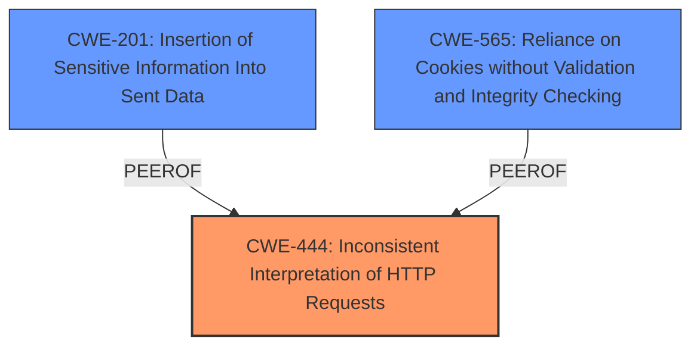

# Raw Analyzer Response for CVE-2024-12397

# Summary
| CWE ID | CWE Name | Confidence | CWE Abstraction Level | CWE Vulnerability Mapping Label | CWE-Vulnerability Mapping Notes |
|---|---|---|---|---|---|
| CWE-444 | Inconsistent Interpretation of HTTP Requests ('HTTP Request/Response Smuggling') | 0.8 | Base | Allowed | Primary CWE. The **improper parsing of cookies** leads to inconsistent interpretation of HTTP requests, which is the core of the vulnerability. |
| CWE-201 | Insertion of Sensitive Information Into Sent Data | 0.6 | Base | Allowed | Secondary candidate. The attacker can insert additional cookie values. |
| CWE-565 | Reliance on Cookies without Validation and Integrity Checking | 0.5 | Base | Allowed | Secondary candidate. The product relies on cookies without properly ensuring their validity. |

## Evidence and Confidence

*   **Confidence Score:** 0.7
*   **Evidence Strength:** MEDIUM

## Relationship Analysis
The primary CWE is CWE-444, which deals with inconsistent interpretation of HTTP requests. The vulnerability involves **improper parsing of cookies**, leading to potential "cookie smuggling." This can be seen as a specific instance of inconsistent interpretation, making CWE-444 a good fit. CWE-201 is a secondary weakness because the attacker can insert sensitive information into sent data by spoofing additional cookie values. CWE-565 is also a secondary weakness because the system relies on cookies without validation, which opens the door to the attack.

## Vulnerability Chain
1.  **Root Cause:** **Improper parsing of cookies with certain value-delimiting characters** (CWE-444).
2.  **Weakness:** Ability to construct a cookie value to exfiltrate HttpOnly cookie values or spoof arbitrary additional cookie values (CWE-201 and CWE-565).
3.  **Impact:** Unauthorized data access or modification, compromise of data confidentiality and integrity.

## Summary of Analysis
The initial analysis, based on the vulnerability description and reference links, pointed towards **improper parsing of cookies** as the root cause. The primary CWE match, CWE-444, aligns well with this, as it addresses the inconsistent interpretation of HTTP requests resulting from the parsing issue. The ability to inject cookies adds CWE-201 and CWE-565 as secondary weaknesses. The graph relationships indicate that CWE-201 and CWE-565 are peer weaknesses that are caused by CWE-444.

The selected CWEs are at the optimal level of specificity because they directly address the root cause (**improper parsing**) and the immediate consequences (cookie injection and reliance on invalid cookies).

Relevant CWE Information:
-   **CWE-444:** "The product acts as an intermediary HTTP agent... but it does not interpret malformed HTTP requests or responses in ways that are consistent with how the messages will be processed by those entities..."
-   **CWE-201:** "The code transmits data to another actor, but a portion of the data includes sensitive information that should not be accessible to that actor."
-   **CWE-565:** "The product relies on the existence or values of cookies when performing security-critical operations, but it does not properly ensure that the setting is valid for the associated user."

I considered other CWEs from the Retriever Results, but they were not as relevant:
-   CWE-1004, CWE-784, CWE-614: These are all related to cookies, but they focus on specific attributes like HttpOnly or Secure, which are not the core issue here. The core issue is the parsing itself, not necessarily the attributes.
-   CWE-113: This focuses on CRLF injection, which is not mentioned in the vulnerability description.
-   CWE-212: This focuses on removal of sensitive information, which is not the core issue here.