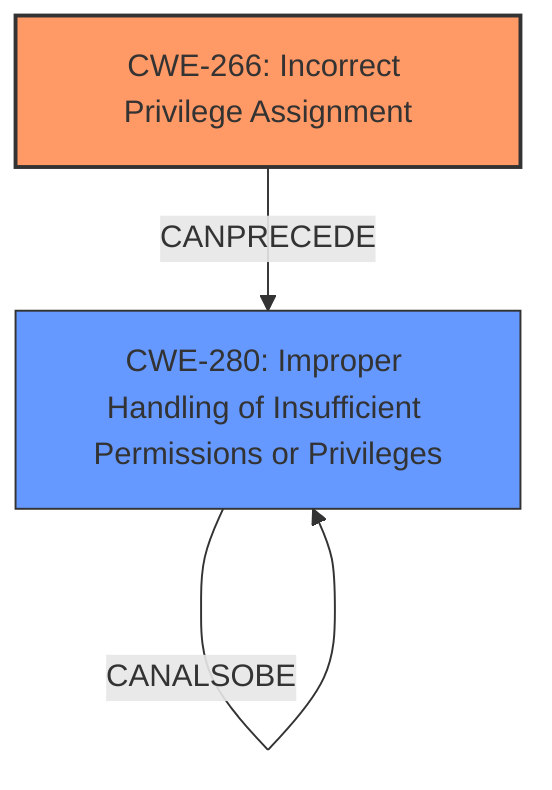

# Enhanced Analysis for CVE-2024-12398

# Summary
| CWE ID  | CWE Name                                                      | Confidence | CWE Abstraction Level | CWE Vulnerability Mapping Label | CWE-Vulnerability Mapping Notes |
| :-------- | :------------------------------------------------------------ | :--------- | :-------------------- | :------------------------------ | :------------------------------ |
| CWE-266 | Incorrect Privilege Assignment                                        | 0.85      | Base                 | Primary                       | Allowed                         |
| CWE-280  | Improper Handling of Insufficient Permissions or Privileges | 0.75      | Base                 | Secondary                     | Allowed                         |

## Evidence and Confidence

*   **Confidence Score:** 0.8
*   **Evidence Strength:** HIGH

## Relationship Analysis
The primary CWE is CWE-266, which represents the root cause of the vulnerability, which is the assignment of incorrect privileges. CWE-266 is a Base level CWE, providing a good level of specificity. CWE-280 represents the condition of the user having insufficient privileges which results from CWE-266. This relationship represents a chain where an incorrect privilege assignment leads to a user having insufficient permissions.



## Vulnerability Chain
The vulnerability chain starts with **improper privilege management** (CWE-266), leading to an authenticated user with limited privileges being able to escalate their privileges to that of an administrator. This escalation allows the user to upload configuration files to the vulnerable device, which is a result of **improper privilege management**.

## Summary of Analysis
The analysis is strongly based on the provided evidence, particularly the **rootcause** identified as "**improper privilege management**" and the impact of escalating privileges. The guidance specifically points to CWE-266 for misconfigured roles that lead to privilege escalation. This confirms CWE-266 as the primary weakness.

The relationships in the graph show how CWE-266 can lead to the conditions described by CWE-280, where the application doesn't properly handle insufficient privileges. This is a logical progression and supports the selection of these CWEs.

The chosen CWEs are at the Base level of abstraction, offering the most specific representation of the vulnerability's root cause and immediate consequence.

Relevant CWE Information:

# Enhanced Context (25 CWEs)
The following CWEs were identified as potentially relevant to this vulnerability:

## CWE-266: Incorrect Privilege Assignment
**Abstraction Level**: Base
**Similarity Score**: 0.80
**Source**: dense

**Description**:
A product incorrectly assigns a privilege to a particular actor, creating an unintended sphere of control for that actor.

**Mapping Guidance**:
- Usage: Allowed
- Rationale: This CWE entry is at the Base level of abstraction, which is a preferred level of abstraction for mapping to the root causes of vulnerabilities.

**Technical explanation for CWE-266:**
The vulnerability description states that the **improper privilege management** allows an authenticated user with limited privileges to escalate their privileges to that of an administrator. This directly aligns with CWE-266, which describes a product incorrectly assigning a privilege to a particular actor. The security implication is that an attacker can gain unauthorized access to sensitive functions and data by exploiting the **incorrect privilege assignment**. The potential impact is privilege escalation. The relationship here is that the application's failure to assign privileges correctly leads to this vulnerability. This is the primary weakness because it's the root cause. The MITRE mapping guidance recommends CWE-266 for cases where a user is assigned the wrong role.

## CWE-280: Improper Handling of Insufficient Permissions or Privileges 
**Abstraction Level**: Base
**Similarity Score**: 0.79
**Source**: dense

**Description**:
The product does not handle or incorrectly handles when it has insufficient privileges to access resources or functionality as specified by their permissions. This may cause it to follow unexpected code paths that may leave the product in an invalid state.

**Mapping Guidance**:
- Usage: Allowed
- Rationale: This CWE entry is at the Base level of abstraction, which is a preferred level of abstraction for mapping to the root causes of vulnerabilities.

**Technical explanation for CWE-280:**
The vulnerability description states that an authenticated user with limited privileges could escalate their privileges. This implies that the product does not properly handle situations where the user has insufficient privileges. The security implication is that the system allows actions to be performed without proper authorization, leading to privilege escalation. The potential impact includes unauthorized access and modification of system resources. This weakness is a consequence of **improper privilege management**, as described in CWE-266. The MITRE mapping guidance allows for the use of this CWE at the Base level of abstraction.

CWE-269: Improper Privilege Management was considered but rejected because the mapping guidance discourages its use due to it being high-level and often misused. The guidance recommends using more specific CWEs when available.

CWE-284: Improper Access Control was considered but rejected because it is a higher-level CWE, and more specific CWEs like CWE-266 and CWE-280 are more applicable.

CWE-285: Improper Authorization was considered but rejected because the issue is not with how authorization checks are performed, but with the initial assignment of privileges.

CWE-306: Missing Authentication for Critical Function was considered but rejected because the vulnerability involves an authenticated user, not a missing authentication.


## CWE Relationship Analysis

Current CWEs represent these abstraction levels: .


### Vulnerability Chain Analysis

**Chain starting from CWE-280:**
- 280 (Improper Handling of Insufficient Permissions or Privileges ) - ROOT


**Chain starting from CWE-306:**
- 306 (Missing Authentication for Critical Function) - ROOT


### CWE Relationship Diagram

```mermaid
graph TD
    classDef primary fill:#f96,stroke:#333,stroke-width:2px
    classDef secondary fill:#69f,stroke:#333
    classDef tertiary fill:#9e9,stroke:#333
```