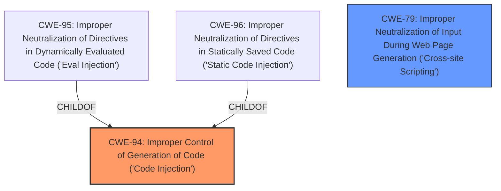

# Enhanced Analysis for CVE-2024-12421

# Summary
| CWE ID | CWE Name | Confidence | CWE Abstraction Level | CWE Vulnerability Mapping Label | CWE-Vulnerability Mapping Notes |
|---|---|---|---|---|---|
| CWE-94 | Improper Control of Generation of Code ('Code Injection') | 0.8 | Base | Primary CWE | Allowed-with-Review |
| CWE-79 | Improper Neutralization of Input During Web Page Generation ('Cross-site Scripting') | 0.7 | Base | Secondary Candidate | Allowed |

## Evidence and Confidence

*   **Confidence Score:** 0.75
*   **Evidence Strength:** MEDIUM

## Relationship Analysis
The primary relationship influencing the decision is that CWE-94 is a parent of CWE-95 (Improper Neutralization of Directives in Dynamically Evaluated Code ('Eval Injection')) and CWE-96 (Improper Neutralization of Directives in Statically Saved Code ('Static Code Injection')). While the vulnerability allows for arbitrary shortcode execution, which could lead to code injection, the specific method isn't detailed enough to determine if it's dynamic or static. Therefore, the more general CWE-94 is chosen. CWE-79 is included as a secondary weakness because the vulnerability description mentions a reflected Cross-Site Scripting vulnerability, which was patched.



## Vulnerability Chain
The vulnerability chain starts with **improper validation** of a value before running `do_shortcode`, leading to arbitrary shortcode execution (code injection) and potentially reflected XSS.

**Chain:**
1.  **Improper Validation** (CWE-Unknown - not enough info to map)
2.  **Improper Control of Generation of Code** (CWE-94)
3.  **Cross-Site Scripting** (CWE-79)

## Summary of Analysis
The primary vulnerability lies in the **improper validation** of input before it's passed to the `do_shortcode` function. This allows unauthenticated attackers to inject and execute arbitrary shortcodes. The description states "This is due to the software allowing users to execute an action that **does not properly validate** a value before running `do_shortcode`." This **rootcause** leads to the execution of arbitrary shortcodes which falls under CWE-94. The vulnerability also mentions reflected Cross-Site Scripting, which supports including CWE-79 as a secondary weakness.

The selection of CWE-94 is further supported by the CVE Reference Links Content Summary, which states: "The plugin fails to validate user-provided input before passing it to the `do_shortcode` function. This allows an unauthenticated user to inject malicious shortcodes and execute them on the website. Additionally, there is a reflected Cross-Site Scripting vulnerability."

The retriever results also pointed to CWE-96, CWE-95, CWE-79. Ultimately, CWE-94 was selected because it is the parent of both CWE-95 and CWE-96.

The evidence supports a confidence level of 0.75, as the core issue is **improper validation** leading to code injection, but the exact mechanism (static vs. dynamic) isn't fully detailed.


## CWE Relationship Analysis

Current CWEs represent these abstraction levels: .


### Vulnerability Chain Analysis

**Chain starting from CWE-96:**
- 96 (Improper Neutralization of Directives in Statically Saved Code ('Static Code Injection')) - ROOT


**Chain starting from CWE-79:**
- 79 (Improper Neutralization of Input During Web Page Generation ('Cross-site Scripting')) - ROOT


### CWE Relationship Diagram

```mermaid
graph TD
    classDef primary fill:#f96,stroke:#333,stroke-width:2px
    classDef secondary fill:#69f,stroke:#333
    classDef tertiary fill:#9e9,stroke:#333
```