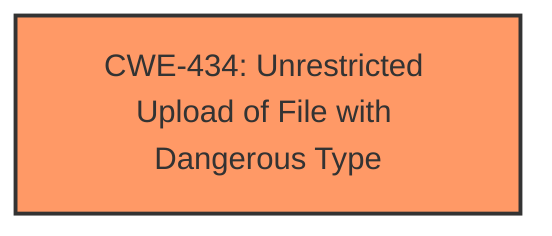

# Analysis Report for CVE-2024-12478

# Vulnerability Analysis Report: CVE-2024-12478

## Description

A vulnerability was found in InvoicePlane up to 1.6.1. It has been declared as critical. This vulnerability affects the function upload_file of the file /index.php/upload/upload_file/1/1. The manipulation of the argument file leads to **unrestricted upload**. The attack can be initiated remotely. The exploit has been disclosed to the public and may be used. Upgrading to version 1.6.2-beta-1 is able to address this issue. It is recommended to upgrade the affected component. The vendor was contacted early, responded in a very professional manner and quickly released a fixed version of the affected product.

## Vulnerability Description Key Phrases

- **Weakness:** unrestricted upload
- **Vector:** manipulation of file argument
- **Product:** InvoicePlane
- **Version:** up to 1.6.1
- **Component:** /index.php/upload/upload_file/1/1

## Analysis (with Relationship Data)

# Summary
| CWE ID | CWE Name | Confidence | CWE Abstraction Level | CWE Vulnerability Mapping Label | CWE-Vulnerability Mapping Notes |
|---|---|---|---|---|---|
| CWE-434 | Unrestricted Upload of File with Dangerous Type | 1.0 | Base | Allowed | Primary CWE |

## Evidence and Confidence

*   **Confidence Score:** 1.0
*   **Evidence Strength:** HIGH

## Relationship Analysis
The primary relationship considered was the direct match of the vulnerability description to the CWE-434 definition. While other CWEs like Path Traversal (CWE-22) or Cross-Site Scripting (CWE-79) could potentially be related in exploitation scenarios, the **root cause** is clearly the **unrestricted upload** itself. Thus, a direct parent-child relationship isn't the most relevant factor here. The abstraction level of CWE-434 being "Base" is appropriate as it directly describes the weakness.



## Vulnerability Chain
The vulnerability chain starts with the **unrestricted upload** (**CWE-434**). Depending on the file type and server configuration, this could lead to various impacts, such as remote code execution (if a malicious script is uploaded and executed), or data corruption (if an inappropriate file overwrites a critical system file). The chain is:

**CWE-434** (Root Cause: **Unrestricted Upload**) -> Potential Impacts (e.g., Remote Code Execution, Data Corruption)

## Summary of Analysis
The analysis is based primarily on the vulnerability description, which clearly states "**unrestricted upload**". The description mentions that the manipulation of the `file` argument leads to this weakness. The pull request commit message "Chore: Fix upload_file function in [#1141](https://github.com/InvoicePlane/InvoicePlane/pull/1141)" adds further confirmation of a file upload related vulnerability.

CWE-434 is the most accurate and specific CWE to describe this vulnerability because it directly addresses the **root cause**: the lack of restrictions on the type of files that can be uploaded. The retriever results also listed CWE-434 with a high score.

Other CWEs were considered but deemed less relevant as the primary classification:

*   CWE-79 (Cross-Site Scripting): While a malicious uploaded file *could* potentially contain XSS payloads, the core issue isn't the improper neutralization of input during web page generation, but the **unrestricted upload** itself.
*   CWE-89 (SQL Injection): Similar to XSS, a malicious file *could* potentially be crafted to exploit SQL injection vulnerabilities, but this isn't the direct result of the **unrestricted upload**.
*   CWE-22 (Path Traversal): Again, a malicious file *could* be crafted to attempt path traversal, but the **root cause** is the ability to upload the file without restrictions in the first place.

The selected CWE is at the optimal level of specificity because it directly describes the **root cause** of the vulnerability, which is the **unrestricted upload** of files.

Relevant CWE Information:

# Enhanced Context (25 CWEs)
The following CWEs were identified as potentially relevant to this vulnerability:

## CWE-434: Unrestricted Upload of File with Dangerous Type
**Abstraction Level**: Base
**Similarity Score**: 0.78
**Source**: dense

**Description**:
The product allows the upload or transfer of dangerous file types that are automatically processed within its environment.

**Mapping Guidance**:
- Usage: Allowed
- Rationale: This CWE entry is at the Base level of abstraction, which is a preferred level of abstraction for mapping to the root causes of vulnerabilities.

## CWE-434: Unrestricted Upload of File with Dangerous Type
**Abstraction Level**: Base
**Similarity Score**: 1279.49
**Source**: sparse

**Description**:
The product allows the upload or transfer of dangerous file types that are automatically processed within its environment.

**Mapping Guidance**:
- Usage: Allowed
- Rationale: This CWE entry is at the Base level of abstraction, which is a preferred level of abstraction for mapping to the root causes of vulnerabilities.

## CWE-434: Unrestricted Upload of File with Dangerous Type
**Abstraction Level**: Base
**Similarity Score**: 2.64
**Source**: graph

**Description**:
The product allows the upload or transfer of dangerous file types that are automatically processed within its environment.

**Mapping Guidance**:
- Usage: Allowed
- Rationale: This CWE entry is at the Base level of abstraction, which is a preferred level of abstraction for mapping to the root causes of vulnerabilities.


## CWE Relationship Analysis

Current CWEs represent these abstraction levels: .


### Vulnerability Chain Analysis

**Chain starting from CWE-89:**
- 89 (Improper Neutralization of Special Elements used in an SQL Command ('SQL Injection')) - ROOT


**Chain starting from CWE-79:**
- 79 (Improper Neutralization of Input During Web Page Generation ('Cross-site Scripting')) - ROOT


### CWE Relationship Diagram

```mermaid
graph TD
    classDef primary fill:#f96,stroke:#333,stroke-width:2px
    classDef secondary fill:#69f,stroke:#333
    classDef tertiary fill:#9e9,stroke:#333
```


*Report generated on 2025-07-13 02:50:07*
