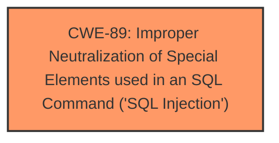

# Raw Analyzer Response for CVE-2024-12492

# Summary

| CWE ID | CWE Name | Confidence | CWE Abstraction Level | CWE Vulnerability Mapping Label | CWE-Vulnerability Mapping Notes |
|---|---|---|---|---|---|
| CWE-89 | Improper Neutralization of Special Elements used in an SQL Command ('SQL Injection') | 1.0 | Base | Allowed | Primary CWE |

## Evidence and Confidence

*   **Confidence Score:** 1.0
*   **Evidence Strength:** HIGH

## Relationship Analysis
The primary relationship considered was that CWE-89 is a Base level CWE which is the preferred level. No other relationships applied.

## Vulnerability Chain
The vulnerability chain consists of:
1.  **Root Cause:** **Improper Neutralization of Special Elements used in an SQL Command ('SQL Injection')** (CWE-89) in the `/visualizar-usuario.php` file due to the **missing** or **incorrect** neutralization of the `id` argument.
2.  **Impact:** Remote attackers can manipulate the `id` argument to inject SQL commands, potentially leading to unauthorized data access, modification, or deletion.

## Summary of Analysis
The vulnerability description clearly states that the manipulation of the `id` argument in `/visualizar-usuario.php` leads to **sql injection**. The **weakness** is explicitly identified as **sql injection**. The most relevant CWE is therefore CWE-89, which directly addresses **Improper Neutralization of Special Elements used in an SQL Command ('SQL Injection')**.

The retriever results also strongly support this, with CWE-89 having the highest score of 1.0.

Relevant CWE Information:

# Enhanced Context (25 CWEs)
The following CWEs were identified as potentially relevant to this vulnerability:

## CWE-89: Improper Neutralization of Special Elements used in an SQL Command ('SQL Injection')
**Abstraction Level**: Base
**Similarity Score**: 0.77
**Source**: dense

**Description**:
The product constructs all or part of an SQL command using externally-influenced input from an upstream component, but it does not neutralize or incorrectly neutralizes special elements that could modify the intended SQL command when it is sent to a downstream component. Without sufficient removal or quoting of SQL syntax in user-controllable inputs, the generated SQL query can cause those inputs to be interpreted as SQL instead of ordinary user data.

**Mapping Guidance**:
- Usage: Allowed
- Rationale: This CWE entry is at the Base level of abstraction, which is a preferred level of abstraction for mapping to the root causes of vulnerabilities.

## CWE-89: Improper Neutralization of Special Elements used in an SQL Command ('SQL Injection')
**Abstraction Level**: Base
**Similarity Score**: 568.94
**Source**: sparse

**Description**:
The product constructs all or part of an SQL command using externally-influenced input from an upstream component, but it does not neutralize or incorrectly neutralizes special elements that could modify the intended SQL command when it is sent to a downstream component. Without sufficient removal or quoting of SQL syntax in user-controllable inputs, the generated SQL query can cause those inputs to be interpreted as SQL instead of ordinary user data.

**Mapping Guidance**:
- Usage: Allowed
- Rationale: This CWE entry is at the Base level of abstraction, which is a preferred level of abstraction for mapping to the root causes of vulnerabilities.

## Retriever Results

### Top Combined Results

| Rank | CWE ID | Name | Abstraction | Usage  | Retrievers | Individual Scores |
|------|--------|------|-------------|-------|------------|-------------------|
| 1 | 89 | Improper Neutralization of Special Elements used in an SQL Command ('SQL Injection') | Base | Allowed | alternate_terms | 1.000 |

I considered the other CWEs listed in the Retriever Results, but none of them matched the **sql injection** vulnerability as directly as CWE-89. For example, CWE-79 (Improper Neutralization of Input During Web Page Generation ('Cross-site Scripting')) is related to web page output, while the vulnerability is in the SQL command construction.

I am confident that CWE-89 is the most accurate and specific classification for this vulnerability, aligning with the vulnerability description and the provided context.