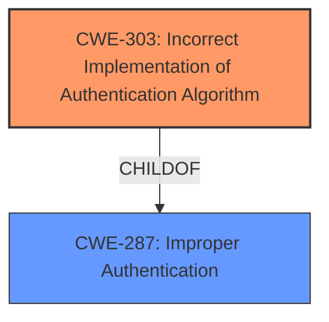

# Analysis for CVE-2024-12510

# Summary

| CWE ID | CWE Name | Confidence | CWE Abstraction Level | CWE Vulnerability Mapping Label | CWE-Vulnerability Mapping Notes |
|---|---|---|---|---|---|
| CWE-303 | Incorrect Implementation of Authentication Algorithm | 0.75 | Base | Primary | Allowed |
| CWE-287 | Improper Authentication | 0.5 | Secondary | Discouraged | Discouraged because it is a Class and a lower-level CWE entry is likely to be applicable. |

## Evidence and Confidence

*   **Confidence Score:** 0.7
*   **Evidence Strength:** MEDIUM

## Relationship Analysis

The primary CWE is CWE-303, which is a base-level CWE, indicating a specific flaw. CWE-287 is a parent Class of CWE-303. The child-parent relationship influenced the decision to prefer CWE-303 due to its greater specificity.

## Vulnerability Chain

The vulnerability chain starts with the **incorrect implementation** of the authentication algorithm (CWE-303). This leads to the potential redirection of authentication to another server, exposing credentials.

## Summary of Analysis

The primary assessment is based on the provided vulnerability description and the retriever results. The description states that if LDAP settings are accessed, authentication could be redirected to another server, potentially exposing credentials. This redirection, caused by an incorrect implementation of the authentication algorithm, is best represented by CWE-303.

The graph relationships show that CWE-303 is a child of CWE-287 (Improper Authentication). While CWE-287 is a broader category, CWE-303 provides a more specific description of the vulnerability. Therefore, CWE-303 is at the optimal level of specificity.

Relevant CWE Information:

# Enhanced Context (25 CWEs)
The following CWEs were identified as potentially relevant to this vulnerability:

## CWE-303: Incorrect Implementation of Authentication Algorithm
**Abstraction Level**: Base
**Similarity Score**: 0.74
**Source**: dense

**Description**:
The requirements for the product dictate the use of an established authentication algorithm, but the **implementation of the algorithm is incorrect**.

**Mapping Guidance**:
- Usage: Allowed
- Rationale: This CWE entry is at the Base level of abstraction, which is a preferred level of abstraction for mapping to the root causes of vulnerabilities.

## CWE-287: Improper Authentication
**Abstraction Level**: class
**Similarity Score**: 2.55
**Source**: graph

**Description**:
CWE-287: Improper Authentication

**Mapping Guidance**:
- Usage: Discouraged
- Rationale: This CWE entry might be misused when lower-level CWE entries are likely to be applicable. It is a level-1 Class (i.e., a child of a Pillar).

### Analysis of Candidate CWEs:

*   **CWE-256: Plaintext Storage of a Password** - Not applicable because the vulnerability description does not mention storing passwords in plaintext.
*   **CWE-1390: Weak Authentication** - While related, the root cause is more specifically the incorrect implementation of the authentication algorithm rather than a generally weak algorithm.
*   **CWE-306: Missing Authentication for Critical Function** - Not applicable because authentication is present but flawed, not missing.
*   **CWE-287: Improper Authentication** - A broader category that could apply, but CWE-303 is more specific and therefore preferred.
*   **CWE-90: Improper Neutralization of Special Elements used in an LDAP Query ('LDAP Injection')** - Not directly applicable, as the vulnerability isn't about LDAP injection but rather about potential redirection due to settings.
*   **CWE-540: Inclusion of Sensitive Information in Source Code** - Not applicable because the vulnerability description doesn't indicate that sensitive information is included in the source code.
*   **CWE-321: Use of Hard-coded Cryptographic Key** - Not applicable because there's no mention of hard-coded cryptographic keys.
*   **CWE-303: Incorrect Implementation of Authentication Algorithm** - This is the most accurate CWE, as the vulnerability lies in the **incorrect implementation** of an authentication mechanism, leading to potential redirection and credential exposure.
*   **CWE-291: Reliance on IP Address for Authentication** - Not applicable; the vulnerability doesn't involve reliance on IP addresses for authentication.
*   **CWE-613: Insufficient Session Expiration** - Not applicable; session expiration is not mentioned in the description.