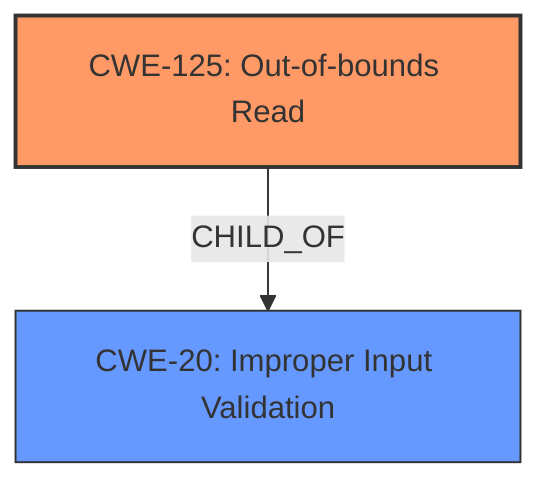

# Analysis for CVE-2024-12549

```markdown
# Summary
| CWE ID    | CWE Name                                                                 | Confidence | CWE Abstraction Level | CWE Vulnerability Mapping Label | CWE-Vulnerability Mapping Notes |
| --------- | ------------------------------------------------------------------------ | ---------- | --------------------- | ------------------------------- | ------------------------------- |
| CWE-125   | Out-of-bounds Read                                                       | 0.9        | Base                  | Primary                         | Allowed                         |
| CWE-20    | Improper Input Validation                                                | 0.7        | Class                 | Secondary                       | Allowed                         |

## Evidence and Confidence

*   **Confidence Score:** 0.8
*   **Evidence Strength:** HIGH

## Relationship Analysis
The primary weakness is CWE-125 (Out-of-bounds Read), which occurs due to the **lack of proper validation of user-supplied data**. This **lack of validation** can be classified as CWE-20 (Improper Input Validation). CWE-125 is a Base level CWE, while CWE-20 is a Class level CWE. CWE-20 can lead to various other weaknesses, including out-of-bounds reads. The selection is based on the vulnerability description explicitly mentioning "out-of-bounds read" as the issue resulting from the **lack of validation**.



## Vulnerability Chain
The vulnerability chain starts with **improper input validation** (CWE-20), which leads to an **out-of-bounds read** (CWE-125). This **out-of-bounds read** can then be exploited to achieve remote code execution.

CWE-20 (Improper Input Validation) -> CWE-125 (Out-of-bounds Read) -> Remote Code Execution

## Summary of Analysis
The vulnerability is primarily due to an **out-of-bounds read** caused by the **lack of proper validation of user-supplied data** when parsing JP2 files.

The evidence for this is: "The specific flaw exists within the parsing of JP2 files. The issue results from the **lack of proper validation of user-supplied data**, which can result in a read past the end of an allocated object."

The retriever results and keyphrase analysis consistently point to CWE-125 and CWE-20 as relevant CWEs. While other CWEs like CWE-787 (Out-of-bounds Write) are mentioned, the description explicitly states a read operation is the root cause, making CWE-125 the most accurate primary classification. CWE-20 is a secondary weakness as the **lack of validation** allowed the **out-of-bounds read** to occur.

The selected CWEs are at the optimal level of specificity because CWE-125 is a Base level CWE that directly describes the type of memory access issue, while CWE-20 is a Class level CWE representing the **improper input validation** that led to the vulnerability.

Relevant CWE Information:
*   CWE-125: Out-of-bounds Read - The product reads data past the end, or before the beginning, of the intended buffer.
*   CWE-20: Improper Input Validation - The product receives input or data, but it does not validate or incorrectly validates that the input has the properties that are required to process the data safely and correctly.
```