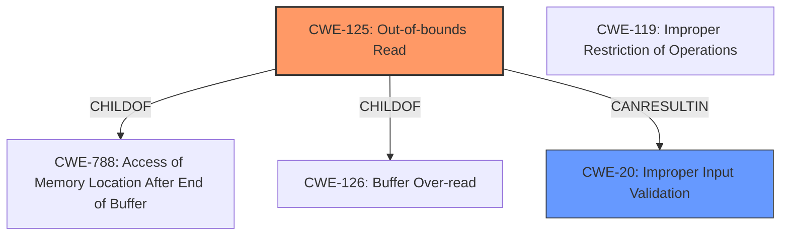

# Analysis Report for CVE-2024-12551

# Vulnerability Analysis Report: CVE-2024-12551

## Description

Tungsten Automation Power PDF JP2 File Parsing **Out-Of-Bounds Read** Remote Code Execution Vulnerability. This vulnerability allows remote attackers to execute arbitrary code on affected installations of Tungsten Automation Power PDF. User interaction is required to exploit this vulnerability in that the target must visit a malicious page or open a malicious file. The specific flaw exists within the parsing of JP2 files. The issue results from the ****lack of proper validation** of user-supplied data**, which can result in a read past the end of an allocated object. An attacker can leverage this vulnerability to execute code in the context of the current process. Was ZDI-CAN-25567.

## Vulnerability Description Key Phrases

- **Rootcause:** lack of proper validation of user-supplied data
- **Weakness:** ['lack of proper validation', 'Out-Of-Bounds Read']
- **Impact:** ['execute code in the context of the current process', 'execute arbitrary code', 'Remote Code Execution']
- **Vector:** malicious page or file
- **Attacker:** remote attackers
- **Product:** Tungsten Automation Power PDF
- **Component:** JP2 File Parsing

## Analysis (with Relationship Data)

# Summary
| CWE ID | CWE Name | Confidence | CWE Abstraction Level | CWE Vulnerability Mapping Label | CWE-Vulnerability Mapping Notes |
|---|---|---|---|---|---|
| CWE-125 | Out-of-bounds Read | 0.9 | Base | Primary | Allowed |
| CWE-20 | Improper Input Validation | 0.7 | Class | Secondary | Allowed |

## Evidence and Confidence

*   **Confidence Score:** 0.8
*   **Evidence Strength:** HIGH

## Relationship Analysis
The primary relationship is that CWE-125 [CWE-125: Out-of-bounds Read] is a specific type of weakness that can result from CWE-20 [CWE-20: Improper Input Validation]. The graph shows that CWE-125 is a child of CWE-788 and CWE-126, which are more specific types of out-of-bounds access. CWE-20 is a more general class of weakness.



## Vulnerability Chain
The vulnerability chain starts with **'lack of proper validation of user-supplied data'** leading to an **'Out-Of-Bounds Read'**, which can then lead to **'execute code in the context of the current process'**.
  - The root cause is **improper input validation**.
  - This leads to an out-of-bounds read, which is the direct cause of the vulnerability.
  - The impact is remote code execution.

## Summary of Analysis
The analysis indicates that the primary weakness is CWE-125 [CWE-125: Out-of-bounds Read], caused by a **'lack of proper validation of user-supplied data'**. The vulnerability description clearly states "**Out-Of-Bounds Read**" and that the issue results from the **'lack of proper validation of user-supplied data'**. This **lack of validation** allows for a read past the end of an allocated object. This aligns perfectly with the description of CWE-125 [CWE-125: Out-of-bounds Read], which states, "The product reads data past the end, or before the beginning, of the intended buffer."

CWE-20 [CWE-20: Improper Input Validation] is also relevant as it represents the root cause of the vulnerability. The **'lack of proper validation'** directly contributes to the out-of-bounds read. However, since CWE-125 [CWE-125: Out-of-bounds Read] more specifically describes the vulnerability, it is chosen as the primary CWE, and CWE-20 [CWE-20: Improper Input Validation] is a secondary contributing factor.

The graph relationships support this decision, showing that CWE-125 [CWE-125: Out-of-bounds Read] is a specific type of out-of-bounds access, while CWE-20 [CWE-20: Improper Input Validation] is a more general class of weakness.

The selected CWEs are at the optimal level of specificity, with CWE-125 [CWE-125: Out-of-bounds Read] being a Base level CWE that directly describes the vulnerability and CWE-20 [CWE-20: Improper Input Validation] being a Class level CWE that represents the root cause.

Several other CWEs were considered but not chosen as primary:

*   CWE-787 [CWE-787: Out-of-bounds Write]: The description specifically mentions a read, not a write.
*   CWE-1284 [CWE-1284: Improper Validation of Specified Quantity in Input]: While input validation is an issue, the core vulnerability is the out-of-bounds read, making CWE-125 [CWE-125: Out-of-bounds Read] a more precise fit.

I have a high confidence in this assessment.


## CWE Relationship Analysis

Current CWEs represent these abstraction levels: .


### Vulnerability Chain Analysis

**Chain starting from CWE-1284:**
- 1284 (Improper Validation of Specified Quantity in Input) - ROOT


**Chain starting from CWE-125:**
- 125 (Out-of-bounds Read) - ROOT


### CWE Relationship Diagram

```mermaid
graph TD
    classDef primary fill:#f96,stroke:#333,stroke-width:2px
    classDef secondary fill:#69f,stroke:#333
    classDef tertiary fill:#9e9,stroke:#333
```


*Report generated on 2025-07-13 02:56:42*
