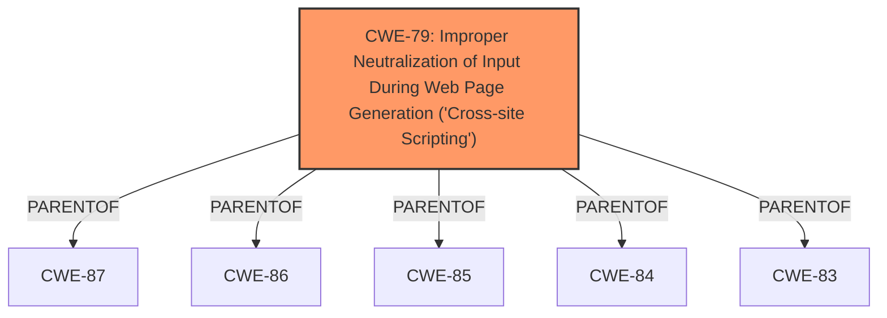

# Enhanced Analysis for CVE-2024-12585

# Summary
| CWE ID | CWE Name | Confidence | CWE Abstraction Level | CWE Vulnerability Mapping Label | CWE-Vulnerability Mapping Notes |
|---|---|---|---|---|---|
| CWE-79 | Improper Neutralization of Input During Web Page Generation ('Cross-site Scripting') | 1 | Base | Allowed | Primary CWE. The plugin fails to sanitize and escape a parameter before outputting it, leading to XSS. |

## Evidence and Confidence

*   **Confidence Score:** 1
*   **Evidence Strength:** HIGH

## Relationship Analysis
The primary CWE is CWE-79, which is a Base level CWE. There are several parent and child relationships. The description states that the plugin does not sanitize and escape a parameter before outputting it back in the page, leading to a Reflected Cross-Site Scripting.



## Vulnerability Chain
The chain of root cause and weaknesses for the Vulnerability Description is:
1.  **Root Cause:** The **Property Hive WordPress plugin does not sanitise and escape a parameter before outputting it back in the page**.
2.  **Weakness:** Reflected Cross-Site Scripting (XSS).
3.  **Impact:** The vulnerability could be used against high privilege users such as admins.

The **Primary CWE** is CWE-79, which identifies the issue that led to the vulnerability (the **rootcause**) and is the first in the "Vulnerability Chain".

## Summary of Analysis
The analysis is based on the provided evidence, which includes the vulnerability description and CVE reference links content summary. The key evidence is: "**Property Hive WordPress plugin does not sanitise and escape a parameter before outputting it back in the page, leading to a Reflected Cross-Site Scripting**". The graph relationships show that CWE-79 is a base CWE with several parent relationships. The selection of CWE-79 is at the optimal level of specificity because it directly describes the **rootcause** of the reflected XSS vulnerability: **improper neutralization of input during web page generation**.

# Enhanced Context (25 CWEs)
The following CWEs were identified as potentially relevant to this vulnerability:

## CWE-472: External Control of Assumed-Immutable Web Parameter
**Abstraction Level**: Base
**Similarity Score**: 0.79
**Source**: dense

**Description**:
The web application does not sufficiently verify inputs that are assumed to be immutable but are actually externally controllable, such as hidden form fields.
**Rationale for not selecting:** This CWE is not the best fit. The vulnerability isn't directly related to immutable web parameters. The main issue is the lack of sanitization and escaping, leading to XSS.

## CWE-266: Incorrect Privilege Assignment
**Abstraction Level**: Base
**Similarity Score**: 0.79
**Source**: dense

**Description**:
A product incorrectly assigns a privilege to a particular actor, creating an unintended sphere of control for that actor.
**Rationale for not selecting:** This CWE is not the best fit. The vulnerability isn't about incorrect privilege assignments.

## CWE-425: Direct Request ('Forced Browsing')
**Abstraction Level**: Base
**Similarity Score**: 0.79
**Source**: dense

**Description**:
The web application does not adequately enforce appropriate authorization on all restricted URLs, scripts, or files.
**Rationale for not selecting:** This CWE is not the best fit. The vulnerability isn't about authorization enforcement.

## CWE-267: Privilege Defined With Unsafe Actions
**Abstraction Level**: Base
**Similarity Score**: 0.78
**Source**: dense

**Description**:
A particular privilege, role, capability, or right can be used to perform unsafe actions that were not intended, even when it is assigned to the correct entity.
**Rationale for not selecting:** This CWE is not the best fit. The vulnerability isn't about privileges enabling unsafe actions.

## CWE-74: Improper Neutralization of Special Elements in Output Used by a Downstream Component ('Injection')
**Abstraction Level**: Class
**Similarity Score**: 0.78
**Source**: dense

**Description**:
The product constructs all or part of a command, data structure, or record using externally-influenced input from an upstream component, but it does not neutralize or incorrectly neutralizes special elements that could modify how it is parsed or interpreted when it is sent to a downstream component.
**Rationale for not selecting:** This CWE is too broad, and the mapping guidance says it is discouraged. CWE-79 is a better fit.

## CWE-41: Improper Resolution of Path Equivalence
**Abstraction Level**: Base
**Similarity Score**: 0.77
**Source**: dense

**Description**:
The product is vulnerable to file system contents disclosure through path equivalence. Path equivalence involves the use of special characters in file and directory names. The associated manipulations are intended to generate multiple names for the same object.
**Rationale for not selecting:** This CWE is not the best fit. The vulnerability isn't about path equivalence.

## CWE-116: Improper Encoding or Escaping of Output
**Abstraction Level**: Class
**Similarity Score**: 0.77
**Source**: dense

**Description**:
The product prepares a structured message for communication with another component, but encoding or escaping of the data is either missing or done incorrectly. As a result, the intended structure of the message is not preserved.
**Rationale for not selecting:** While encoding/escaping is related, CWE-79 is a more precise fit for XSS.

## CWE-639: Authorization Bypass Through User-Controlled Key
**Abstraction Level**: Base
**Similarity Score**: 0.77
**Source**: dense

**Description**:
The system's authorization functionality does not prevent one user from gaining access to another user's data or record by modifying the key value identifying the data.
**Rationale for not selecting:** This CWE is not the best fit. The vulnerability isn't about authorization bypass.

## CWE-178: Improper Handling of Case Sensitivity
**Abstraction Level**: Base
**Similarity Score**: 0.77
**Source**: dense

**Description**:
The product does not properly account for differences in case sensitivity when accessing or determining the properties of a resource, leading to inconsistent results.
**Rationale for not selecting:** This CWE is not the best fit. The vulnerability isn't about case sensitivity issues.

## CWE-80: Improper Neutralization of Script-Related HTML Tags in a Web Page (Basic XSS)
**Abstraction Level**: Variant
**Similarity Score**: 0.77
**Source**: dense

**Description**:
The product receives input from an upstream component, but it does not neutralize or incorrectly neutralizes special characters such as "<", ">", and "&" that could be interpreted as web-scripting elements when they are sent to a downstream component that processes web pages.
**Rationale for not selecting:** CWE-79 is a broader description of XSS.

## CWE-863: Incorrect Authorization
**Abstraction Level**: Class
**Similarity Score**: 1671.08
**Source**: sparse

**Description**:
The product performs an authorization check when an actor attempts to access a resource or perform an action, but it does not correctly perform the check.
**Rationale for not selecting:** This CWE is not the best fit. The vulnerability isn't about authorization checks.

## CWE-285: Improper Authorization
**Abstraction Level**: Class
**Similarity Score**: 1610.05
**Source**: sparse

**Description**:
The product does not perform or incorrectly performs an authorization check when an actor attempts to access a resource or perform an action.
**Rationale for not selecting:** This CWE is not the best fit. The vulnerability isn't about authorization checks.

## CWE-352: Cross-Site Request Forgery (CSRF)
**Abstraction Level**: Compound
**Similarity Score**: 1588.65
**Source**: sparse

**Description**:
The web application does not, or can not, sufficiently verify whether a well-formed, valid, consistent request was intentionally provided by the user who submitted the request.
**Rationale for not selecting:** This CWE is not the best fit. The vulnerability is a reflected XSS not CSRF.

## CWE-434: Unrestricted Upload of File with Dangerous Type
**Abstraction Level**: Base
**Similarity Score**: 2


## CWE Relationship Analysis

Current CWEs represent these abstraction levels: .


### Vulnerability Chain Analysis

**Chain starting from CWE-80:**
- 80 (Improper Neutralization of Script-Related HTML Tags in a Web Page (Basic XSS)) - ROOT


**Chain starting from CWE-639:**
- 639 (Authorization Bypass Through User-Controlled Key) - ROOT


### CWE Relationship Diagram

```mermaid
graph TD
    classDef primary fill:#f96,stroke:#333,stroke-width:2px
    classDef secondary fill:#69f,stroke:#333
    classDef tertiary fill:#9e9,stroke:#333
```