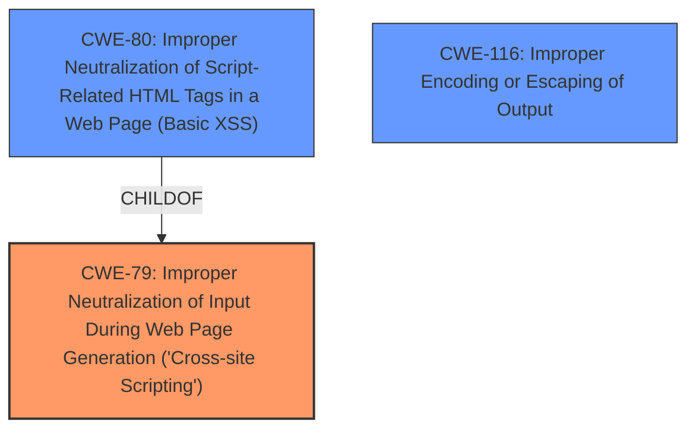

# Raw Analyzer Response for CVE-2024-12611

# Summary
| CWE ID | CWE Name | Confidence | CWE Abstraction Level | CWE Vulnerability Mapping Label | CWE-Vulnerability Mapping Notes |
|---|---|---|---|---|---|
| CWE-79 | Improper Neutralization of Input During Web Page Generation ('Cross-site Scripting') | 1.0 | Base | Allowed | Primary CWE. The vulnerability description explicitly mentions cross-site scripting due to **insufficient input sanitization and output escaping**. |
| CWE-80 | Improper Neutralization of Script-Related HTML Tags in a Web Page (Basic XSS) | 0.7 | Variant | Allowed | Secondary candidate. CWE-80 is a variant of CWE-79 and focuses on script-related HTML tags. It is also a good match, given the context of XSS. |
| CWE-116 | Improper Encoding or Escaping of Output | 0.6 | Class | Allowed-with-Review | Secondary candidate. The vulnerability description mentions **insufficient output escaping**. CWE-116 covers improper encoding or escaping of output, but it is a class-level CWE, so CWE-79 is preferred. |

## Evidence and Confidence

*   **Confidence Score:** 1.0
*   **Evidence Strength:** HIGH

## Relationship Analysis
The primary CWE is CWE-79, which directly addresses the **improper neutralization** leading to XSS. CWE-80, a variant of CWE-79, focuses on script-related HTML tags, making it a more specific classification. CWE-116 is a class-level CWE related to encoding/escaping, which is a component of the overall problem. The relationships show that CWE-79 is the general case of XSS, with CWE-80 being a specific variant, and CWE-116 being a related but broader issue.

## Vulnerability Chain
The vulnerability chain starts with **insufficient input sanitization and output escaping**, leading to the injection of arbitrary web scripts, resulting in Cross-Site Scripting (XSS).
  - Root Cause: **Insufficient input sanitization and output escaping**
  - Weakness: Cross-Site Scripting (CWE-79)
  - Impact: Execution of arbitrary web scripts

## Summary of Analysis
The vulnerability description clearly states that the School Management System for Wordpress plugin is vulnerable to Reflected Cross-Site Scripting due to **insufficient input sanitization and output escaping**. This directly aligns with the description of CWE-79 (Improper Neutralization of Input During Web Page Generation ('Cross-site Scripting')). The retriever results also list CWE-79 as a relevant CWE. CWE-80 is considered as a more specific variant focusing on script-related tags, while CWE-116 is a related class-level CWE regarding encoding/escaping issues.

I am confident in selecting CWE-79 as the primary CWE because the description explicitly points to XSS due to **insufficient sanitization and escaping**. This aligns directly with the definition and scope of CWE-79.

Other CWEs Considered:

*   CWE-352 (Cross-Site Request Forgery (CSRF)): While also a web application vulnerability, CSRF is not the primary issue here. The description focuses on XSS due to **improper sanitization**, not on forging requests.
*   CWE-425 (Direct Request ('Forced Browsing')): This CWE relates to authorization bypass, which is not mentioned in the vulnerability description.
*   CWE-434 (Unrestricted Upload of File with Dangerous Type): File upload vulnerabilities are not relevant to this description, which focuses on XSS.
*   CWE-96 (Improper Neutralization of Directives in Statically Saved Code ('Static Code Injection')): This is related to code injection, but the vulnerability description specifies XSS, which is a different type of injection.
*   CWE-639 (Authorization Bypass Through User-Controlled Key): This CWE is about bypassing authorization, which is not the core issue in the provided description.