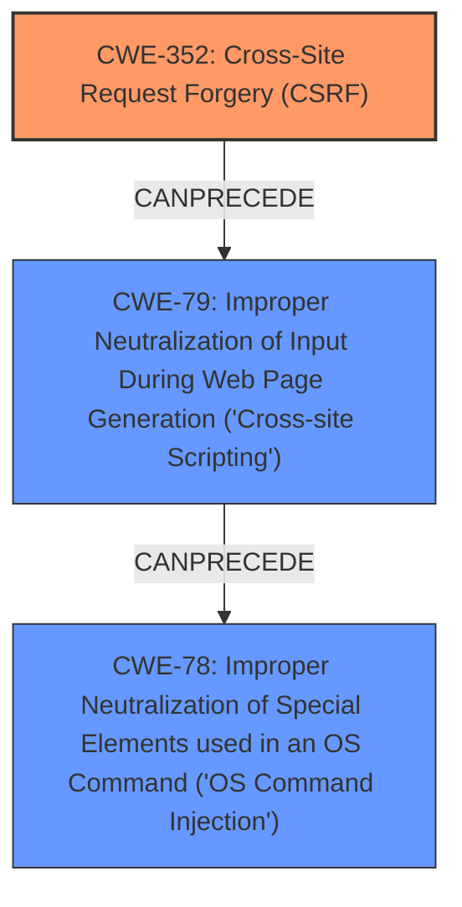

# Analysis Report for CVE-2024-12641

# Vulnerability Analysis Report: CVE-2024-12641

## Description

TenderDocTransfer from Chunghwa Telecom has a Reflected Cross-site scripting vulnerability. The application sets up a simple local web server and provides APIs for communication with the target website. Due to the **lack of CSRF protection** for the APIs, unauthenticated remote attackers could use specific APIs through phishing to execute arbitrary JavaScript code in the users browser. Since the web server set by the application supports Node.Js features, attackers can further leverage this to run OS commands.

## Vulnerability Description Key Phrases

- **Rootcause:** lack of CSRF protection
- **Weakness:** cross-site scripting
- **Impact:** ['execute arbitrary JavaScript code', 'phishing']
- **Attacker:** unauthenticated remote attackers
- **Product:** TenderDocTransfer from Chunghwa Telecom

## Analysis (with Relationship Data)

# Summary
| CWE ID | CWE Name | Confidence | CWE Abstraction Level | CWE Vulnerability Mapping Label | CWE-Vulnerability Mapping Notes |
|---|---|---|---|---|---|
| CWE-352 | Cross-Site Request Forgery (CSRF) | 1.0 | Compound | Primary | Allowed |
| CWE-79 | Improper Neutralization of Input During Web Page Generation ('Cross-site Scripting') | 0.9 | Base | Secondary | Allowed |
| CWE-78 | Improper Neutralization of Special Elements used in an OS Command ('OS Command Injection') | 0.7 | Base | Secondary | Allowed |

## Evidence and Confidence

*   **Confidence Score:** 0.9
*   **Evidence Strength:** HIGH

## Relationship Analysis
The primary weakness is the **lack of CSRF protection** (CWE-352). This can lead to Cross-Site Scripting (CWE-79) if an attacker successfully tricks a user into executing malicious JavaScript. Furthermore, the application's support for Node.js features allows attackers to potentially leverage XSS to run OS commands (CWE-78). Therefore, we have a chain where CWE-352 can lead to CWE-79, which in turn can lead to CWE-78. The abstraction levels are appropriate, with CWE-352 being a compound weakness and CWE-79 and CWE-78 being base weaknesses.



## Vulnerability Chain
The vulnerability chain starts with the **lack of CSRF protection** (CWE-352), which enables an attacker to potentially induce a user to perform actions they did not intend. If the application also has insufficient input validation, this can lead to Cross-Site Scripting (CWE-79), allowing the attacker to inject arbitrary JavaScript code. With Node.js support, the attacker could then leverage XSS to execute OS commands (CWE-78).

CWE-352 (Root Cause) -> CWE-79 (Secondary Weakness) -> CWE-78 (Impact)

## Summary of Analysis
The analysis is primarily based on the vulnerability description, which explicitly mentions the **lack of CSRF protection** as the root cause. This aligns well with CWE-352. The description also mentions the potential for XSS, which corresponds to CWE-79, and the possibility of running OS commands due to Node.js support, aligning with CWE-78. The graph relationships support this chain of vulnerabilities. The selected CWEs are at the optimal level of specificity, with CWE-352 being a compound weakness and CWE-79 and CWE-78 being base weaknesses.

The vulnerability description clearly states: "Due to the **lack of CSRF protection** for the APIs, unauthenticated remote attackers could use specific APIs through phishing to execute arbitrary JavaScript code in the users browser. Since the web server set by the application supports Node.Js features, attackers can further leverage this to run OS commands." This statement directly supports the selection of CWE-352, CWE-79, and CWE-78.

Other CWEs Considered and Rejected:

*   CWE-113, CWE-116, CWE-138, CWE-306, CWE-346, CWE-425, CWE-862: While these CWEs have some relevance, they do not directly address the primary root cause of the **lack of CSRF protection** or the specific chain of vulnerabilities described.
*   CWE-89: SQL Injection is not mentioned in the vulnerability description.
*   CWE-494: Download of code without integrity check is not relevant.
*   CWE-471: Modification of Assumed-Immutable Data is not relevant.

Relevant CWE Information:

# Enhanced Context (25 CWEs)
The following CWEs were identified as potentially relevant to this vulnerability:

## CWE-80: Improper Neutralization of Script-Related HTML Tags in a Web Page (Basic XSS)
**Abstraction Level**: Variant
**Similarity Score**: 0.75
**Source**: dense

**Description**:
The product receives input from an upstream component, but it does not neutralize or incorrectly neutralizes special characters such as "<", ">", and "&" that could be interpreted as web-scripting elements when they are sent to a downstream component that processes web pages.

**Mapping Guidance**:
- Usage: Allowed
- Rationale: This CWE entry is at the Variant level of abstraction, which is a preferred level of abstraction for mapping to the root causes of vulnerabilities.


## CWE-113: Improper Neutralization of CRLF Sequences in HTTP Headers ('HTTP Request/Response Splitting')
**Abstraction Level**: Variant
**Similarity Score**: 0.74
**Source**: dense

**Description**:
The product receives data from an HTTP agent/component (e.g., web server, proxy, browser, etc.), but it does not neutralize or incorrectly neutralizes CR and LF characters before the data is included in outgoing HTTP headers.

**Mapping Guidance**:
- Usage: Allowed
- Rationale: This CWE entry is at the Variant level of abstraction, which is a preferred level of abstraction for mapping to the root causes of vulnerabilities.


## CWE-346: Origin Validation Error
**Abstraction Level**: Class
**Similarity Score**: 0.73
**Source**: dense

**Description**:
The product does not properly verify that the source of data or communication is valid.

**Mapping Guidance**:
- Usage: Allowed-with-Review
- Rationale: This CWE entry is a Class and might have Base-level children that would be more appropriate


## CWE-790: Improper Filtering of Special Elements
**Abstraction Level**: Class
**Similarity Score**: 0.73
**Source**: dense

**Description**:
The product receives data from an upstream component, but does not filter or incorrectly filters special elements before sending it to a downstream component.

**Mapping Guidance**:
- Usage: Allowed-with-Review
- Rationale: This CWE entry is a Class and might have Base-level children that would be more appropriate


## CWE-425: Direct Request ('Forced Browsing')
**Abstraction Level**: Base
**Similarity Score**: 0.73
**Source**: dense

**Description**:
The web application does not adequately enforce appropriate authorization on all restricted URLs, scripts, or files.

**Mapping Guidance**:
- Usage: Allowed
- Rationale: This CWE entry is at the Base level of abstraction, which is a preferred level of abstraction for mapping to the root causes of vulnerabilities.


## CWE-472: External Control of Assumed-Immutable Web Parameter
**Abstraction Level**: Base
**Similarity Score**: 0.73
**Source**: dense

**Description**:
The web application does not sufficiently verify inputs that are assumed to be immutable but are actually externally controllable, such as hidden form fields.

**Mapping Guidance**:
- Usage: Allowed
- Rationale: This CWE entry is at the Base level of abstraction, which is a preferred level of abstraction for mapping to the root causes of vulnerabilities.


## CWE-918: Server-Side Request Forgery (SSRF)
**Abstraction Level**: Base
**Similarity Score**: 0.73
**Source**: dense

**Description**:
The web server receives a URL or similar request from an upstream component and retrieves the contents of this URL, but it does not sufficiently ensure that the request is being sent to the expected destination.

**Mapping Guidance**:
- Usage: Allowed
- Rationale: This CWE entry is at the Base level of abstraction, which is a preferred level of abstraction for mapping to the root causes of vulnerabilities.


## CWE-319: Cleartext Transmission of Sensitive Information
**Abstraction Level**: Base
**Similarity Score**: 0.72
**Source**: dense

**Description**:
The product transmits sensitive or security-critical data in cleartext in a communication channel that can be sniffed by unauthorized actors.

**Mapping Guidance**:
- Usage: Allowed
- Rationale: This CWE entry is at the Base level of abstraction, which is a preferred level of abstraction for mapping to the root causes of vulnerabilities.


## CWE-116: Improper Encoding or Escaping of Output
**Abstraction Level**: Class
**Similarity Score**: 0.72
**Source**: dense

**Description**:
The product prepares a structured message for communication with another component, but encoding or escaping of the data is either missing or done incorrectly. As a result, the intended structure of the message is not preserved.

**Mapping Guidance**:


## CWE Relationship Analysis

Current CWEs represent these abstraction levels: .


### Vulnerability Chain Analysis

**Chain starting from CWE-89:**
- 89 (Improper Neutralization of Special Elements used in an SQL Command ('SQL Injection')) - ROOT


**Chain starting from CWE-471:**
- 471 (Modification of Assumed-Immutable Data (MAID)) - ROOT


### CWE Relationship Diagram

```mermaid
graph TD
    classDef primary fill:#f96,stroke:#333,stroke-width:2px
    classDef secondary fill:#69f,stroke:#333
    classDef tertiary fill:#9e9,stroke:#333
```


*Report generated on 2025-07-13 03:03:11*
