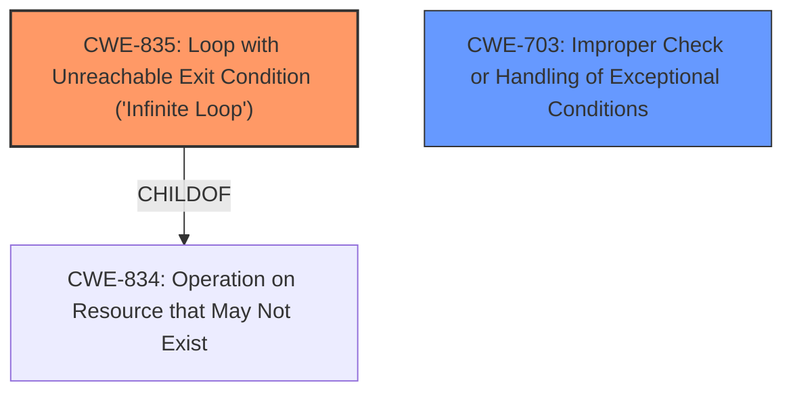

# Raw Analyzer Response for CVE-2024-12704

# Summary
| CWE ID | CWE Name | Confidence | CWE Abstraction Level | CWE Vulnerability Mapping Label | CWE-Vulnerability Mapping Notes |
|---|---|---|---|---|---|
| CWE-835 | Loop with Unreachable Exit Condition ('Infinite Loop') | 1.0 | Base | Allowed | Primary CWE. The **weakness** is an **infinite loop**. |
| CWE-703 | Improper Check or Handling of Exceptional Conditions | 0.7 | Pillar | Discouraged | Secondary candidate. The **rootcause** includes "no exception handling". |

## Evidence and Confidence

*   **Confidence Score:** 0.9
*   **Evidence Strength:** HIGH

## Relationship Analysis
The primary CWE is CWE-835, which is a Base level CWE. It is a child of CWE-834: Operation on Resource that May Not Exist. CWE-703 is a possible secondary CWE as the **rootcause** included "no exception handling".

## Vulnerability Chain
The chain of events is as follows:
1.  Incorrect input type is provided.
2.  Thread terminates abnormally before `_llm.predict` is executed.
3.  No exception handling for this case.
4.  **Infinite loop** in the `get_response_gen` function.
5.  Denial of Service (DoS).

Here, the **infinite loop** is the **weakness** (CWE-835), and the lack of exception handling (possibly CWE-703) contributes to it. The final impact is Denial of Service.

## Summary of Analysis
The primary **weakness** is an **infinite loop** (CWE-835) caused by a thread terminating prematurely without proper exception handling.

The evidence supporting this is:

*   Vulnerability Description: "...leading to an **infinite loop** in the get_response_gen function."
*   Vulnerability Description Key Phrases: "**weakness:** **infinite loop**" and "**rootcause:** **['thread termination before _llm.predict', 'no exception handling']**"

CWE-835 is the most specific and appropriate CWE.

I considered CWE-703 because the description mentioned "no exception handling". However, CWE-703 is a Pillar, which is a very high level of abstraction. Since the primary issue is the **infinite loop**, CWE-835 is more appropriate as the primary CWE. The provided patch adds a timeout to the callback handler to avoid the **infinite loop**.

Relevant CWE Information:
* CWE-835: Loop with Unreachable Exit Condition ('Infinite Loop')
* CWE-703: Improper Check or Handling of Exceptional Conditions