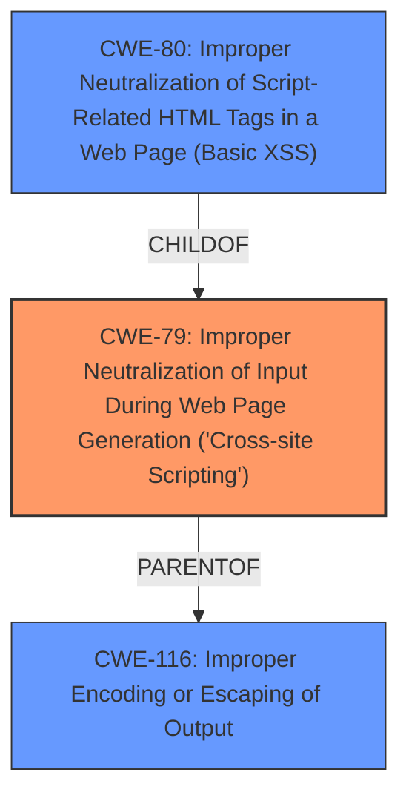

# Enhanced Analysis for CVE-2024-12724

# Summary
| CWE ID | CWE Name | Confidence | CWE Abstraction Level | CWE Vulnerability Mapping Label | CWE-Vulnerability Mapping Notes |
|---|---|---|---|---|---|
| CWE-79 | Improper Neutralization of Input During Web Page Generation ('Cross-site Scripting') | 1.0 | Base | Allowed | Primary CWE |

## Evidence and Confidence

*   **Confidence Score:** 1.0
*   **Evidence Strength:** HIGH

## Relationship Analysis
The primary relationship influencing the decision is the direct match of the vulnerability description to CWE-79, which is at the Base level of abstraction. There are also parent relationships to CWE-79, like CWE-116, but those are at a higher level of abstraction (Class) which makes CWE-79 the optimal level of specificity. There are also child relationships, like CWE-80, but the evidence does not support that level of specificity.



## Vulnerability Chain
The vulnerability chain begins with the **root cause**: a parameter that **does not sanitise and escape a parameter before outputting**. This leads directly to the impact: Reflected Cross-Site Scripting (XSS).

## Summary of Analysis
The vulnerability description clearly states that the WP DeskLite WordPress plugin **does not sanitise and escape a parameter before outputting** it back in the page, leading to a Reflected Cross-Site Scripting. The CVE Reference Links Content Summary reinforces this by stating that the **root cause of the vulnerability** is that the plugin **does not sanitize and escape a parameter before outputting** it back in the page, leading to XSS. The retriever results also strongly suggest CWE-79 as the primary candidate.

CWE-79 (Improper Neutralization of Input During Web Page Generation ('Cross-site Scripting')) is the most appropriate CWE because it directly addresses the **root cause** of the vulnerability: the **lack of sanitization and escaping of a parameter before outputting** it to a web page.

I considered other CWEs from the Retriever Results, but they were not as directly relevant:

*   CWE-352 (Cross-Site Request Forgery (CSRF)): This CWE addresses a different type of vulnerability where an attacker tricks a user into performing an action on a web application without their knowledge. It is not directly related to the **lack of input sanitization and escaping** in this case.
*   CWE-116 (Improper Encoding or Escaping of Output): While related to output handling, CWE-116 is more general and doesn't specifically address the context of web page generation like CWE-79 does. Additionally, CWE-116 is a Class, and CWE-79 is a Base.
*   CWE-89 (Improper Neutralization of Special Elements used in an SQL Command ('SQL Injection')): This CWE is specific to SQL injection vulnerabilities, which are not mentioned or implied in the vulnerability description.
*   CWE-434 (Unrestricted Upload of File with Dangerous Type): This CWE deals with the unrestricted upload of dangerous file types, which is not relevant to the XSS vulnerability described.
*   CWE-862 (Missing Authorization): This CWE is related to missing authorization checks, which is a different type of vulnerability than the one described.
*   CWE-138 (Improper Neutralization of Special Elements): This CWE is more general and doesn't specifically address the context of web page generation like CWE-79 does. Additionally, CWE-138 is a Class, and CWE-79 is a Base.
*   CWE-472 (External Control of Assumed-Immutable Web Parameter): While this CWE relates to web parameters, it's not directly tied to XSS like CWE-79 is.
*   CWE-96 (Improper Neutralization of Directives in Statically Saved Code ('Static Code Injection')): This CWE deals with static code injection, which is not relevant to the XSS vulnerability described.
*   CWE-471 (Modification of Assumed-Immutable Data (MAID)): This CWE is not relevant to the XSS vulnerability described.


## CWE Relationship Analysis

Current CWEs represent these abstraction levels: .


### Vulnerability Chain Analysis

**Chain starting from CWE-89:**
- 89 (Improper Neutralization of Special Elements used in an SQL Command ('SQL Injection')) - ROOT


**Chain starting from CWE-471:**
- 471 (Modification of Assumed-Immutable Data (MAID)) - ROOT


### CWE Relationship Diagram

```mermaid
graph TD
    classDef primary fill:#f96,stroke:#333,stroke-width:2px
    classDef secondary fill:#69f,stroke:#333
    classDef tertiary fill:#9e9,stroke:#333
```