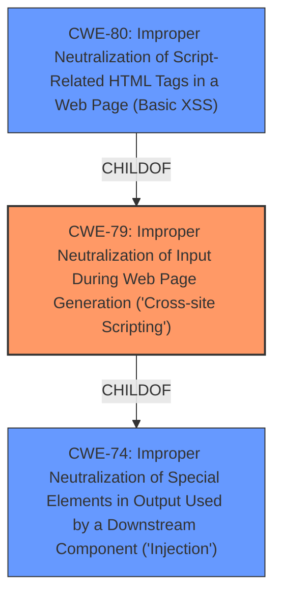

# Enhanced Analysis for CVE-2024-12736

# Summary

| CWE ID   | CWE Name                                                                    | Confidence | CWE Abstraction Level | CWE Vulnerability Mapping Label | CWE-Vulnerability Mapping Notes |
| -------- | --------------------------------------------------------------------------- | ---------- | --------------------- | ------------------------------- | ------------------------------- |
| CWE-79   | Improper Neutralization of Input During Web Page Generation ('Cross-site Scripting') | 1          | Base                  | Primary CWE                     | Allowed                       |

## Evidence and Confidence

*   **Confidence Score:** 1
*   **Evidence Strength:** HIGH

## Relationship Analysis

The primary relationship influencing this decision is the direct match of the vulnerability description to CWE-79's definition. While other CWEs like CWE-116 (Improper Encoding or Escaping of Output) are related, CWE-79 directly addresses the **improper neutralization** leading to **cross-site scripting**. The abstraction level of Base is appropriate as it directly describes the weakness.



## Vulnerability Chain

The vulnerability chain starts with the **lack of sanitization and escaping** of user input, leading directly to **CWE-79 (Improper Neutralization of Input During Web Page Generation ('Cross-site Scripting'))**. The impact is the execution of arbitrary scripts in the context of a high-privilege user, such as an administrator.

## Summary of Analysis

The analysis is based on the provided evidence, specifically the vulnerability description and the CVE reference summary, both of which explicitly state the presence of a **cross-site scripting** vulnerability due to **improper neutralization**.

The vulnerability description states: "The BU Section Editing WordPress plugin through 0.9.9 does not sanitise and escape a parameter before outputting it back in the page, leading to a Reflected **Cross-Site Scripting** which could be used against high privilege users such as admin."

The CVE reference summary highlights the root cause: "The plugin does not sanitize and escape a parameter before outputting it back in the page." and "Weaknesses/vulnerabilities present: \* Reflected **Cross-Site Scripting** (XSS)".

CWE-79 is at the optimal level of specificity because it directly addresses the core issue of **improper neutralization** of input leading to XSS. While other CWEs like CWE-116 (Improper Encoding or Escaping of Output) could be considered, CWE-79 is a more precise fit.

The retriever results also list CWE-79 as a top candidate, further supporting this assessment.

**CWE-80: Improper Neutralization of Script-Related HTML Tags in a Web Page (Basic XSS)** was considered, but CWE-79 is a better fit because it is a broader category that encompasses all forms of XSS, not just those related to HTML tags.

**CWE-116: Improper Encoding or Escaping of Output** was considered, but the core issue is not just the lack of encoding/escaping, but the specific failure to neutralize input in a way that prevents it from being interpreted as code when generating a web page. Thus, CWE-79 is a more precise representation of the vulnerability.

**CWE-862: Missing Authorization** was considered and rejected. The vulnerability is not related to missing authorization checks.

**CWE-472: External Control of Assumed-Immutable Web Parameter** was considered and rejected. The vulnerability is not related to the external control of assumed immutable web parameters.

**CWE-89: Improper Neutralization of Special Elements used in an SQL Command ('SQL Injection')** was considered and rejected. The vulnerability is not related to SQL injection.


## CWE Relationship Analysis

Current CWEs represent these abstraction levels: .


### Vulnerability Chain Analysis

**Chain starting from CWE-89:**
- 89 (Improper Neutralization of Special Elements used in an SQL Command ('SQL Injection')) - ROOT


**Chain starting from CWE-116:**
- 116 (Improper Encoding or Escaping of Output) - ROOT


### CWE Relationship Diagram

```mermaid
graph TD
    classDef primary fill:#f96,stroke:#333,stroke-width:2px
    classDef secondary fill:#69f,stroke:#333
    classDef tertiary fill:#9e9,stroke:#333
```