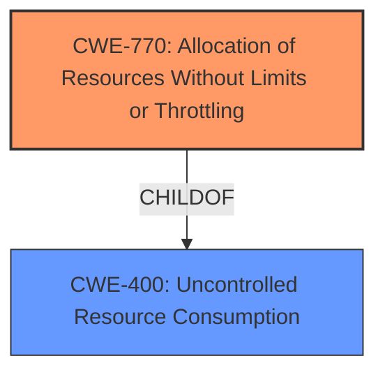

# Analysis Report for CVE-2024-12778

# Vulnerability Analysis Report: CVE-2024-12778

## Description

A vulnerability in aimhubio/aim version 3.25.0 allows for a denial of service (DoS) attack. The issue arises when a large number of tracked metrics are retrieved simultaneously from the Aim web API, causing the web server to become unresponsive. The root cause is the lack of a limit on the number of metrics that can be requested per call, combined with the servers single-threaded nature, leading to excessive resource consumption and blocking of the server.

## Vulnerability Description Key Phrases

- **Rootcause:** lack of limit on the number of metrics that can be requested per call
- **Product:** aimhubio/aim
- **Impact:** denial of service (DoS), excessive resource consumption
- **Version:** 3.25.0

## Analysis (with Relationship Data)

# Summary
| CWE ID | CWE Name | Confidence | CWE Abstraction Level | CWE Vulnerability Mapping Label | CWE-Vulnerability Mapping Notes |
|---|---|---|---|---|---|
| CWE-770 | Allocation of Resources Without Limits or Throttling | 0.9 | Base | Allowed | Primary CWE. The **lack of limit on the number of metrics that can be requested per call** is the root cause. |
| CWE-400 | Uncontrolled Resource Consumption | 0.7 | Class | Discouraged | Secondary CWE. The server's single-threaded nature contributes to excessive resource consumption. |

## Evidence and Confidence

*   **Confidence Score:** 0.8
*   **Evidence Strength:** HIGH

## Relationship Analysis
The primary weakness is CWE-770, a Base level CWE, describing the **lack of resource limits**. CWE-400, a Class level CWE, describes the **uncontrolled resource consumption** which is a consequence of CWE-770. There is a parent-child relationship between them, and we choose CWE-770 as the primary because it's a more specific Base level CWE.



## Vulnerability Chain
The vulnerability chain starts with the **lack of limit on the number of metrics that can be requested per call (CWE-770)**, leading to **excessive resource consumption (CWE-400)**, and finally resulting in a **denial of service (DoS)**.

## Summary of Analysis
The analysis is based on the vulnerability description which states that the **rootcause** is the **lack of limit on the number of metrics that can be requested per call**, leading to excessive resource consumption and a DoS. The Retriever Results identified CWE-770 as the top candidate, and its description perfectly matches the **rootcause**. CWE-400 was also considered because excessive resource consumption is a direct consequence of the **lack of limits**. The graph relationships influenced the choice of CWE-770 as primary because it's a more specific Base level CWE, with CWE-400 as a related Class level CWE.

Relevant CWE Information:

# Enhanced Context (25 CWEs)
The following CWEs were identified as potentially relevant to this vulnerability:

## CWE-770: Allocation of Resources Without Limits or Throttling
**Abstraction Level**: Base
**Similarity Score**: 0.68
**Source**: dense

**Description**:
The product allocates a reusable resource or group of resources on behalf of an actor without imposing any restrictions on the size or number of resources that can be allocated, in violation of the intended security policy for that actor.

**Mapping Guidance**:
- Usage: Allowed
- Rationale: This CWE entry is at the Base level of abstraction, which is a preferred level of abstraction for mapping to the root causes of vulnerabilities.

## CWE-400: Uncontrolled Resource Consumption
**Abstraction Level**: Class
**Similarity Score**: 0.67
**Source**: dense

**Description**:
The product does not properly control the allocation and maintenance of a limited resource, thereby enabling an actor to influence the amount of resources consumed, eventually leading to the exhaustion of available resources.

**Mapping Guidance**:
- Usage: Discouraged
- Rationale: CWE-400 is intended for incorrect behaviors in which the product is expected to track and restrict how many resources it consumes, but CWE-400 is often misused because it is conflated with the "technical impact" of vulnerabilities in which resource consumption occurs. It is sometimes used for low-information vulnerability reports. It is a level-1 Class (i.e., a child of a Pillar).

CWEs considered but not used:

*   CWE-401: Missing Release of Memory after Effective Lifetime - This CWE relates to memory leaks, where resources are not released after use. This doesn't directly apply as the issue is about allocating too many resources initially, not failing to release them.
*   CWE-789: Memory Allocation with Excessive Size Value - While memory allocation is involved, the core issue is the **lack of control over the number of metrics requested**, not the size of individual memory allocations.
*   CWE-1284: Improper Validation of Specified Quantity in Input - This is close, but the problem isn't an improper validation of an input *quantity* per se. It's the **absence of a limit on the total number of requests**.
*   CWE-799: Improper Control of Interaction Frequency - This is a broader category. CWE-770 is more precise as it focuses on the resource allocation aspect.
*   CWE-834: Excessive Iteration - This might be relevant if the retrieval process involves excessive looping without limits, but the description doesn't explicitly mention this. The core issue is the **unlimited number of requests**.
*   CWE-674: Uncontrolled Recursion - Not relevant as the vulnerability doesn't involve recursion.
*   CWE-307: Improper Restriction of Excessive Authentication Attempts - Not relevant as the vulnerability doesn't involve authentication.
*   CWE-1325: Improperly Controlled Sequential Memory Allocation - It's about how memory is allocated for multiple objects or resources. Although related to memory, it's less specific than CWE-770.


## CWE Relationship Analysis

Current CWEs represent these abstraction levels: .


### Vulnerability Chain Analysis

**Chain starting from CWE-1284:**
- 1284 (Improper Validation of Specified Quantity in Input) - ROOT


**Chain starting from CWE-400:**
- 400 (Uncontrolled Resource Consumption) - ROOT


### CWE Relationship Diagram

```mermaid
graph TD
    classDef primary fill:#f96,stroke:#333,stroke-width:2px
    classDef secondary fill:#69f,stroke:#333
    classDef tertiary fill:#9e9,stroke:#333
```


*Report generated on 2025-07-13 03:09:44*
